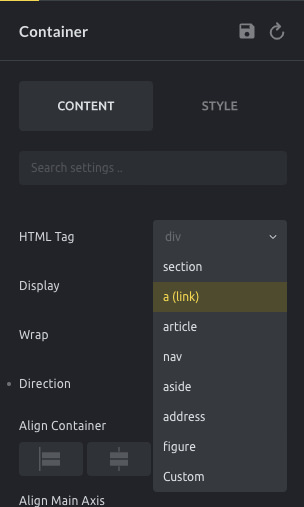
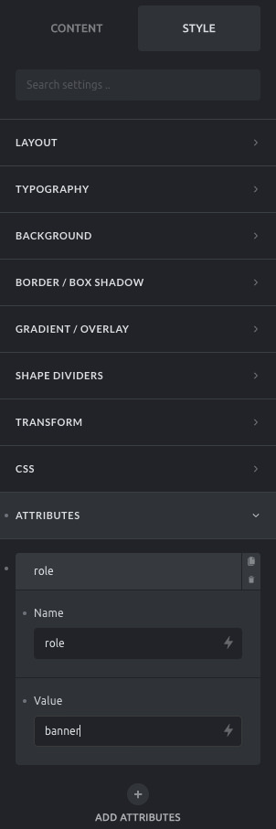

Accessibility (short: **a11y**), is the fine art of making your website as usable as possible by as many people as possible.

No matter your drive to improve the accessibility of your website, making your website as inclusive as possible is the most ethical approach and will benefit your business in the long term.

According to the [WHO](https://www.who.int/disabilities/world_report/2011/report.pdf) around 15% of the world’s population has some sort of disability. Your time is better invested in improving your site accessibility than optimizing it for IE (which has only 2% global usage). In some countries, this is a legal requirement.

## How Bricks Helps To Address Accessibility

Bricks provides the tools for you to generate the most semantic HTML possible and approach a11y requirements & best practices without the need to code.

Making sure the content is understandable by the majority of your site's target visitors. The [HTML is valid](https://validator.w3.org/nu/) with an appropriate semantic structure. Links and buttons are descriptive enough. Images have relevant `alt` descriptions, etc. Just to mention some of the relevant aspects of **a11y**.

## ARIA landmarks

Bricks, by default, creates three different [landmark regions](https://www.w3.org/TR/wai-aria-practices/examples/landmarks/HTML5.html) for you: Header, Main, and Footer.

Bricks elements use the most semantic tags whenever possible. For example, the **Form** element and the **Nav Menu** element use the correct HTML tag: `form` and `nav`, respectively. If you need to add more landmarks to your page, or any other semantic tag, you may do it using the Container element, selecting the **HTML tag** needed. You can specify a custom HTML tag, too.

Bricks 1.3 also introduces [Custom Attributes](https://academy.bricksbuilder.io/article/custom-attributes/). Those allow you to add other attributes to any Bricks element.

A common example: If you want to assign the **role** attribute to a container, to go "Style > Attributes", add a new attribute by clicking the "+" icon, and set the "Name" to "role" and the "Value" to the appropriate value:

## Images

Images in Bricks are rendered using the alternative text provided in the image media attributes (WordPress Media). The `alt` attribute is the place where site owners should provide a description of the image for people that are not able to view it. Bricks will also allow you to provide a custom `alt` attribute if you are using the Image element inside the builder.

For background images, when needed, Bricks automatically adds `role="img" aria-label="{image alt description}"` to the div that displays the image on the background. The description of the image is the content got from the image `alt` attribute defined on the WordPress media.

## Links

Set `aria-label` (and `title`) attributes to links using the builder if the link description is empty or not clear enough. These attributes will improve how assistive technology like screen readers interpret your website and should be used to provide better context to the link in case the link content is not semantic enough.

It is also important to mention that it is a good practice to avoid using links with terms like "Read more" or "Click here" as these labels do not provide any context to the visitors. If you still want to use these terms, make sure your links contain the `aria-label` attribute to provide context to the navigation.

## Forms

The Form element lets you add or remove field labels. Field labels are important to comply with a11y guidelines as they provide a description of what is expected to be input in each field. If you prefer to not present field labels, Bricks automatically adds the `aria-label` attribute to the field input using the label defined for each field in the builder.

## Keyboard navigation

One of the main a11y requirements is to make sure your website can be operated/navigated using the keyboard only. Assuring good keyboard navigation not only will allow people that cannot use a mouse to navigate through your website but also people using other assistive technologies.

One of the key aspects of keyboard navigation is to have a visual hint of where the focus is. Bricks 1.3 introduces default CSS to style the `:focus` property.

You can set your own focus style under "Settings > Theme Styles > Typography > Focus Outline". Although not recommended, if you want to remove this focus outline default, simply set it to "none".

### Skip navigation links

When using the keyboard navigation it can be frustrating having to navigate through all the menu links before arriving at the page's main content. To overcome this, one of the best practices, together with semantic ARIA landmarks (as described above), is to insert links on the top of the page to bypass the navigation.

Bricks 1.3 introduces two skip links by default: one to skip to the content and another to skip to the footer (if the footer exists). These skip links are added automatically to your website and will only appear if you press the TAB key on your keyboard.

### Menus

One of the most used elements in websites is the navigation menu. This element makes the website content more approachable to everyone and therefore deserves special attention to allow people without a mouse to also be able to navigate and open links inside menus.

Bricks also covers this need. All menus generated by Bricks are wrapped inside a `<nav>` tag and are fully keyboard-accessible according to the typical behavior of the keys when the focus is inside a menu element:

- TAB: Selects the next menu item

- SHIFT TAB: Select the previous menu item

- ENTER: Follows the link (similar to click)

- SPACE: Toggles the submenu (if exists)

Bricks implements the keyboard menu navigation using the [fly-out menu](https://www.w3.org/WAI/tutorials/menus/flyout/) approach.

As accessibility requirements and best practices evolve, so does Bricks. If you spot any potential accessibility improvements, [please let us know](https://bricksbuilder.io/contact/).
