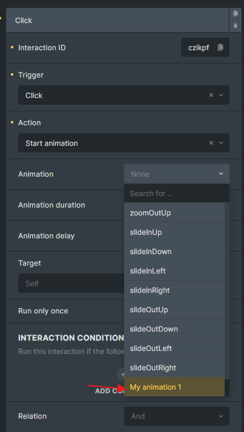
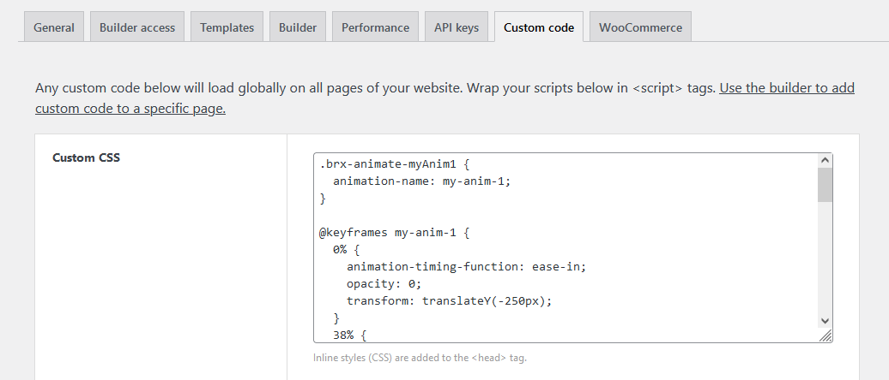

## Step 1: Add a new option via bricks/setup/control\_options hook

Hook documentation: [https://academy.bricksbuilder.io/article/filter-bricks-setup-control\_options/](https://academy.bricksbuilder.io/article/filter-bricks-setup-control_options/)

```php
add_filter( 'bricks/setup/control_options', function( $options ) {
  // Add custom animation into animationTypes
  // Note that the key is very important, must be unique
  $options['animationTypes']['myAnim1'] = esc_html__( 'My animation 1', 'bricks' );

  return $options;
}, 10 );
```



Custom animation added to the interaction "Animation" dropdown

## Step 2: Add animation CSS

When the interaction is set, Bricks will assign a class to the element using your animation key (`myAnim1` in our example), and it will be prefixed with `brx-animate-`.

All you have to do is create a CSS class that sets the animation name for your element, along with the corresponding keyframes for your animation. You can place these CSS inside `Bricks > Settings > Custom Code > Custom CSS`.



```php
.brx-animate-myAnim1 {
  animation-name: my-anim-1;
}

@keyframes my-anim-1 {
  0% {
    animation-timing-function: ease-in;
    opacity: 0;
    transform: translateY(-250px);
  }
  38% {
    animation-timing-function: ease-out;
    opacity: 1;
    transform: translateY(0);
  }
  55% {
    animation-timing-function: ease-in;
    transform: translateY(-65px);
  }
  72% {
    animation-timing-function: ease-out;
    transform: translateY(0);
  }
  81% {
    animation-timing-function: ease-in;
    transform: translateY(-28px);
  }
  90% {
    animation-timing-function: ease-out;
    transform: translateY(0);
  }
  95% {
    animation-timing-function: ease-in;
    transform: translateY(-8px);
  }
  100% {
    animation-timing-function: ease-out;
    transform: translateY(0);
  }
}
```

Now, you can use this new animation on any element from the "Interactions" panel.
