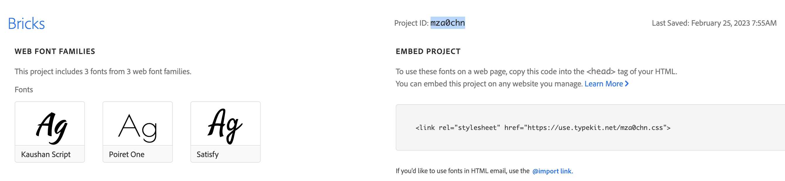
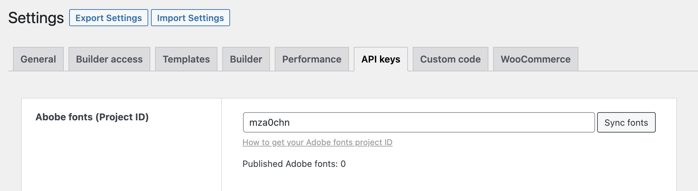
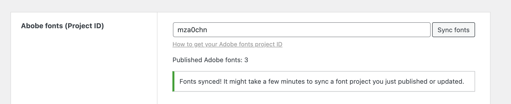
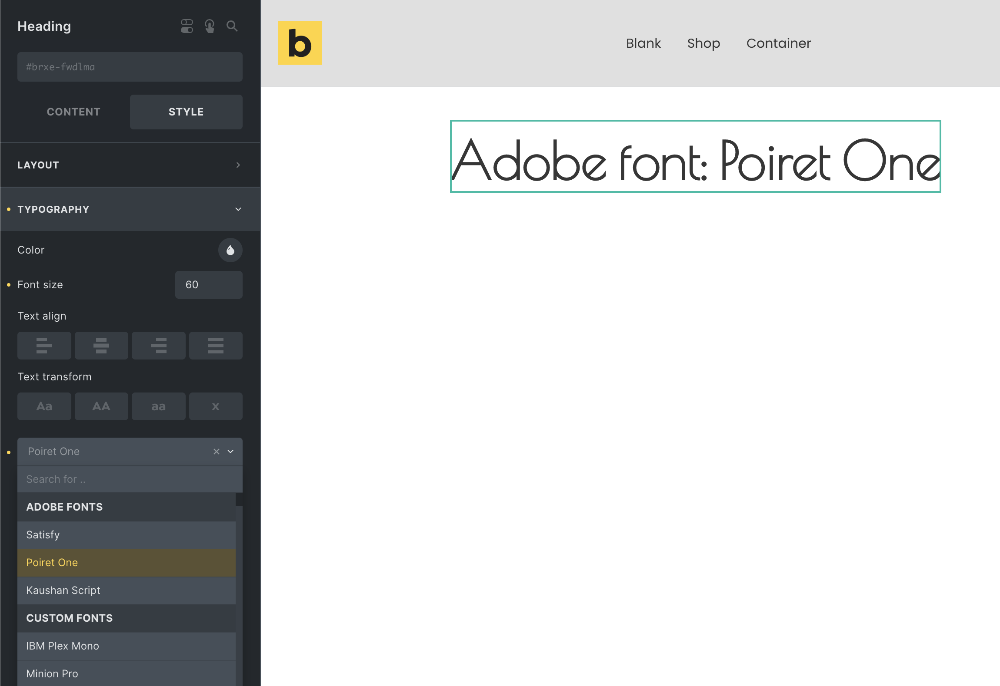
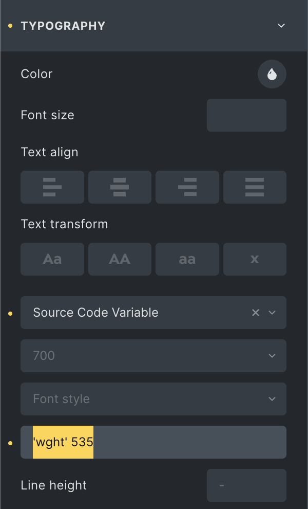

## How to use Adobe Fonts with Bricks

All you need to do is provide Bricks with your Adobe Fonts "Project ID".

First, visit the "web projects" section inside your Adobe Fonts account: [https://fonts.adobe.com/my\_fonts#web\_projects-section](https://fonts.adobe.com/my_fonts#web_projects-section)

Each of your web projects contains a unique "Project ID".

Copy the project ID of the web project whose fonts you want to use on your Bricks site.

<figcaption>

Copy the project ID into your clipboard

</figcaption>

Next, inside your WordPress dashboard, go to `Bricks > Settings > API keys` and paste the project ID into the "Adobe fonts (Project ID)" input field. Then save your settings.

<figcaption>

Click "Sync fonts" to fetch all fonts of this project

</figcaption>

Next to the project ID input, a "Sync fonts" button should now be visible. Click it to fetch the Adobe fonts of this project. A success message should appear & the "Published Adobe fonts" counter should reflect the number of published fonts.

<figcaption>

Fonts are now synced & available in the builder

</figcaption>

Those fonts are now available inside the builder in any `font-family` dropdown:

NOTE: Bricks recognizes when you use an Adobe font that is also available as a Google font. Bricks will load only the Adobe font to prevent loading this font from Google as well.

## Variable fonts

Bricks also provides a new `font-variation-settings`. This CSS property allows you to control the four-letter axis names of a variable Adobe font. Such as the `wght`, `wdth`, `slnt`, and `ital`.

For more information about the specifics please visit [https://developer.mozilla.org/en-US/docs/Web/CSS/font-variation-settings](https://developer.mozilla.org/en-US/docs/Web/CSS/font-variation-settings)

<figcaption>

Variable Adobe font with a custom font-weight (axis: "wght") of 535

</figcaption>

You can view available variable Adobe fonts by selecting "Variable Fonts" under "Font technology on [https://fonts.adobe.com/fonts](https://fonts.adobe.com/fonts).

NOTE: This new `font-variation-settings` is also available for [custom fonts](https://academy.bricksbuilder.io/article/custom-fonts/). Google fonts currently only support the `wght` axis in Bricks. We are working on full variable font support with Google fonts as well.
