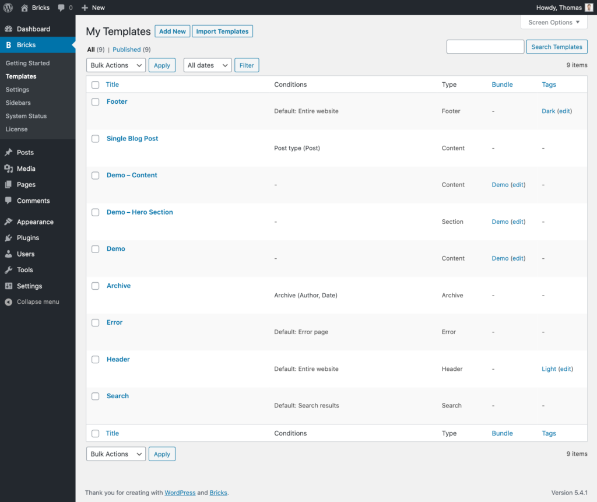
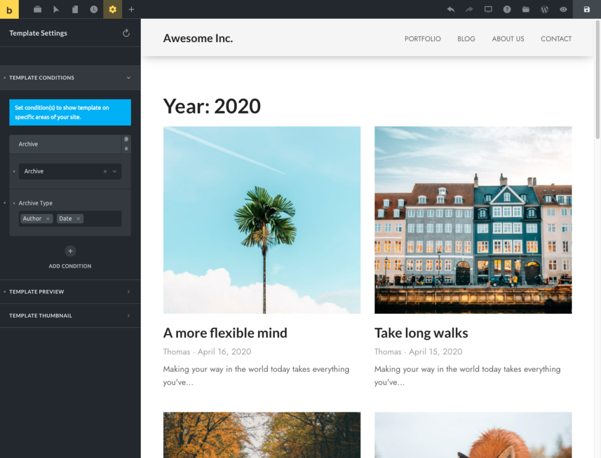

Templates are a central feature of Bricks. There are different template types. At the very least, you usually create a header, footer, and blog post template.

A template can contain a single section (your website header, a hero section, etc.) or the entire page content (a single blog post layout, archive pages, search results page, error page, etc.).

You can create your own templates or browse dozens of pre-designed templates from the **[Template Library](https://academy.bricksbuilder.io/article/template-library/)** by clicking the Templates (folder) icon in the builder toolbar.

Add a screenshot for your template by setting the featured image.

https://youtu.be/AALkqzu-aBA

## Pre-Designed Community Templates

Browse our ever-growing collection of pre-designed templates right from within the builder.

Access the Community Templates by clicking the "folder" icon in the builder's top toolbar. Then, under "Source," select "Community Templates". You'll now see a list of all pre-designed templates:

Insert the template of your choice with a single click and tweak it from there. All community template images are royalty-free and can be used in your and your client's projects.

**TIP:** When you start with Bricks, inspecting a template is a great way to learn how a certain layout is structured.

## My Templates

You can view, create, import, and export your own templates by clicking the Templates (folder) icon in the builder toolbar or directly from the WordPress dashboard:

<figcaption>

My Templates in WordPress Dashboard

</figcaption>

This also provides a great overview of where on your site a template appears (**Template Conditions**), the **Template Type**, plus any template metadata you've added (**Templates Bundle**, **Template Tags**) to better organize your templates.

Let's quickly go over those template-specific terms:

## Template Conditions

Template conditions determine where on your site a template appears.

For example, an **Archive** template will be used on all author and date archive pages (see screenshot below). The **Single Blog Post** template is responsible for all your posts. Both are set as such via template conditions.

If no template condition is set, Bricks will use published templates of certain Template Type, such as header and footer templates on the front end of your website.

View the table below to see which **[Template Types](#template-types)** are picked up by default.

To set template conditions for the template you are editing, click the **Settings** (gear) icon in the builder toolbar, then go to **Template Settings → Template Conditions**:

<figcaption>

Template Conditions are located under Settings > Template Settings

</figcaption>

**TIP:** To disable the use of default templates, go to **Bricks → Settings** and select the **Disable Default Templates** setting.

### Inject Section templates via hooks

Want to render a template at a specific WordPress hook? Starting at Bricks 1.9.1, you can inject any template of type "Section" via any WordPress hook.

All you need to do when editing your section template is to select your template condition (i.e., the entire website) and enter the WordPress action hook name under "**Hook: Name**". Your section template will now be rendered wherever this action hook is triggered.

You can optionally also set a "**Hook: Priority**" (default is 10).

<figcaption>

Section template rendered at the `bricks_before_header` hook

</figcaption>

Templates with action hook set will only be injected on the actual frontend.

## Template Types

Setting a template type is required for any template.

Assigning the most suitable template type helps you easily filter large template libraries, and it allows Bricks to determine if a certain template should be shown on the front end of your website in case no conditions are set. This is if you haven't disabled this option as described in the tip above.

| **Template Type** | **Description** | **Used By Default** |
| --- | --- | --- |
| **Header** | Set for any template that contains your website header (logo, nav menu, etc.) | Yes |
| **Footer** | Set for any template that contains your website footer (copyright info, footer nav menu, etc.) | Yes |
| **Single** | Set for any template that contains the main content. Such as a single blog post template. | No (it's unique) |
| **Single product** | Set for any template that contains the main content of the WooCommerce product. | No (it's unique) |
| **Section** | Set for any template that contains a single section. Such as a hero section, contact section, etc. | No (it's unique) |
| **Archive** | Set for any template that contains your website archive. Can be broken down via Template Conditions into author, date, category/tags archive pages. | Yes |
| **Product archive** | Set for any template that contains a WooCommerce archive. Can be broken down via Template Conditions into product categories or tags archive pages. | No (it's unique) |
| **Search Results** | Set for the template that you want to use to display your search results page. | Yes |
| **Error Page** | Set for the template that you want to use as your 404 error page. | Yes |
| **Password Protection** | Set for any template designed to protect content using the [Password Protection feature](https://academy.bricksbuilder.io/password-protection). | No (it's unique) |

**IMPORTANT:** Section templates do NOT sync/are updated between pages. Please set the template type to show a certain template at a specific area of your site. "Single" & "Section" templates are unique and not used anywhere by default.

## Template Bundles & Template Tags

These two Bricks template taxonomies can be used to organize and group your templates together. They are 100% optional.

For example, Our Community Templates use **Template Bundles** to group individual templates of the same website design (Milo, Sizzle, Rank, etc.) together. Feel free to use template bundles in any other way.

**Template Tags** are simple tags. The "My Templates" screenshot above uses template tags such as "Dark" and "Light". Again, they are completely optional but often very useful. Especially as your template library grows over time.
