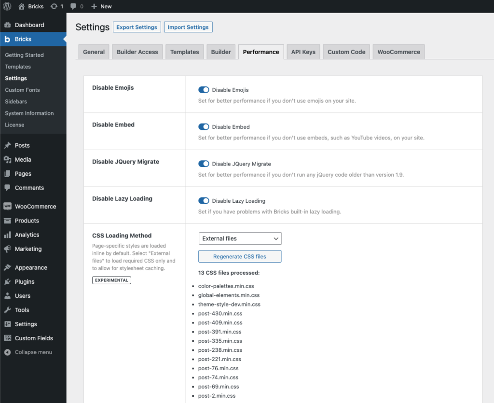

"Performance" being one of Bricks' three pillars, we have introduced a new asset loading solution in version 1.3.4 that offers you even more control and helps you to further enhance your page loading times and speed results.

https://www.youtube.com/watch?v=O\_B19LBtnwM&t=45s

Bricks, by default, serves all styles (CSS) and scripts (JS) through two major files:

- frontend.min.css (293 kb)

- bricks.min.js (354 kb)

This approach ensures that all styles and scripts are always available on any page.

The downside is that those two files together were roughly 650 kb in size. Although, after caching and on subsequent page loads that's not really an issue. But it had a negative impact on the very first visit resulting in longer page loads and affecting visitors on slow/weak networks the most.

Bricks 1.3.4 introduces a new asset delivery solution.

Scripts are now only served as needed. **Reducing the bricks.min.js file size by 90%** (from 354 kb down to 37 kb).

Large styles such as animate.css, icon font libraries, etc. are now only loaded as needed. **Reducing the frontend.min.css file size by 60%** (from 293 kb down to 116 kb).

## How To Reduce Asset Loading Even Further through "External Files"

All default element styles are still loaded inside the frontend.min.css file. Other styles such as global custom CSS, theme styles, template styles, page element styles, color palettes, global element CSS, etc. are loaded via inline styles which adds a lot of repetitive and oftentimes non-cacheable data to every page request.

To further optimize & minimize the loaded styles you can set the "CSS Loading Method" under "Bricks - Settings - Performance" to "**External Files**".

To regenerate all CSS files in one go, please click the "Regenerate CSS files" button located under the "CSS loading method setting. This action is only available after the CSS loading method has been set to "External Files".

**Please click the "Regenerate CSS files" button once you've changed the CSS loading method to "External Files", so Bricks can create the required directory and CSS files.**

This will generate minified CSS files for your Bricks data within the `wp-content/uploads/bricks/css` directory (or whatever you've set as your WordPress "uploads" directory) and serves them as needed according to the requested page.

If the "External Files" CSS loading method does conflict for some reason with your server or plugin caching solution or outputs incorrect or missing styles, please revert to the default "**Inline Styles**" CSS loading method, and report the issue to us via [email](https://bricksbuilder.io/contact/), so we can address it. Thank you!




<figcaption>

CSS Loading Method: "External Files"

</figcaption>


## How To Enqueue Individual Styles & Scripts

If you are working with a third-party Bricks plugin or if for some reason a certain style/script is not being loaded as needed, you can always load/enqueue those individually to your own needs by following the instructions below.

What follows is a list of Bricks style & script names which you can enqueue on any of your pages as needed through your child theme's functions.php by hooking into the `wp_enqueue_scripts` WordPress action or inside the `enqueue_scripts` function in case your [custom Bricks element](https://academy.bricksbuilder.io/article/create-your-own-elements/) depends on any of those styles and/or scripts.

```php
add_action( 'wp_enqueue_scripts', function() {
  // isotopeJS (e.g. metro & masony layouts)
  wp_enqueue_script( 'bricks-isotope' );
  wp_enqueue_style( 'bricks-isotope' );
  
  // Icon font files
  wp_enqueue_style( 'bricks-font-awesome-6' );
  wp_enqueue_style( 'bricks-font-awesome-6-brands' );
  wp_enqueue_style( 'bricks-ionicons' );
  wp_enqueue_style( 'bricks-themify-icons' );

  // Animations
  wp_enqueue_style( 'bricks-animate' );

  // Tooltips
  wp_enqueue_style( 'bricks-tooltips' );

  // Datepicker
  wp_enqueue_script( 'bricks-flatpickr' );
  wp_enqueue_style( 'bricks-flatpickr' );

  // swiperJS (e.g. slider, carousel)
  wp_enqueue_script( 'bricks-swiper' );
  wp_enqueue_style( 'bricks-swiper' );

  // Lightbox
  wp_enqueue_script( 'bricks-photoswipe' );
  wp_enqueue_style( 'bricks-photoswipe' );

  // Code prettifier
  wp_enqueue_script( 'bricks-prettify' );
  wp_enqueue_style( 'bricks-prettify' );
}, 11 );
```
