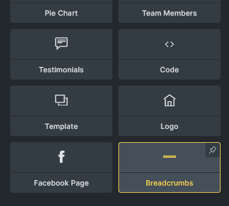
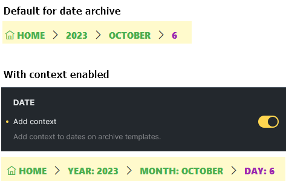
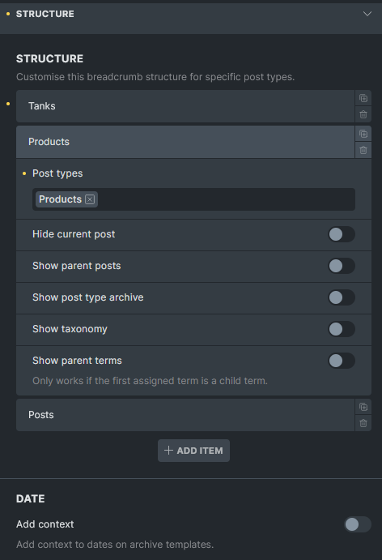
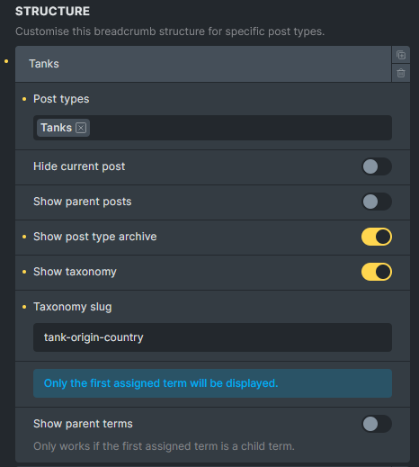
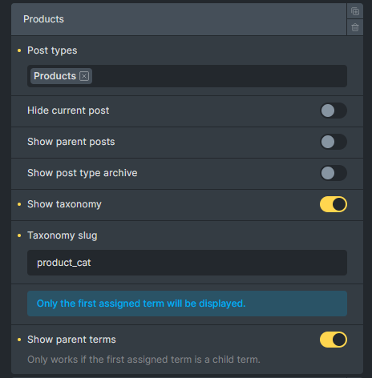
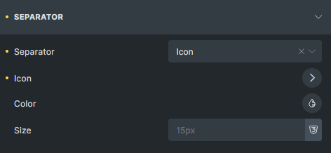
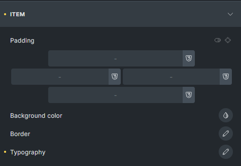
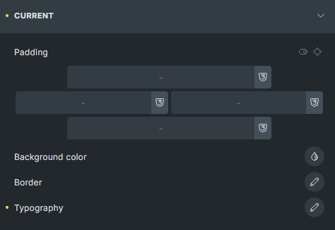

Breadcrumbs are an essential part of website navigation, providing users with a clear path to navigate through the site hierarchy. They improve the overall user experience by helping users know their location within the site and easily navigate back to previous pages.

In this article, we will explore how to use the Breadcrumbs element to enhance your site's navigation structure. It can be found in the elements panel under "General".

The Breadcrumbs element generates different breadcrumb items depending on the type of page being viewed.

It supports various page types, including single posts or pages (`is_singular()`), the homepage (`is_home()`), categories (`is_category()`), taxonomies (`is_tax()`), post type archives (`is_post_type_archive()`), tags (`is_tag()`), date archives (`is_date()`), author pages (`is_author()`), search results (`is_search()`), and error pages (`is_404()`).

Notably, support for **date** and **tag** archives was introduced in version `1.11`.

## Controls

Please note that the controls in this article is based on Bricks `1.11`

The Breadcrumbs element is divided into several configuration sections: **[Structure](#structure)**, **[Home](#home)**, **[Separator](#separator)**, **[Item](#item)**, and **[Current](#current)**.

### Structure

This is a new section in version `1.11`. You can customize the structure of breadcrumb items here. Currently it supports single pages and the date archive.

#### Date archive structure

#### Single page structure

By default, Bricks displays breadcrumb items as follows:

For posts:  
`Home` > `Parent categories (if any)` > `Category (if any)` > `Post parents (if any)` > `Current post`

For other post types:  
`Home` \> `Post archives` > `Post parents (if any)` > `Current post`  
  
Starting with version `1.11`, you can customize the breadcrumb structure for different post types. You can also group multiple post types together if you want them to share the same structure. Any post type not specifically defined in your custom structures will automatically use the default structure.

**Example 1:**  
For the Tanks post type singular page, I want to display the post type archive and the custom taxonomy as breadcrumb items.

**Example 2:**  
For the products singular page, I want to display custom taxonomy as breadcrumb items.

#### Home

In this section, you can customize the root item (home) of the breadcrumb trail. Adjust the URL, change the label text, select an icon, and determine the icon's position.

#### Separator

Here, you can modify the appearance and behavior of the separators between breadcrumb links, adjusting both display mode and styling.

#### Item

This section allows you to style each breadcrumb link.

#### Current

Use these settings to style the last item in the breadcrumb trail, which represents the current page or post.
