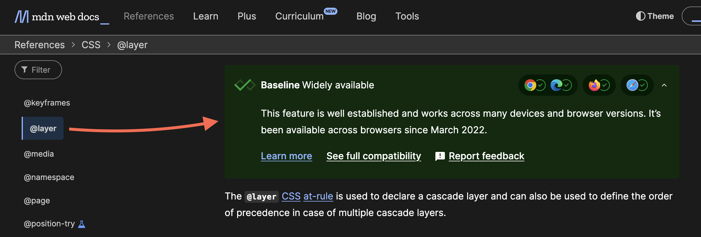

Bricks follows the [Baseline](https://developer.mozilla.org/en-US/docs/Glossary/Baseline/Compatibility) compatibility standard to determine which CSS features we natively support in the styles Bricks outputs.

## What is Baseline?

Baseline is a compatibility model that tracks when web platform features become widely interoperable across all major browsers. It defines two key stages:

- **Newly Available**: Feature works across all major browsers (desktop and mobile).

- **Widely Available**: Reached ~30 months after “Newly Available”; safe to use in production for most users globally (~95% support).

Baseline considers support in the following browsers:

- Apple Safari (iOS)

- Apple Safari (macOS)

- Google Chrome (Android)

- Google Chrome (desktop)

- Microsoft Edge (desktop)

- Mozilla Firefox (Android)

- Mozilla Firefox (desktop)

## Which CSS features does Bricks use?

Bricks only uses CSS features that have reached the **Widely Available** stage under Baseline. For example, the [`:where` pseudo-class](https://developer.mozilla.org/en-US/docs/Web/CSS/:where) and [@layer CSS at-rule](https://developer.mozilla.org/en-US/docs/Web/CSS/@layer) are already in that stage and are part of Bricks' output.

## What happens on much older or less common browsers?

We aim to strike the right balance: adopting modern standards when they’re stable and broadly supported, while avoiding unnecessary technical debt or regressions for the majority of users. Adding fallbacks for edge-case devices below the Baseline threshold would compromise code quality and performance for everyone else.

## Does this affect user-added CSS?

No. This only applies to the CSS generated by Bricks.

You can continue writing your own CSS however you like, including fallbacks or feature checks for legacy devices. Bricks just won't include those fallbacks automatically in its own output.
