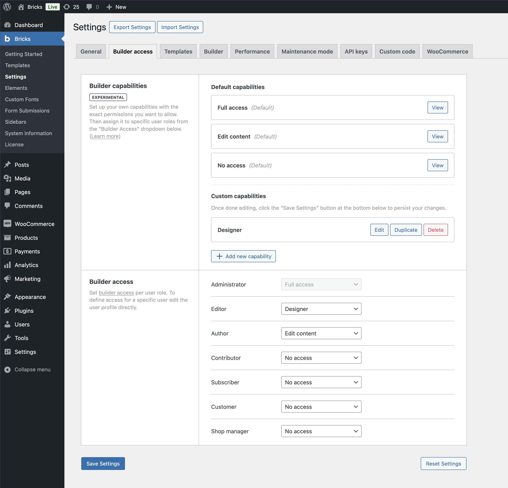
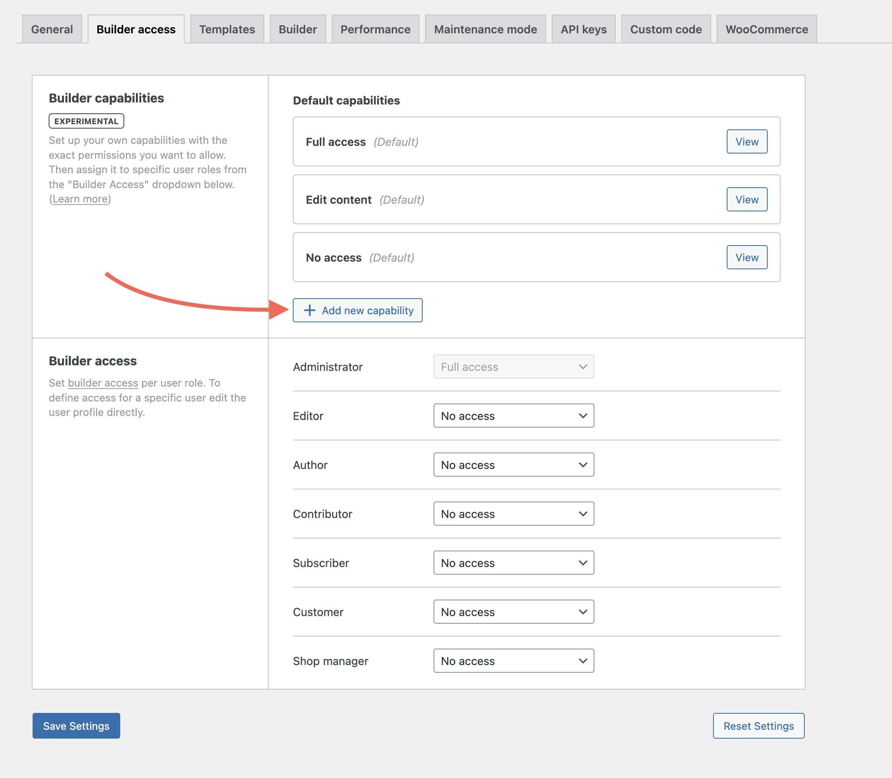
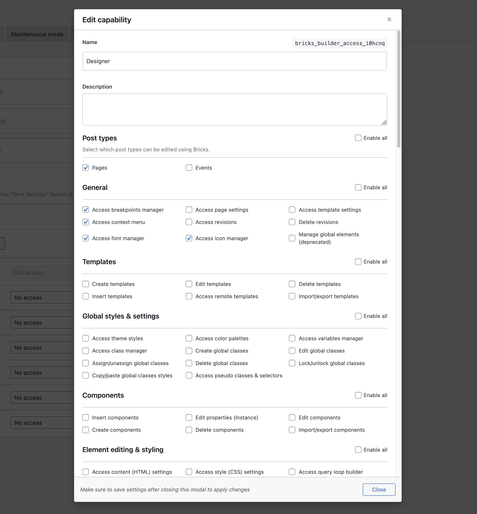
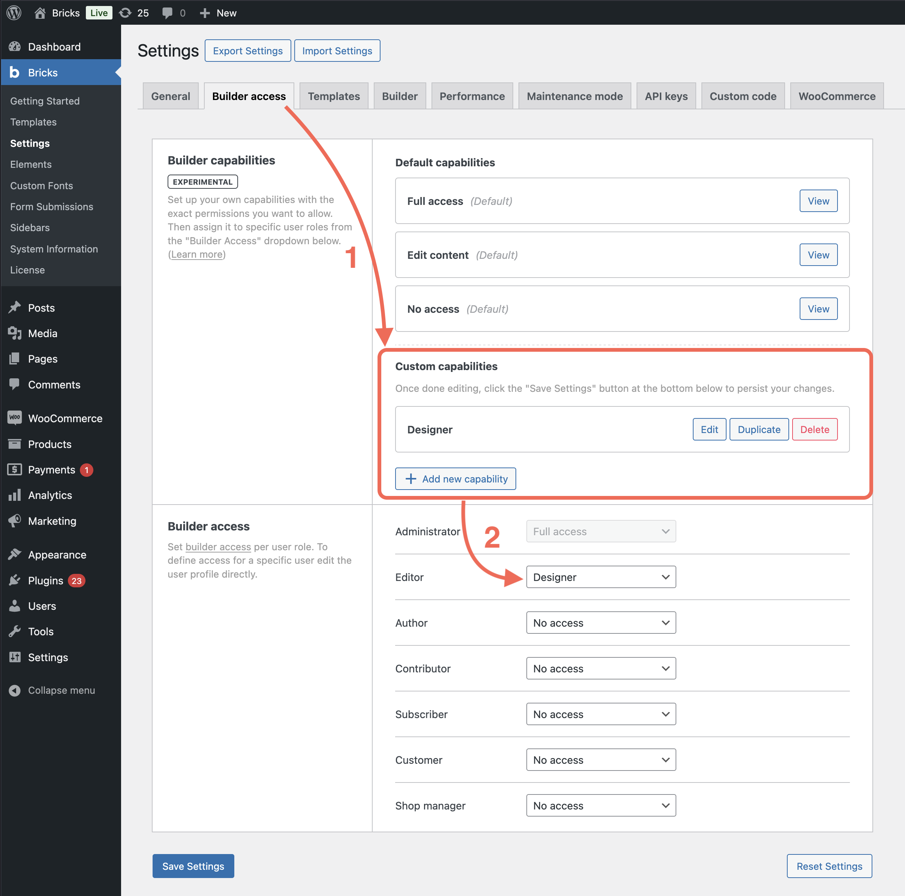
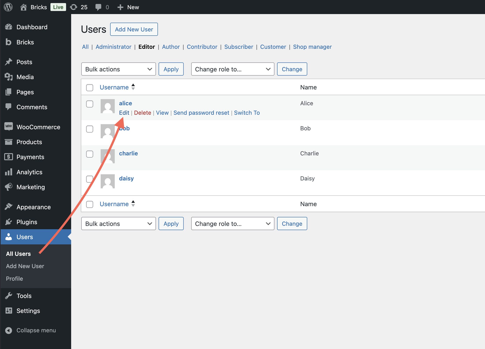
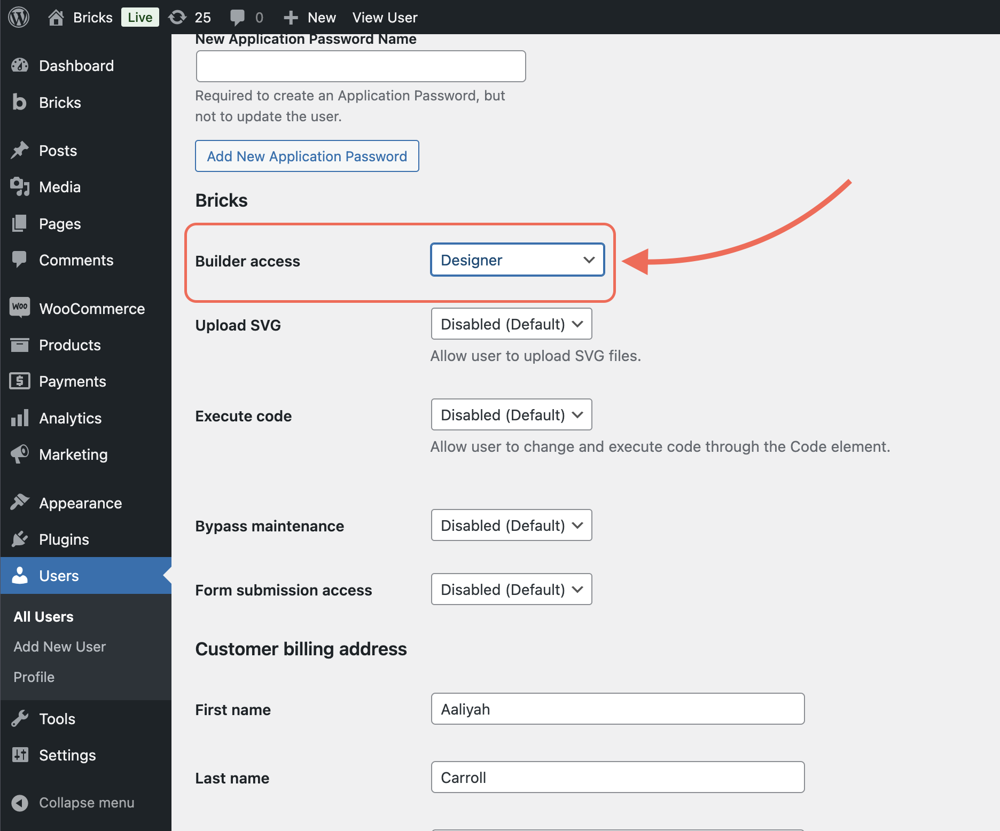

Starting at version 2.0, Bricks gives you full control over who can access the builder, and what actions they’re allowed to perform. You can either assign a **predefined capability**, or create your own **custom capability** that allows only the specific permissions you enable for it.

This gives you complete freedom and control to tailor the builder experience to any roles (i.e. content editor, designer, client, etc.) depending on what they should be able to do.

## Access levels

There are two ways to manage builder access:

1. Use one of the predefined capabilities: **Full access**, **Edit content**, or **No access**

3. Create your own custom builder capability with detailed permission control

### Predefined capabilities

- **Full access**: Grants access to all features and permissions in the Bricks builder.

- **Edit content**: Limits the user to content editing only. Layout, styling, and structural controls are disabled. More specifically, this includes the following permissions:
    - Access revisions
    
    - Set component properties (instance)
    
    - Access content (HTML) settings
    
    - Edit all elements
    
    - Edit all Bricks-enabled post types

- **No access**: Blocks access to the Bricks builder entirely.

## Creating a custom capability

If you need precise control over the actions a user or role should be able to perform, you can create your very own custom builder capability, following the steps outlines below.

1. Go to **Bricks > Settings > Builder access**

3. Under **Builder capabilities**, click **Add new capability**

Inside the capability popup, you can:

- Give the capability a name & a description

- Enable exactly the permissions you want to grant

Once created, you can assign this capability to specific users or user roles.

## Assigning capabilities

You can assign any builder capability, whether predefined or custom:

- To a **user role**, under **Bricks > Settings > Builder access > Builder access**

- To a **specific user**, by editing their WordPress user profile

This gives you flexibility to apply permissions globally or individually.

## Available permissions

When editing a capability, the following permissions are available and grouped by category:

### Post types

Choose which post types can be edited using Bricks.

### General

- Access breakpoints manager

- Access page settings

- Access template settings

- Access revisions

- Delete revisions

- Access font manager

- Access icon manager

### Templates

- Create templates

- Edit templates

- Delete templates

- Insert templates

- Access remote templates

- Import/export templates

### Global styles & settings

- Access theme styles

- Access color palettes

- Access variables manager

- Access class manager

- Create global classes

- Edit global classes

- Assign/unassign global classes

- Delete global classes

- Lock/unlock global classes

- Copy/paste global class styles

- Access pseudo classes & selectors

### Components

- Insert components

- Edit properties (instance)

- Edit components

- Create components

- Delete components

- Import/export components

### Element editing & styling

- Access content (HTML) settings

- Access style (CSS) settings

- Access query loop builder

- Access element conditions

- Access element interactions

- Duplicate elements

- Delete elements

- Move elements

- Copy/paste elements

- Copy/paste element styles

- Copy/paste element conditions

- Copy/paste element interactions

- Copy/paste element attributes

- Pin/unpin elements

### Edit elements

Controls general editing of existing elements.

_Note: Requires access to content and/or style settings._

### Add elements

Define which elements can be inserted.
