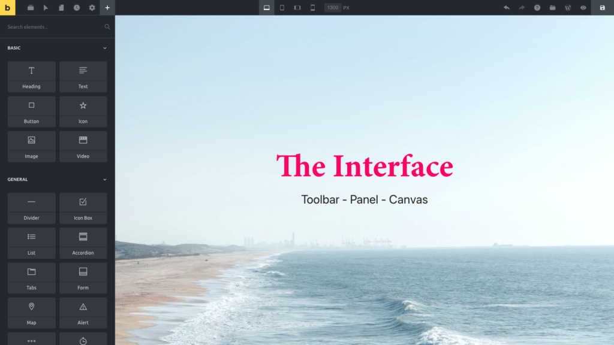

Bricks is a drag & drop website builder for WordPress. It enables you to create your entire site visually, and in real-time. All on one screen.

The builder is composed of three areas: **TOOLBAR**, **PANEL** and **CANVAS**:

## Toolbar

The toolbar, positioned at the very top of the builder, lets you perform various actions without leaving the page you edit. For example, you can view and edit your layout by [switching between the breakpoints](https://academy.bricksbuilder.io/article/responsive-editing/) to ensure your site is responsive and looks great on all devices.

## Panel

The panel displays relevant information for the action you are currently performing.

Positioned on the left by default. You can move the panel around freely by dragging it via the panel header anywhere on your screen.

By default, it shows you a list of all available elements, for you to drag and drop onto the canvas. When editing an element you'll see all controls of the selected element. When accessing the Settings (gear icon) from the toolbar, all available settings are displayed, and so on.

## Canvas

The heart of the builder is the canvas. A visual representation of your page that you can visually adjust to your liking by adding sections, rows, columns, and elements.

Let's have a look how those three areas work together in Bricks in this "Getting Started" tutorial:

https://youtu.be/5DGo0AYOJ7s?t=1224
