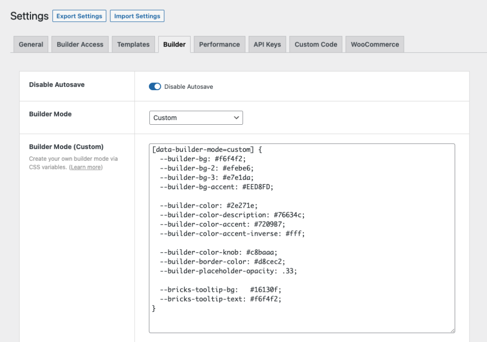
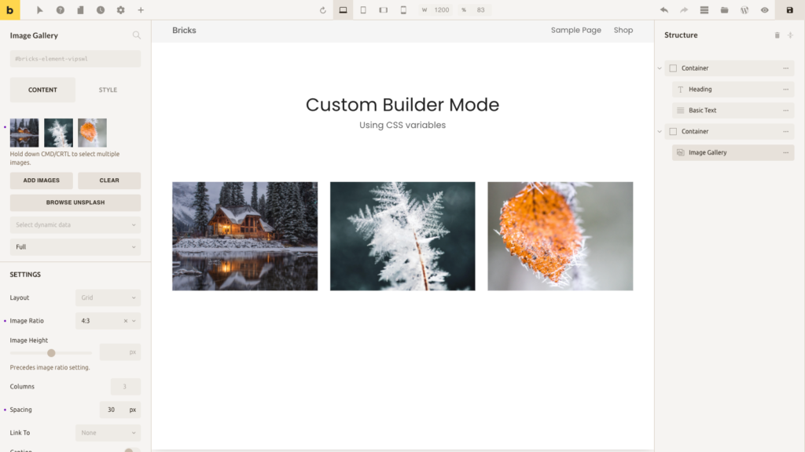

Starting with Bricks 1.3.7 you can customize the builder mode (color scheme) to your liking by tweaking a few CSS variables.

You first have to set the "Builder Mode" under Bricks → Settings → Builder to "Custom" and save your settings.

The following new setting called "Builder Mode (Custom)" should now appear:



Below you can find an example CSS snippet that contains all relevant builder CSS variables:

```php
[data-builder-mode=custom] {
  --builder-bg: #f6f4f2;
  --builder-bg-2: #efebe6;
  --builder-bg-3: #e7e1da;
  --builder-bg-accent: #EED8FD;

  --builder-color: #2e271e;
  --builder-color-description: #76634c;
  --builder-color-accent: #7209B7;
  --builder-color-accent-inverse: #fff;

  --builder-color-knob: #c8baaa;
  --builder-border-color: #d8cec2;
  --builder-placeholder-opacity: .33;

  --bricks-tooltip-bg:   #16130f;
  --bricks-tooltip-text: #f6f4f2;
}
```

If you copy the CSS above, paste it into your "Builder Mode (Custom)" setting, and save your settings, your builder should look like this:




<figcaption>

Bricks builder with a custom color scheme (mode)

</figcaption>


### Resources

- Color palettes: [https://coolors.co/palettes/trending](https://coolors.co/palettes/trending)
- Color palettes: [https://colorhunt.co](https://colorhunt.co)
- Generate color shades & tints: [https://www.colorhexa.com](https://www.colorhexa.com)

Note: In custom builder mode, Code element's background color changes to a light color scheme.
