The cart page is a special WooCommerce page, created by default during WooCommerce installation. It contains WooCommerce Cart gutenberg blocks. Please remove all of the gutenberg blocks and use `[woocommerce_cart]` instead.

Remove the Gutenberg Cart block if it is located within your Cart Page. Instead, replace it with \[woocommerce\_cart\] or utilize the Shortcode element if you have edited the Cart page with Bricks.

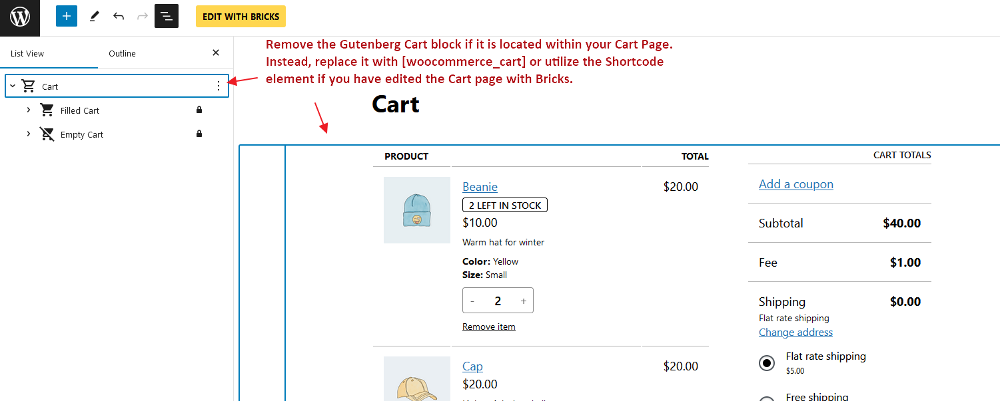

Bricks is only supporting `[woocommerce_cart]` shortcode. You can either place the `[woocommerce_cart]` shortcode directly in the Cart page, or edit the Cart page with Bricks, then use Shortcode element and set the content as `[woocommerce_cart]`. Bricks offers two different template types (in this context, they are like template parts) to customize the cart:

- **WooCommerce - Cart**: Rendered when the cart contains products.

- **WooCommerce** - **Empty** **Cart**: Rendered when the cart is empty.

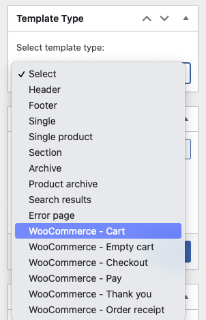

The "Cart" and "Empty Cart" template types are only visible if you have the WooCommerce plugin installed and active. These templates are used inside the WooCommerce Cart shortcode logic and ****they do not support template conditions (they are automatically rendered on the correct page)****.

By default, the cart in the Bricks theme will be shown as in the image below. You'll notice there are typically two different zones: the cart items table & the cart totals:

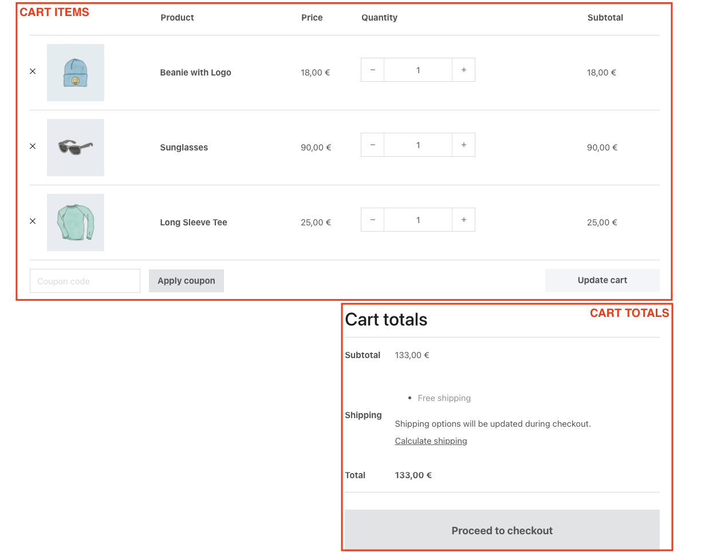

If you want to customize this screen, you'll need to create a **WooCommerce - Cart** template type.

Please remember to add [template hooks](https://academy.bricksbuilder.io/article/woocommerce-template-hooks/#cart-template-hooks) if you are using third-party plugins.

## Template Type: WooCommerce - Cart

You would set the **WooCommerce - Cart** template type to customize the Cart page (used when the cart contains products).

When opening this template with Bricks you'll see three new elements (specific for this template type):

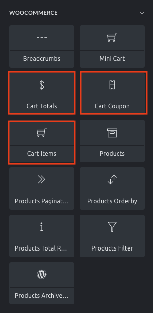

<figcaption>

The specific Bricks elements to be used inside the "WooCommerce - Cart" template type

</figcaption>

### Cart items

Render the cart contents table. With this element, you'll be able to hide different parts of the table, style the table elements and the buttons, and hide the coupon input (so you could set it separately using the **Cart Coupon** element). For custom layout, check the section down below [Cart contents loop](#loop).

### Cart totals

Renders the cart totals zone. With this element, you could hide the cart cross-sells, style the totals table, and style the button.

### Cart Coupon

Render the coupon input. Use this element if you don't want to have the coupon input attached to the cart items table. With this element, you could style the input and the apply coupon button

## Template Type: WooCommerce - Empty Cart

You would set the **WooCommerce - Empty Cart** template type to customize how the cart page renders when the cart is empty.

By default, the empty cart shows a message and a button to return to the shop page.

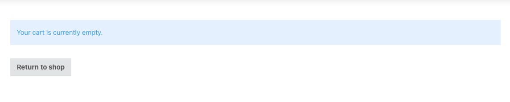

To customize this screen you need to create a **WooCommerce - Empty Cart** template type where you could place the required elements and configure as needed.

## Cart contents loop

Bricks 1.4. introduces a new query loop type, the **Cart Contents**. This query loops through all the products in the cart thus enabling the usage of the [Dynamic Data tags](https://academy.bricksbuilder.io/article/woocommerce-builder/#dynamic-data) to get the product name (post title), the product image (featured image), and the product-related tags like the product price, description, SKU and so on. This query loop is just for the Cart page.

This will allow you to build your own cart items widget, and place it anywhere on your site.

### Build your own cart items element inside the cart page

By default, the list of products inside the cart appears displayed on a table layout. This happens in the default WooCommerce cart template or when using the Bricks Cart Items element.

To create a different layout for the cart products list, you'll need to add a container with a query loop, and set it to **Cart Contents**. Inside this container you may use the following new dynamic data tags (since Bricks 1.5.3):

In order to make your custom cart loop work, you must add `woocommerce-cart-form__cart-item cart_item` CSS class on the loop itself and add `woocommerce-cart-form__contents` CSS class on the parent of looping div.

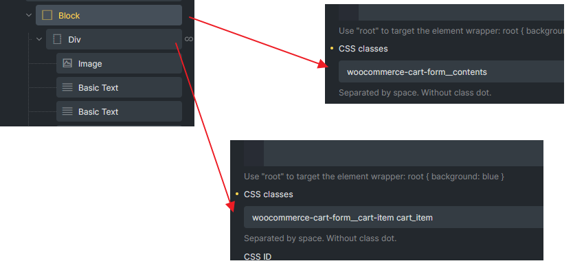

<figcaption>

CSS classes needed for WooCommerce JS works in cart page

</figcaption>

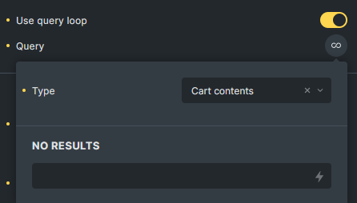

<figcaption>

Cart Contents query loop

</figcaption>

- `{woo_cart_product_name}` - Renders the product name with a link. It is meant to be used inside of the Cart Contents loop.

- `{woo_cart_remove_link}` - Renders the anchor tag with the link to remove the product from the cart. By default, uses an "x" in the anchor content. Remember to add `product-remove` CSS class on the element that holding this dynamic tag. Do **NOT** use on Rich text element or additional `
` tag will cause the AJAX not working.

- `{woo_product_price}` - This tag shows the product price. But when used inside of the Cart Contents loop it doesn't show the sale price.

- `{woo_cart_quantity}` - Renders the input field to add/remove the product quantity inside of the cart.

- `{woo_cart_subtotal}` - Renders the product price subtotal (price x quantity)

To complete this component, you have to wrap the products loop inside a `form` tag in order to use the product quantity input fields. To do that, wrap the container loop inside of another container (or div, or block) and set the HTML tag to `custom` and then insert `form` in the Custom tag input field.

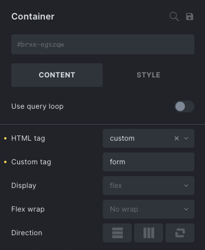

<figcaption>

Wrap the products loop with a form container

</figcaption>

**IMPORTANT**: Using Bricks 1.10.2+ you have explicitly allow the `form` HTML tag programmatically. Please follow the instructions at [https://academy.bricksbuilder.io/article/filter-bricks-allowed\_html\_tags/](https://academy.bricksbuilder.io/article/filter-bricks-allowed_html_tags/)

This form container, in order to work properly with the WooCommerce scripts needs the following configurations:

- Add the custom class `woocommerce-cart-form` (Style > CSS > CSS classes)

- Add custom attributes: method = `post` and action = `{post_url}`

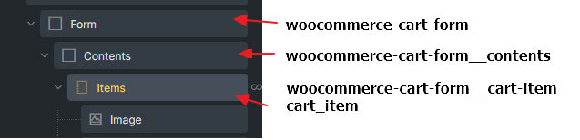

<figcaption>

Example Form container

</figcaption>

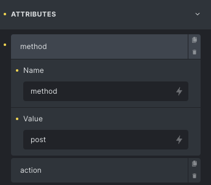

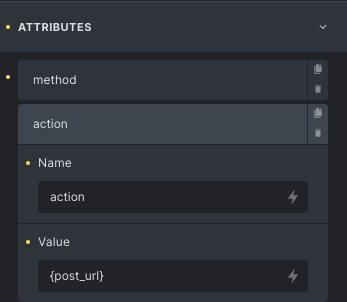

To add the update cart button, there's also another dynamic data tag `{woo_cart_update}` that you'll need to add inside of the form container (but outside of the loop). This will generate a button with the proper settings to update the cart.
