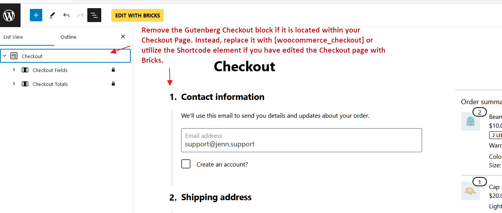
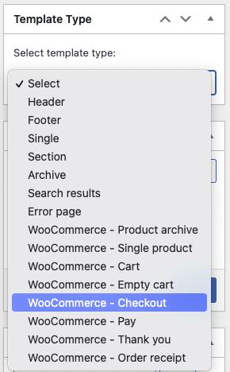
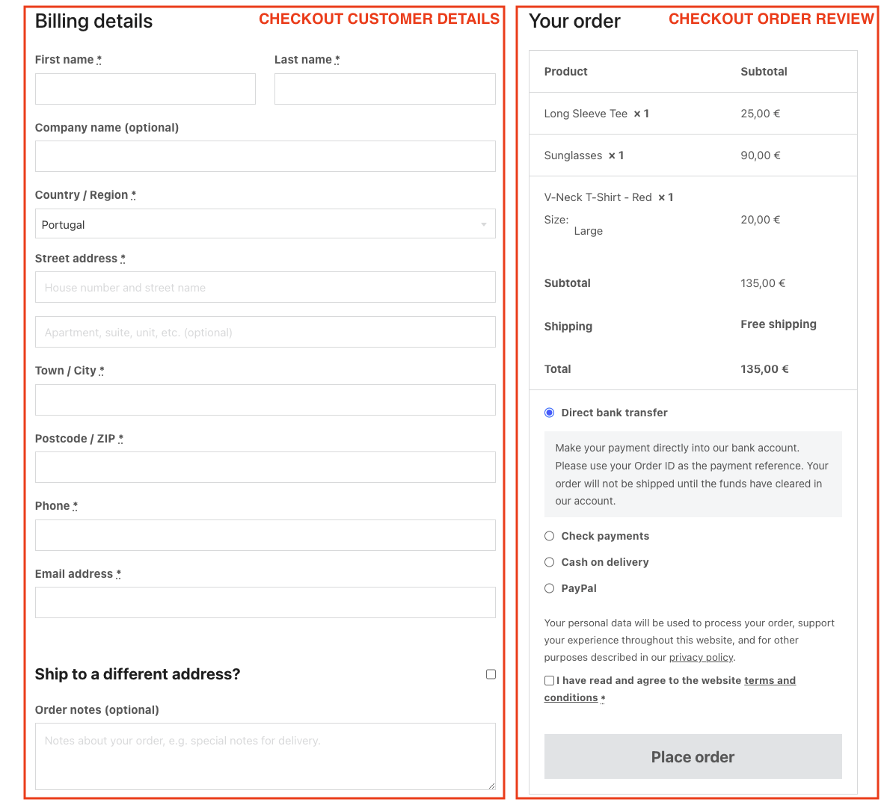
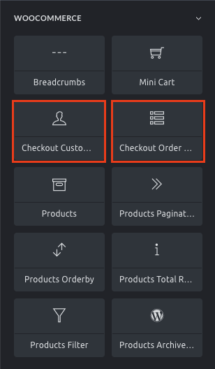
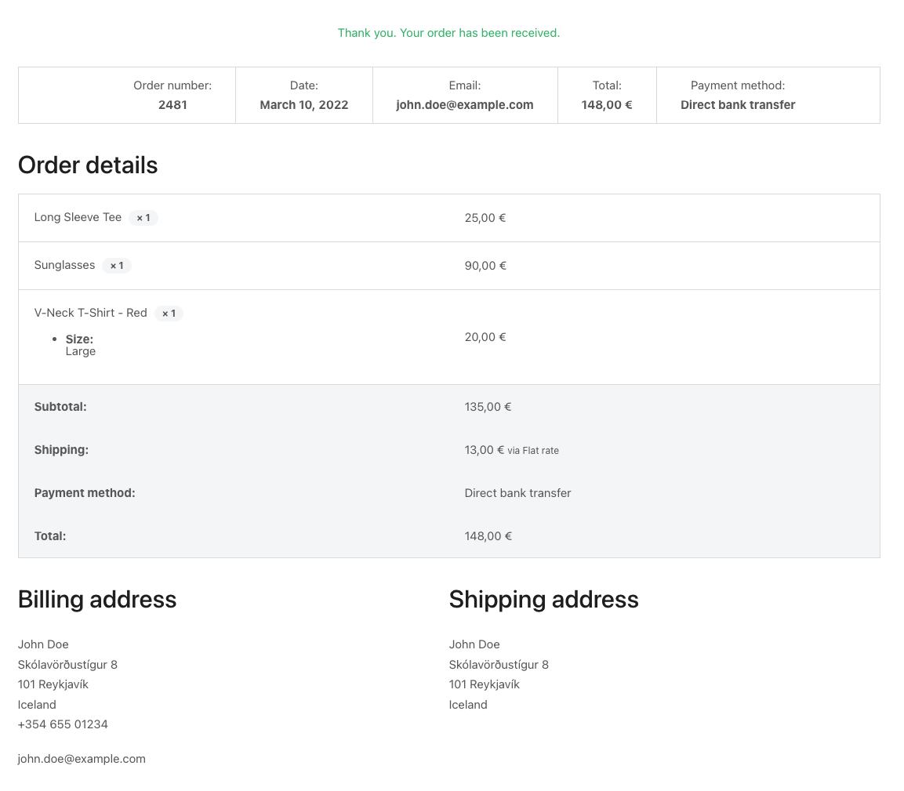
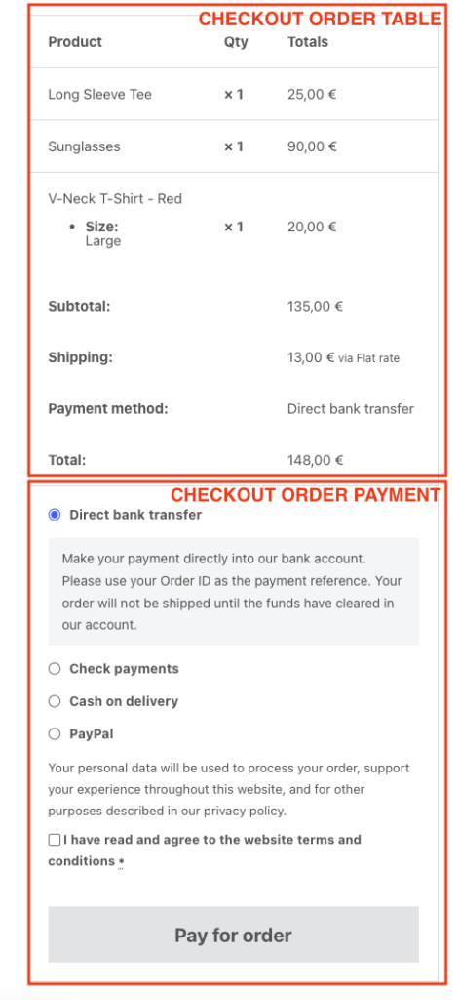
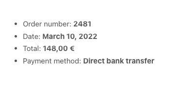
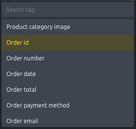

The checkout page is a special WooCommerce page, created by default during WooCommerce installation. It contains WooCommerce Checkout gutenberg blocks. Please remove all gutenberg blocks and use `[woocommerce_checkout]` instead.

Remove the Gutenberg Checkout block if it is located within your Checkout Page. Instead, replace it with \[woocommerce\_checkout\] or utilize the Shortcode element if you have edited the Checkout page with Bricks.



Bricks is only supporting `[woocommerce_checkout]` shortcode. You can either place the `[woocommerce_checkout]` shortcode directly in the Checkout page, or edit the Checkout page with Bricks, then use Shortcode element and set the content as `[woocommerce_checkout]`. Bricks offers four different template types (in this context, they are like template parts) to customize the checkout workflow:

- WooCommerce - Checkout

- WooCommerce - Thank you

- WooCommerce - Pay

- WooCommerce - Order receipt



The "WooCommerce - Checkout", "WooCommerce - Pay", "WooCommerce - Thank you", and "WooCommerce - Order receipt" template types are only visible if you have the WooCommerce plugin installed and active. These templates are used inside the WooCommerce checkout shortcode logic and **they do not support template conditions (they are automatically rendered on the correct page)**.

## Checkout template

The default checkout page consists of a two-columns layout: one column with the billing and shipping details form and another one with the order summary + a button to proceed with the order.




<figcaption>

Bricks default WooCommerce default checkout screen

</figcaption>


Use the **WooCommerce - Checkout** template type to change the appearance of this first checkout screen.

When editing this template with Bricks you’ll see two new elements (specific to this template type):



### Checkout customer details

The checkout customer details element renders the billing and shipping details form.

You'll be able to remove/hide some of the non-required fields (e.g. Company name) and style the form fields.

### Checkout order review

The checkout order review element renders the order summary, the available payment methods, and the button to place the order. Using this element, you'll be able to style its different parts.

### Remove the checkout coupon form

If you have enabled the use of coupons in the WooCommerce general settings you'll notice a blue coupon form on the top of the checkout form page. If you want to remove this form from the checkout page you may hide it using custom CSS or adding the following code to your child theme:

```php
remove_action( 'woocommerce_before_checkout_form', 'woocommerce_checkout_coupon_form', 10 );
```

### Checkout Coupon & Checkout Login elements

Starting at version 1.11.1 you have greater control over the location and design of the checkout coupon & login by enabling and using the following two checkout elements:

- [Checkout Coupon element](https://academy.bricksbuilder.io/article/element-checkout-coupon/)

- [Checkout Login element](https://academy.bricksbuilder.io/article/element-checkout-login/)

## Thank you template

After placing an order, and depending on the payment workflow, you'll get to the "Thank you" screen.




<figcaption>

The Bricks default **Thank You** screen

</figcaption>


To style this screen, you'd create a Bricks template of type **WooCommerce - Thank you**. And insert the **Checkout Thank You** element to customize the thank you message, and modify the styles of the different components of the order details.

## Pay template

For the situation where the visitor gets a link to pay for an unpaid order, there's a special checkout screen that contains the order summary, the available payment gateways, and the button to pay for the order.




<figcaption>

Default pay form screen with the representation of the Bricks elements

</figcaption>


If you would like to customize this screen you'd need to add a **WooCommerce - Pay** template type where you'll have access to two new elements: the **Checkout order table** and the **Checkout order payment** both with style controls to customize the look and feel.

## Order receipt

For the situation where the visitor gets a link to the unpaid order receipt, the checkout workflow triggers the `checkout/order-receipt.php` template, which by default will look like this:



If you would like to customize this template you could add the Bricks **WooCommerce - Order receipt** template type and inside the builder, you'll have access to the order-specific Dynamic Data tags such as:



`{woo_order_id}` - Returns the order id  
`{woo_order_number}` - Returns the order number  
`{woo_order_date}` - Returns the order date  
`{woo_order_total}` - Returns the order total  
`{woo_order_payment_title}` - Returns the order payment method name  
`{woo_order_email}` - Returns the email address registered with the order

**NOTE:** These Dynamic Data tags will also work inside the **WooCommerce - Thank you** template type.
