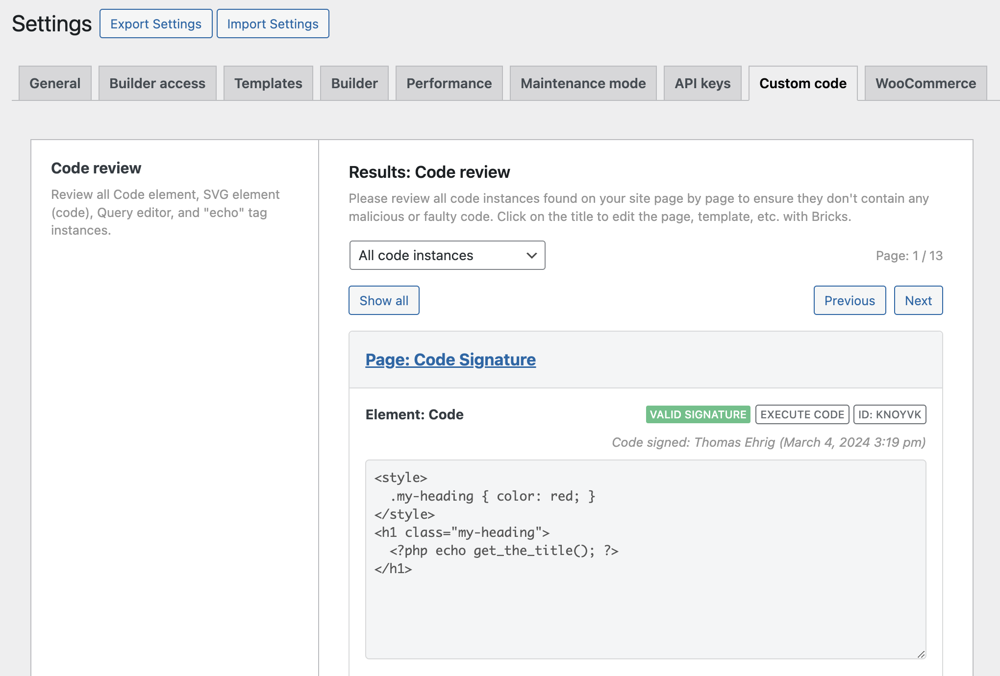

With the implementation of code signatures in Bricks 1.9.7 providing a robust mechanism to safeguard code authenticity, another new key feature to further improve the security management of your Bricks site is the "Code review".

The "Code review" gives you a thorough overview of all custom and executable PHP code added to your site through Bricks.

We recommend performing a code review every time before generating code signatures globally via the Bricks settings.

You can access and start a "Code review" under `Bricks > Settings > Custom code` by clicking the "Start: Code review" button.

<figcaption>

Code review results

</figcaption>

## Core functionalities

**Review executable code & functions:** The code review displays all instances of executable code in Code elements, SVG elements (source: code), Query editor instances, and all functions called through `echo:` tags.

**Quickly locate code:** View and edit the specific page or template where each code instance is located, along with the element's ID, and if contains a valid, invalid or no code signature. And the user who last signed the code.

**Lists all echo function names in use:** At the bottom of the code review results, you'll find a code snippet for the new Bricks filter `bricks/code/echo_function_names`, which you can copy & paste into your Bricks child theme `functions.php` file in order to use those functions in your dynamic `echo` tag. For more details about using the `echo` tag in Bricks 1.9.7+, please visit [https://academy.bricksbuilder.io/article/filter-bricks-code-echo\_function\_names/](https://academy.bricksbuilder.io/article/filter-bricks-code-echo_function_names/)

## Advantages of centralized code monitoring

- **Centralized code oversight:** Offering one page to review all the Bricks-added PHP code on your site, this feature makes it easy to ensure that all code added through Bricks elements to your website is legitimate and safe.

- **Proactive security:** The new code review feature empowers you to identify and rectify potential exploitations preemptively by providing an overview of all code elements.
