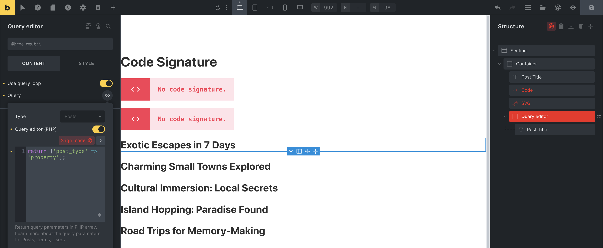
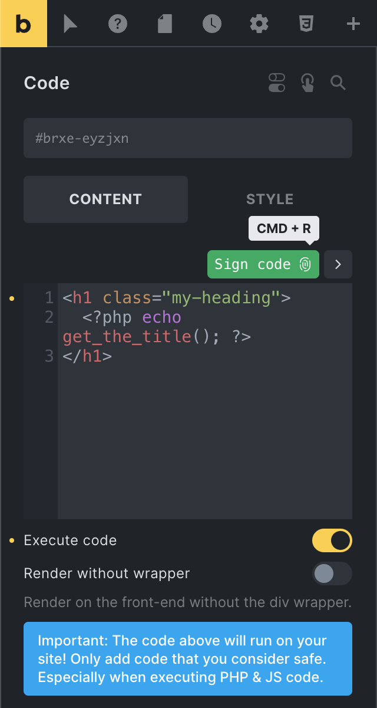
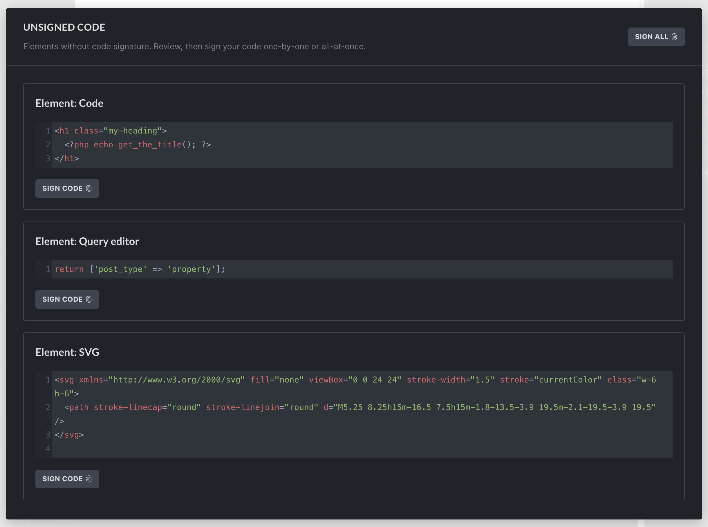

With the release of version 1.9.7, Bricks takes another significant step to enhance the built-in code security by introducing code signatures.

Code signatures ensure that the code you are running has not been tampered with. Valid code signatures are now mandatory. Any code without a valid signature won't run.

## Elements that require code signatures

The following elements require valid code signatures to run:

- Code element with "Code execution" enabled

- SVG element with "Source" set to "Code"

- Query loop editor

## How to generate code signatures

You can generate code signatures for individual elements when editing them in the builder, for the entire page inside the builder, or globally via the Bricks settings. Let's explore all options together.

### Generate code signatures in the builder

Inside the builder, all elements with unsigned code are highlighted in red. You'll also see a red "fingerprint" icon at the top of the structure panel.




<figcaption>

Builder: Code, SVG, and Query editor with unsigned code

</figcaption>


#### Sign code for an individual element



To generate a code signature for an individual element while you edit it, you can click the "Sign code" button right above the code editor. Or, if your cursor focus is inside the code editor, use the "CMD/CRTL + R" keyboard shortcut.

### View & sign unsigned code in bulk

You can also view and sign all elements with unsigned code on the current page by clicking the "fingerprint" icon at the top of the structure panel. The same icon is also available on individual unsigned elements in the structure panel.



### Sign all code globally via Bricks settings

To generate code signatures for your entire site, navigate to `Bricks > Settings` > Custom code > Code signature in your WordPress dashboard.

Click the `Regenerate code signatures` button. This will generate code signatures for all pages, templates, etc., built with Bricks.

This feature is only available when code execution is enabled and for users with code execution capability.

## Locking code signature generation

In Bricks 1.11.1, we introduced the `BRICKS_LOCK_CODE_SIGNATURES` constant, an additional layer of control for high-security environments. When `BRICKS_LOCK_CODE_SIGNATURES` is set to `true`, Bricks prevents any new code signatures from being generated, regardless of user permissions. This feature is especially useful if you want to lock down the ability to modify code signatures after initial development is complete.

To enable this lock, add the following line to your `functions.php` file:

```php
if ( ! defined( 'BRICKS_LOCK_CODE_SIGNATURES' ) ) {
    define( 'BRICKS_LOCK_CODE_SIGNATURES', true );
}
```

With this constant set to `true`, any attempt to generate new code signatures will be blocked. This constant provides an alternative to the Bricks settings for managing code signature access in production environments where strict security is essential.

## When to regenerate signatures

**When updating Bricks from a version before 1.9.7, generating code signatures via `Bricks > Settings` for your code to execute is mandatory, as only code with a valid signature will be executed. Please make sure to first perform a "Code review" on the same page**.

**After changing your WordPress salt (secret keys):** Whenever the salts in `wp-config.php` are changed, you have to regenerate code signatures.

**After site migration:** When moving your site to a new domain or server, you might need to regenerate signatures if the salts in the new environment are different.

## Why code signatures?

Before explaining the rationale behind introducing code signatures in Bricks and how Bricks uses them, it's important to understand how hashing works and the specific role of WordPress salts in this process.

### Understanding WordPress salts

In the context of WordPress, salts are essentially random strings that serve as keys for cryptographic operations.

These strings, stored in the `wp-config.php` file, are crucial for operations like keyed hashing and encryption. Salts add an extra layer of security by ensuring that the hash signatures generated for your site's code are unique and securely encrypted.

In simpler terms, think of WordPress salts as a secret ingredient in your website's recipe, stored in the `wp-config.php` file. Just like a secret ingredient can uniquely identify a dish, these salts ensure the uniqueness of your website's code.

When the code is prepared (or hashed) with this secret ingredient, it creates a signature that's unique to your site.

If someone tries to replicate or alter your website's code without knowing the secret ingredient, their version won't have the same signature, making it easy to spot and reject the change.

### Understanding the `wp_hash` function

For hashing, Bricks utilizes the WordPress-native `[wp_hash](https://developer.wordpress.org/reference/functions/wp_hash/)` function, which uses an HMAC-MD5 algorithm to generate unique hash signatures.

This function combines your site’s data with its unique salts, creating a hash signature that is distinctive to your site.

### Bricks code integrity verification process

In Bricks, these hash signatures are important in ensuring that any modifications to the code on your site can only be made with access to these unique salts and code execution capability in Bricks.

Here's a brief overview of how this process works:

1. **Code and signature generation:** When you sign your code, a unique hash signature is generated using your site's unique WordPress salts.

3. **Code retrieval for execution:** When the code is accessed on your site, Bricks retrieves the code and its stored hash signature from the database.

5. **Verification process:** Bricks re-hashes the retrieved code and compares this new hash with the original stored signature.

7. **Execution decision:** If the hashes match, it confirms the code's integrity, allowing it to execute. A mismatch indicates potential unauthorized changes, preventing execution.

The integration of `Code signatures` & `Code review` in Bricks 1.9.7 marks a significant advancement in our commitment to enhancing the security and integrity of websites built with Bricks.

Collectively, these enhancements provide a comprehensive framework for ensuring the security and authenticity of your site's code. Helping you safeguard against potential unauthorized modifications and maintain the overall health and safety of your WordPress site.

## Why rotating WordPress salts regularly is a bad idea

If you rotate the salts in your `wp-config.php` file, all existing Bricks code signatures will become invalid. You’ll need to manually regenerate them from **Bricks Settings > Custom code > Code signatures** for any signed code to run again. If you're wondering why we don’t automate signature regeneration, read [the next section](#no-automatic-code-signing).

Some plugins offer automatic salt rotation with the claim that it makes cracking passwords harder. That claim is incorrect. WordPress salts are not used for hashing user passwords. Rotating them provides no added protection against password theft or brute-force attacks.

What salt rotation _does_ cause:

- Logs out all users by invalidating authentication cookies

- Breaks nonces, which can disrupt form submissions and AJAX requests

- Can break plugins that use salts for encryption or data integrity

- Invalidates all code signatures

Unless your site has been compromised, there’s no practical reason to rotate salts. It introduces unnecessary breakage and instability.

## Why can’t code be automatically signed?

Bricks requires **manual code signing** to prevent a bad situation from becoming much worse in the event of a breach.

Here’s the risk: If someone gains access to your database (e.g. through a plugin vulnerability or compromised credentials _of a user without code execution capability_), they could inject malicious code into a Bricks element. That’s already a serious breach, but it _doesn’t_ mean they have full control of your server.

Because Bricks uses code signatures tied to your site’s unique WordPress salts, that attacker can’t make the code executable by only having access to the database. It remains unsigned, and Bricks blocks it from running.

However, if code were automatically signed just because a logged-in user with code execution capability opens the builder, that entire protection would collapse. The attacker could plant malicious code in the database and wait. As soon as you load the builder, the code would be auto-signed and run the code on your behalf, _without you even seeing it_.

Manual signing forces a checkpoint. The code shows up as unsigned (red), so you have a chance to review and decide whether it should be trusted. This step contains the impact of a partial breach and stops it from escalating into full code execution.
