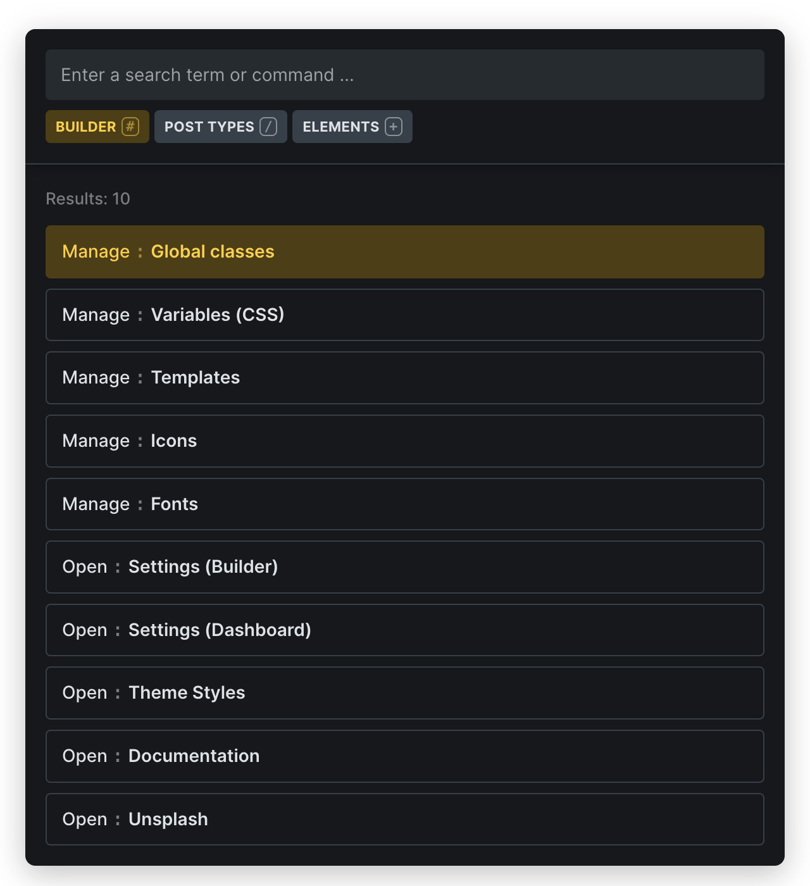
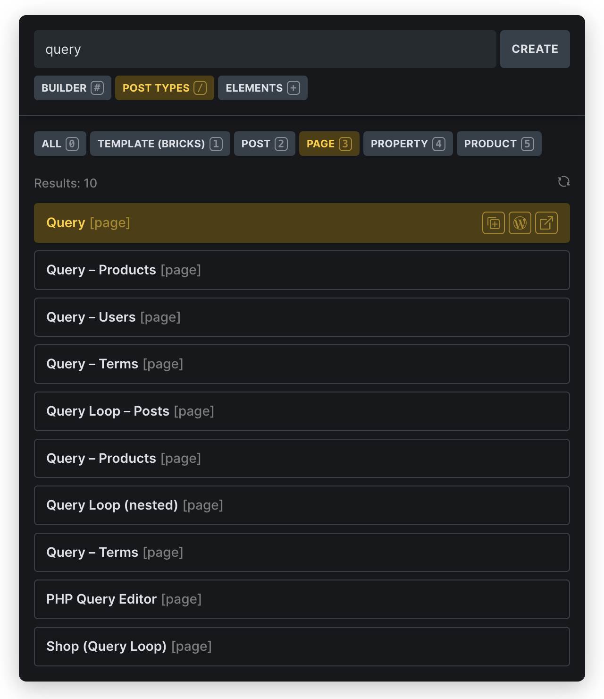
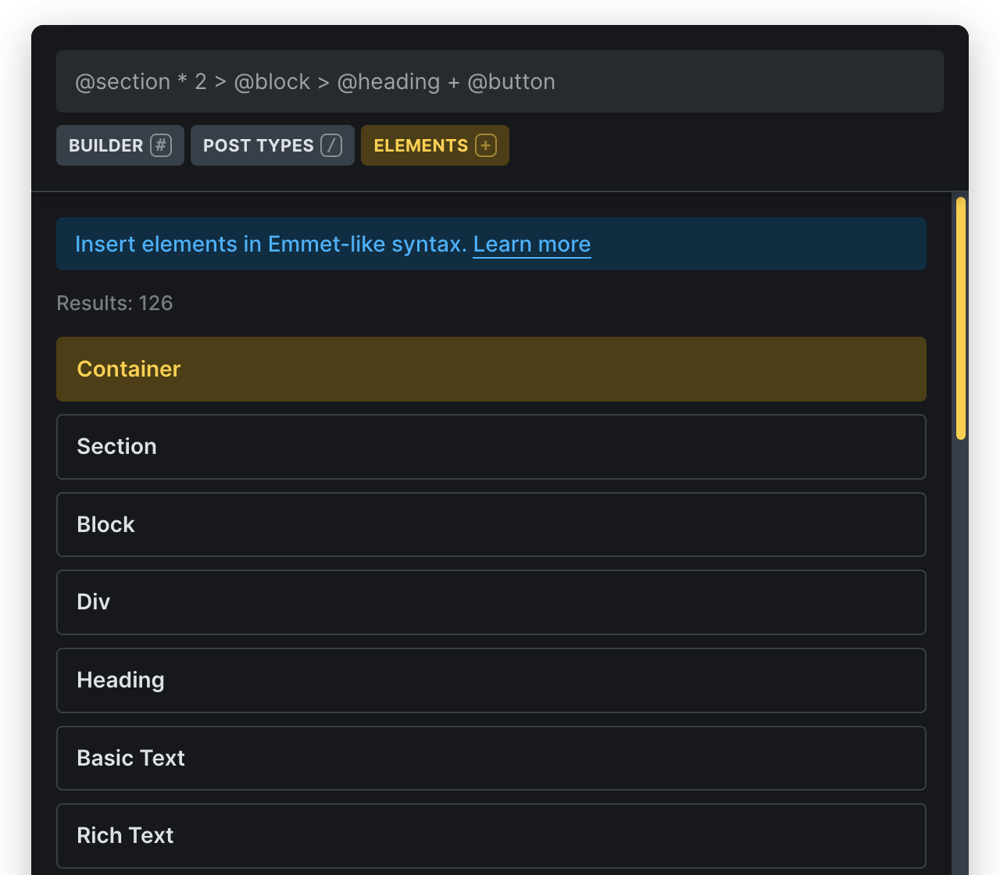
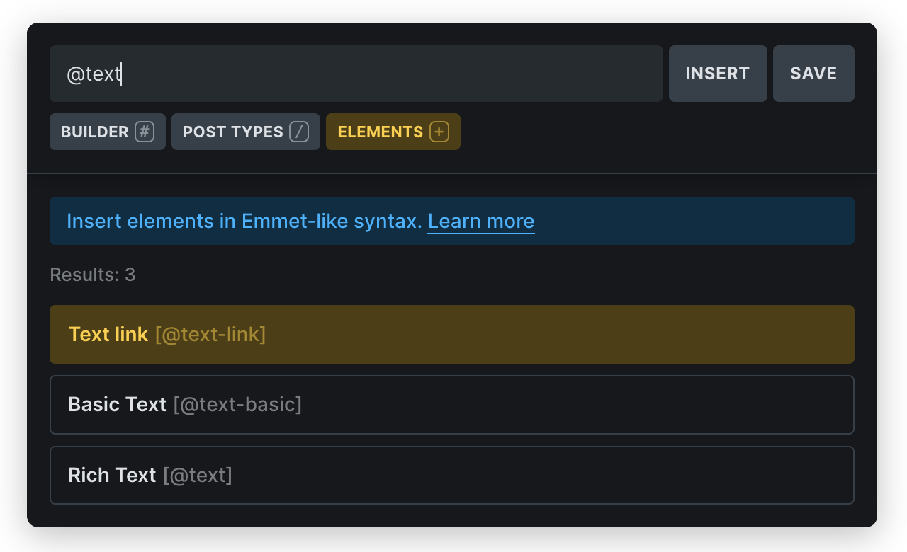
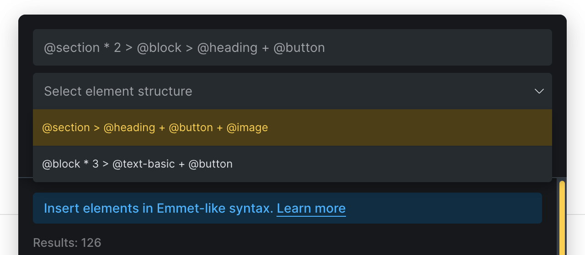

Bricks 2.0 introduces the **Command Palette**, a powerful new feature that gives you instant keyboard-driven access to core functionality inside the builder.

## How to launch It

Click the command `⌘` icon in the builder toolbar or use the `CMD/CTRL + K` keyboard shortcut to open the Command Palette, which appears as an overlay, allowing you to type and filter commands across three distinct scopes.

## **Scope**: **Builder**

Navigate to key parts of the builder from a growing list of targets such as classes, variables, templates, theme styles, settings, etc.

## Scope: **Post Types**

This scope lets browse all registered post types, create new posts or duplicate any existing post.

The scope auto-selects the post type that you are currently editing. So if are editing a Bricks template the "Template (Bricks)" post type will be selected. If you edit a "Page", then "Page" is selected and so on.

## **Scope**: **Elements**

The "Elements" scope will dramatically speed up your workflow by allowing you to insert multiple elements with specific structure in a single action.

By mastering the Emmet-like syntax, you can create complex layouts in seconds rather than minutes, making your design process significantly more efficient.

With practice, this feature becomes second nature and an essential part of your Bricks Builder toolkit, especially for quickly creating common page structures and element combinations that you use frequently, which you can also save for instant access to use whenever needed.

### Insert single element

To insert a single element simple type its name, such as "Section", then `ARROW`\-navigate to it in the elements list, and insert it by pressing `ENTER` or just click on the element name.

### Insert element structure

Each element starts with an **@** symbol.

The element name that the command bar requires is displayed in square brackets in the results list:

<figcaption>

Text link element command: `@text-link`

</figcaption>

### Supported operators

Use the following opeators to define nested structure, siblings or a multiplier.

| Symbol | Meaning |
| --- | --- |
| `@` | Bricks element name (e.g. `@heading`) |
| `>` | Nest inside |
| `+` | Insert element as sibling |
| \* | How often to insert the element |

### Element structure example

`@section * 2 > @heading + @text + @button`  
This creates the following structure _(two times because of the multiplier: `* 2`)_:

- `Section`  
     └ `Container`  
       ├ `Heading`  
       ├ `Text`  
       └ `Button`

### Quick element insertion

After selecting an element from the search results, its name is added to your query with the `@` prefix, allowing you to quickly build complex queries:

1. Type `@` to activate insertion mode

3. Select an element (e.g., "section")

5. Type `>` for a child element

7. Continue building your structure

9. Click your element structture
    - Click the "Insert" button that appears next to your query
    
    - Press `CMD/CTRL + ENTER`

### Save element structures

Instead of typing out your favorite structures by hand every time can just save them by clicking the "Save" button next to the command bar. Your structures are stored in `localStorage`, so every user on your site can have it own set of their favorite structures.

<figcaption>

List of saved element structures

</figcaption>

To delete a structure, mouseover the structure item in the list, and click the "Delete" icon.

## Keyboard shortcuts

| **Keyboard shortcut** | **Action** |
| --- | --- |
| `CMD/CTRL + K` | Open/close the command palette |
| `ESC` | Navigate to a specific post type |
| `TAB > ENTER` (to enter selected scope) | Navigate between search and scopes |
| `#` (as the first character in the search input) | Enter scope “Builder” |
| `/` (as the first character in the search input) | Enter scope “Post Types” |
| `+` or `@` (as the first character in the search input) | Enter scope “Elements” |
| `/0-9` (forward slash followed by number) | Navigate to a specific post type |
| `ARROW UP/DOWN` + ENTER | Navigate to a search result and open it |

## Notes

Bricks remembers your last selected scope, even after builder reload (stored in your localStorage).

The "Pages" panel has been deprecated as all its functionality is now available in the Command Palette.

The "Docs" icon disappeared from the toolbar as well, but is still accessible from the "Builder" scope.
