Components let you create reusable elements. Each component instance can is be customized through properties.

While templates serve as the blueprint for specific pages, components are the blueprints for a specific element (i.e. button) or collection of elements (i.e. a card) that you can reuse and customize per instance throughout your website.

Create a component from an element (including all its children) such as a button, card, navigation, or even an entire hero section, and reuse it anywhere else on your site.

Any change to the main component automatically applies to every instance of this component.

This keeps the structure and style of those reusable elements consistent throughout your website.

Resulting in an extremely consistent, scalable, and easy to maintain workflow. 🚀

https://www.youtube.com/watch?v=nNvcrK-vDDs

## How to create a component

Create a component from any element, except Template & Filter elements, by right-clicking on the element, and select the `Save as component` action.

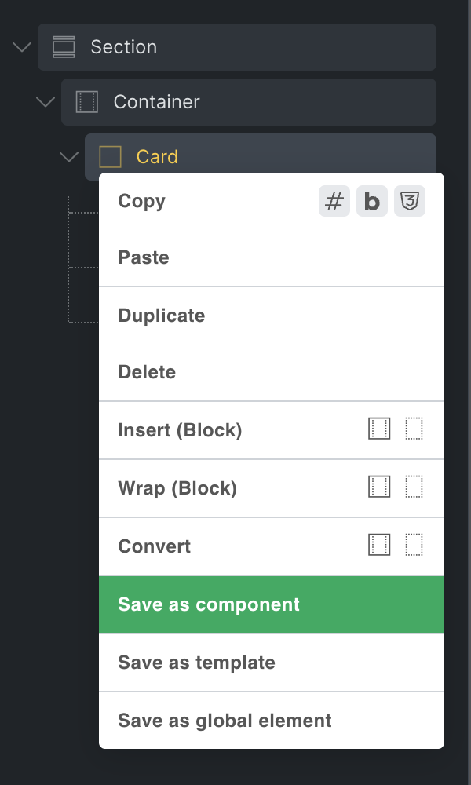

In the popup that appears, enter a name (required), category (optional), and description (optional) for your new component. Once done, click `Create` to finish creating your component.

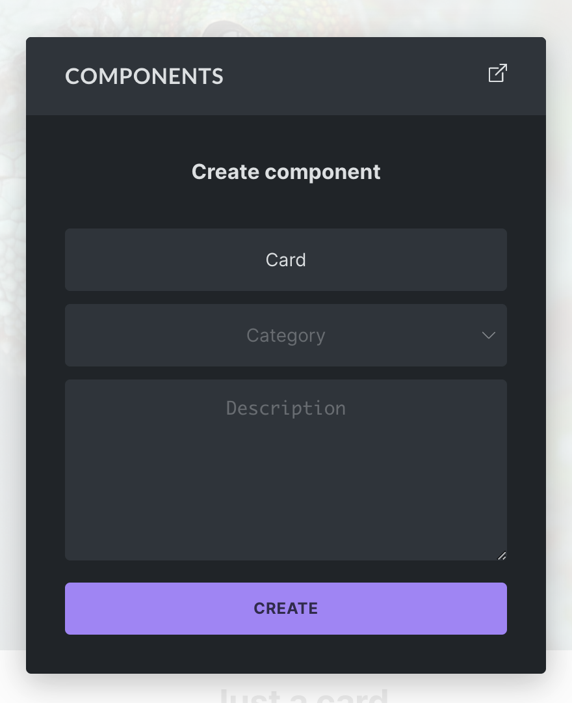

Once created, you can components anywhere on your site from the components library.

## Components Library

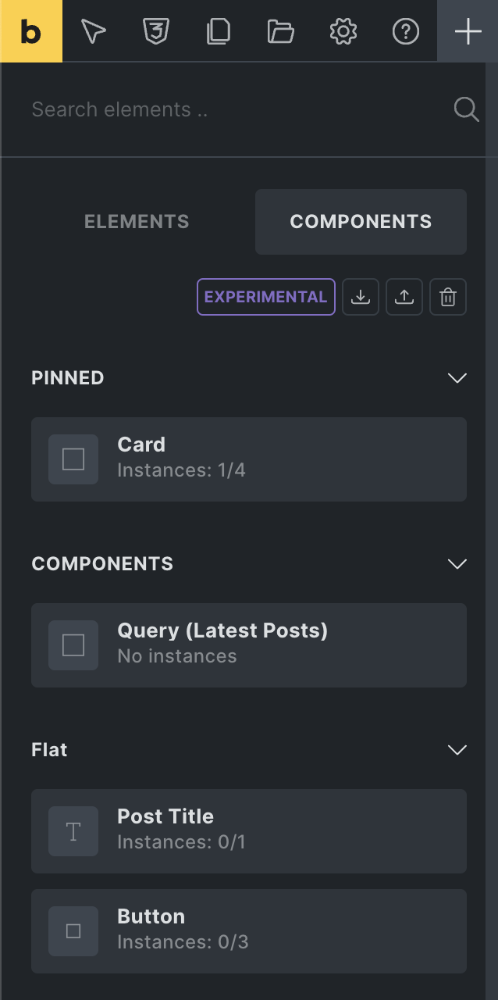

You can access your components from the `Components` tab, located next to the `Elements` panel tab.

From here you can add a component to the canvas or structure panel via drag & drop or click (same as any other element).

You can perform the following actions by clicking the respective icons at the top of the `Components` tab:

- **Import:** Import a components JSON file from another installation.

- **Export:** Export all components of your site as a JSON file. To export a specific component, hover over it, and click the "export" action icon.

- **Delete:** Click the "delete" icon to enter the delete mode. Once activated, hover over the component you want to delete, and click the "delete" icon. We recommend to first export all components before performing any deletion.

### Instance count & location (current page/global)

Below the name of the component is the instance count. For our "Card" component it says "Instances: 3/6". The first number (3) is the instance count of the page you are currently editing, and the second number (6) is the total instance count global/site-wide.

Hover over the component, and clicking the "globe" icon shows you all instances of this component on the "Current page", and a list with count of all the "Other Pages" on which this component is being used.

## Instances - How to reuse a component

Every time you add a component to a page, a so-called `Instance` of that component is created.

Changes to the main component automatically reflect in all instances of this component throughout your entire website.

The following screenshot shows three instances of our Card component:

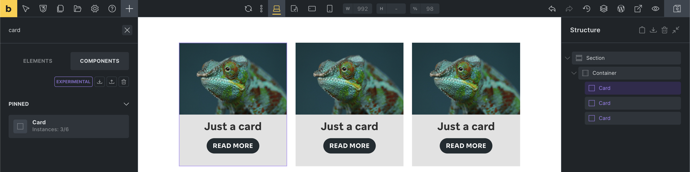

Before we explore customizing our instances, let's have a look at ...

## Editing the main component

To view and edit the elements of the main component, which is the source of truth for all its instances, right-click on any instance (purple) and select `Edit component`.

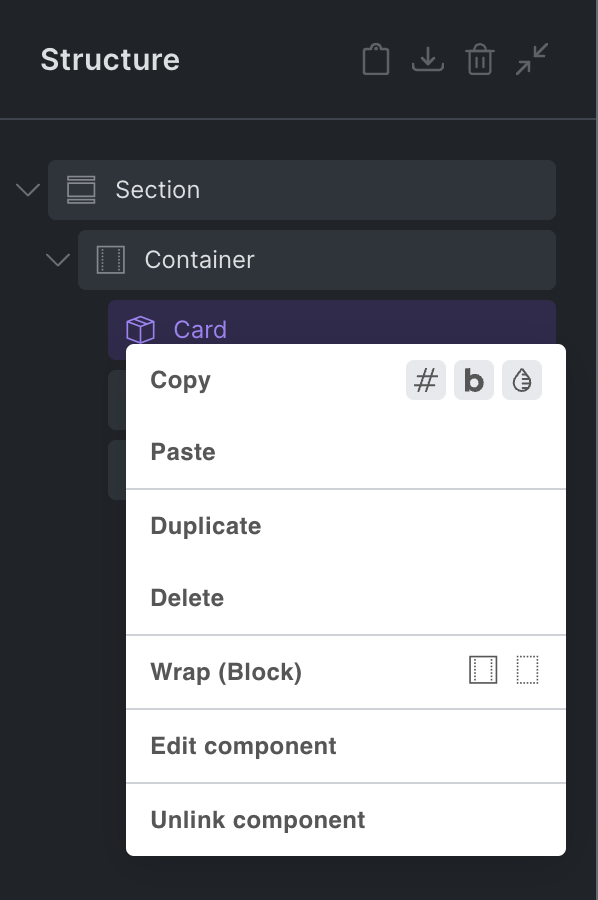

Alternatively, you can also click the gear icon in the control panel header of the instance to enter the component editing mode:

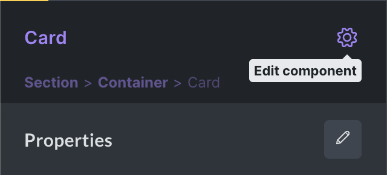

**You are now editing the main component** indicated by the purple color in the control panel header.

As mentioned before, any change you perform on the main component applies to all instances of this component on your site.

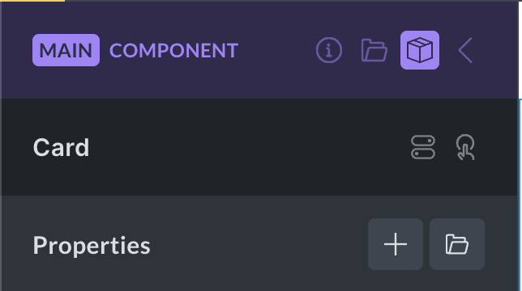

The main component header contains the following actions:

- **Description** (info icon): Click to show/hide the component description (editable).

- **Category** (folder icon): Click to show/hide the component category (editable).

- **Properties** (box icon): Click to view the component properties panel.

- **Instance** (arrow icon): Exit the component edit mode, and go back to the instance you were editing before or the components panel. Pressing the ESCAPE key also exists the main component.

Now that you are editing the main component you can see and edit all elements of this component in the structure panel:

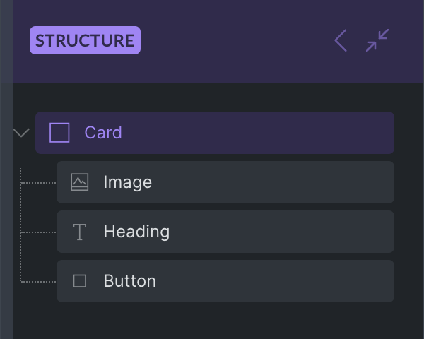

To edit the title of our Card component, select the Heading element inside our component, and change its text to "Just a card".

All instances of our Card component automatically reflect this change:

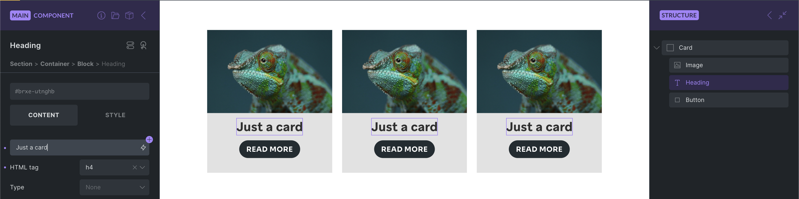

While this is great for using the exact same element multiple times throughout your site, and updating the main component automatically applies every change to all instances, the real power of components lies in their ability to customize the content of each instance through `Properties`.

## Properties

**Properties let you expose controls for customization for each instance.**

Lets create some properties so each Card instance on our website can have its own unique card title and image.

There's a simple, two-step process of (1) creating and (2) connecting properties.

**NOTE:** Creating and editing properties requires the `Edit component` [builder permission](https://academy.bricksbuilder.io/article/builder-access/#components).

### 1) Creating a property

To access the properties panel, select any instance of the component you want to edit.

Then click the "edit" icon in the properties control panel on the left-hand side:

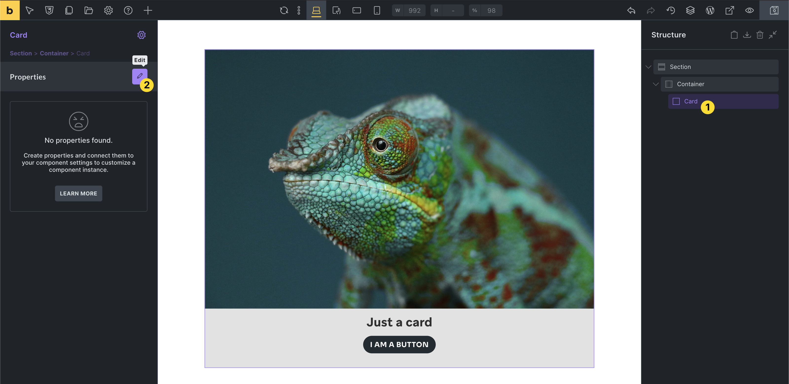

If there aren't any instances of the component you want to edit on the current page, you can go to the Components library, hover over the respective component, and click the "edit" icon.

If you are editing the main component, you can access the Properties panel by clicking the "box" icon in the panel header (highlighted in the screenshot below).

### Property types

You can choose from the following, growing variety of property types, that you can then connect to specific controls of elements inside your component:

| **Property type** | **Connectable to** | **Example** |
| --- | --- | --- |
| Text | Text/textarea controls | Heading or Basic text |
| Rich text | Rich text controls | Rich text or Accordion content |
| Icon | Icon controls | Icon or Icon Box element |
| Image | Image controls | Image or Logo element |
| Image gallery | Image gallery controls | Image gallery or Carousel element |
| Link | Link controls | Button or Heading link |
| Select _(@since 2.0)_ | Text/select controls | HTML tag, Button style |
| Toggle _(@since 2.0)_ | Toggle controls | Hide element toggle |
| Query loop | Query loop controls | Layout elements |
| Global classes _(@since 2.0)_ | Global classes control | Element global classes |

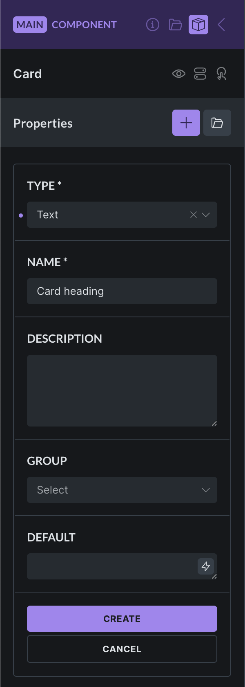

We want to expose the heading of our card component, so we select the property type `Text`.

The **property name** is mandatory. Choose a descriptive name. This is especially important for complex components with potentially dozens of different properties, so everyone working with this component knows exactly what each property is for.

Providing a **property description** is optional, but can be super helpful for anyone who will be using this component.

Selecting a **property group** is optional, but very useful for complex components with multiple properties and potentially even the same name.

The **default property value** is optional. Its used for the control you connect this property to. If left empty, no setting will be applied to the connected control by default.

### 2) Connecting a property to a control

Now that we created our first property, we have to connect it to the element control that we want to expose on the instance.

Note that the properties panel shows a message if any unconnected properties are detected.

Also, unconnected properties have a "broken link" icon next to their name.

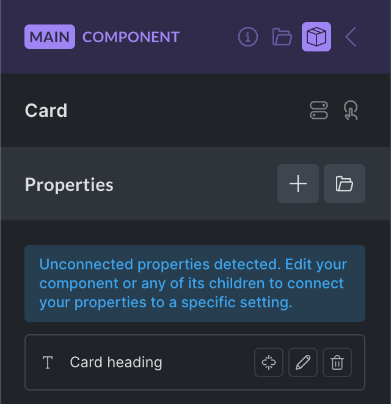

Lets connect our "Card heading" text property to the "Heading" element of our card component.

First, we select the "Heading" element inside our component.

You'll notice a round purple `+` icon next to the text control of our Heading element.

This `+` icon indicates that this control can be connected to a property.

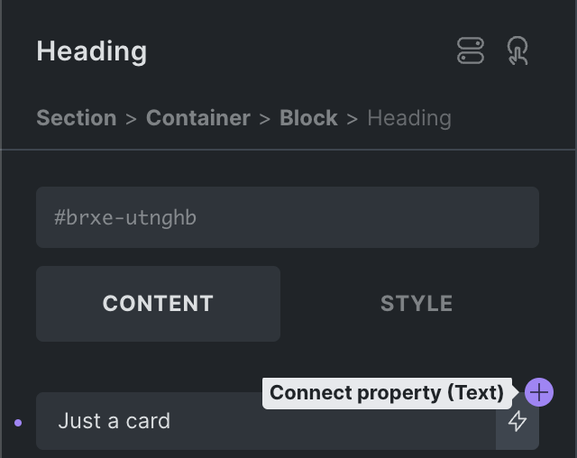

Clicking the `+` icon reveals a list of properties that we can connect to this control:

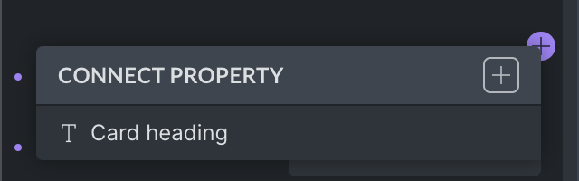

**Workflow boost:** Quickly create a new property by clicking the `+` icon, located at the top right of the "Connect property" dropdown.

We can see the "Card heading" property that we just created in the dropdown and select it.

Once selected, our Heading text control shows the name of the property that we just connected:

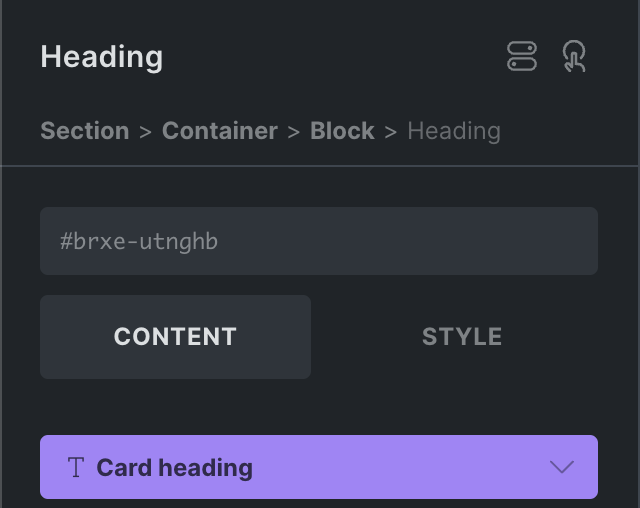

Our default property value "Default Card heading" that we set when we created this property is now used as the text value for our all our Card component headings.

And that's it. You successfully created and connected your first property. 🥳

You can continue creating and connecting as many properties as needed.

We used the same two-step process of creating & connecting for our image property so we can customize the "Card image" as well. Our component now looks like this:

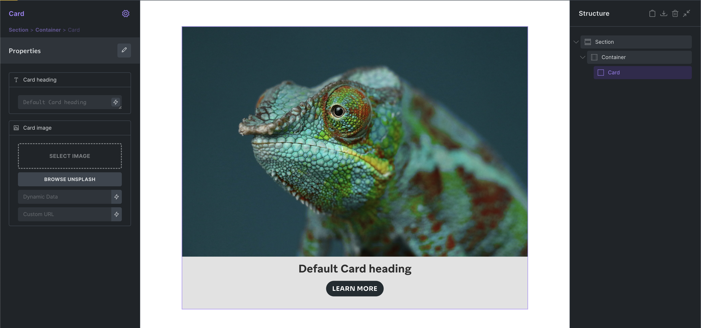

### Disconnecting a property

To disconnect a property from a settings, click the connected property setting, hover over the connected property name, and click the "unlink" icon.

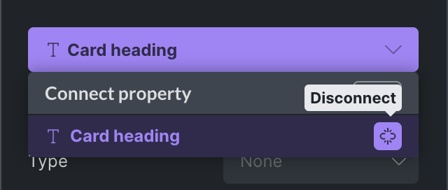

## Customizing an instance

Right now, all our Card components use the exact same content.

But we've created two properties so we can customize the title & image of each Card instance. So lets do that by selecting the Card instance that you want to customize, then set custom property values in the control panel like this:

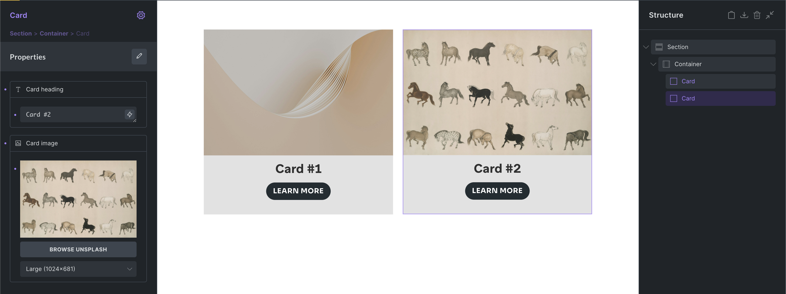

We could continue to also expose the button text through a text property, but you get the picture.

## Components as loops and inside loops

Components are also compatible with query loop. Either by enabling the loop on the component root or by having a loop inside the component.

In the following screenshot we use our Card component inside a loop. The Card title uses the `post_title` dynamic data tag and the Card image uses the `featured_image` tag to render the post title & featured image of the loop results.

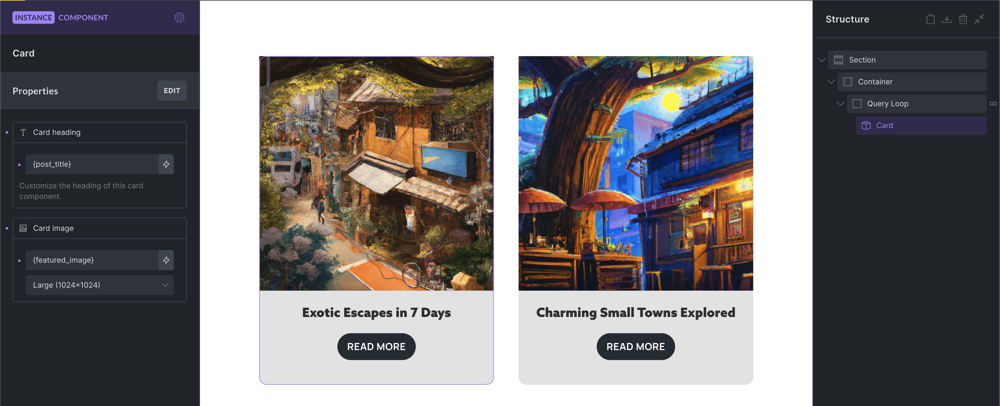

There's also a property type "Query loop" which allows you to customise your in-component query loop for every instance.

## Component variations

Starting with Bricks 2.0, you can further customize your components instance by conditionally hiding elements within a component through the `Toggle` property.

Styling variations are easy to setup through the new `Global classes` property.

Lets have a look at both approaches next.

### Variation: Show/hide elements

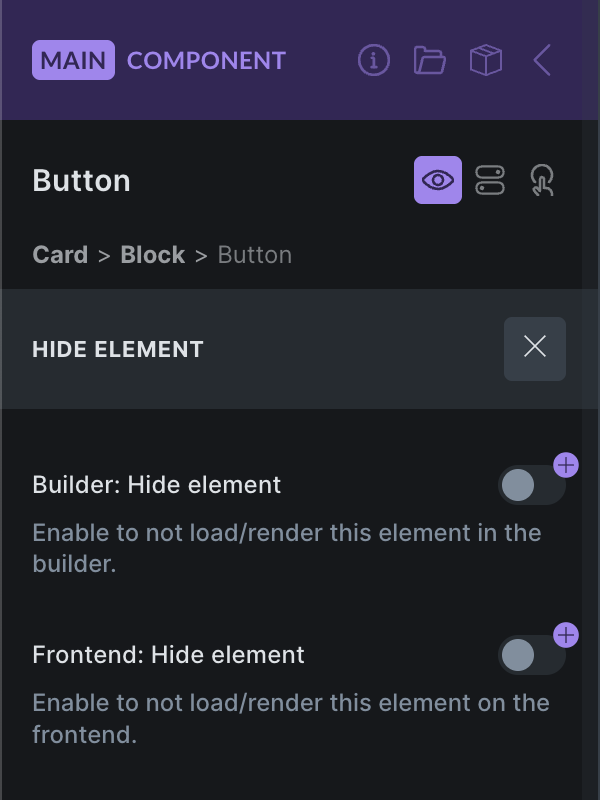

Bricks `2.0` introduces a new "Hide element" feature, available by clicking the `"eye`" icon in the element panel header, or from the context menu.

You can create a `toggle` property and connect it to the "Builder Hide element" and/or "Frontend: Hide element" toggle controls to show/hide elements inside your component on an instance-basis.

"Hide element" doesn't visually hide the element via CSS. The element is not loaded or added to the DOM at all.

### Variation: Global classes

The `Global classes` property type, available @since 2.0, lets you create different styling variations through global classes. Assign a collection of default and/or custom classes on the instance for any element of your component.

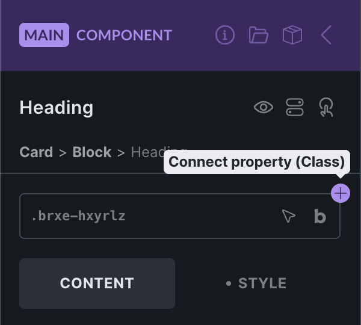

In the following example (see screenshot below) we create a global classes property with the custom options "Small", "Medium", "Large". Each option is has a different global class assigned to it. You can also assign multiple classes.

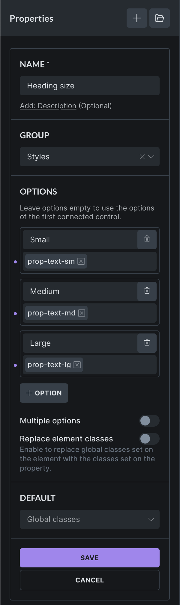

Once we have created this new "Heading size" property, we need to connect it to the global classes control of the element of our choice. For our example, we connect it to the Heading:

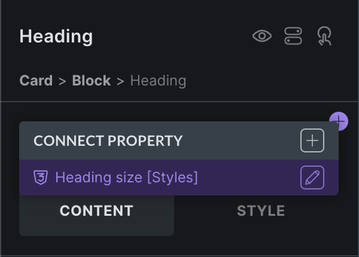

Once connected, the property becomes available on every instance. In the following screenshot we selected the "Large" option, which adds global class `prop-text-lg` to the Heading element of the instance.

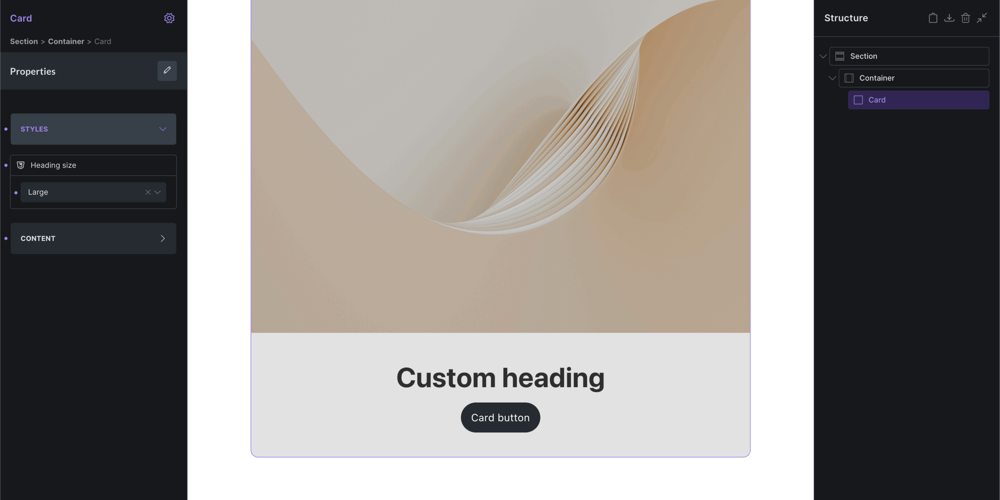

This is just a very simple example of how you can use the global classes property to create styling variations for your components.

You can connect as many global class properties to an element as needed.

When defining custom options you can leave the "Label" empty to show the selected global class names instead. User-friendly labels are usually the preferred option.

You can change the global class selection of an option any time and the newly selected global classes will be added to the instance if the corresponding option is selected.

### Variation: Local classes

If you aren't working with global classes you can utilize the "Select" property type to define custom options that your users can choose from, which then apply the class names through the "Attributes" control to an element of your component.

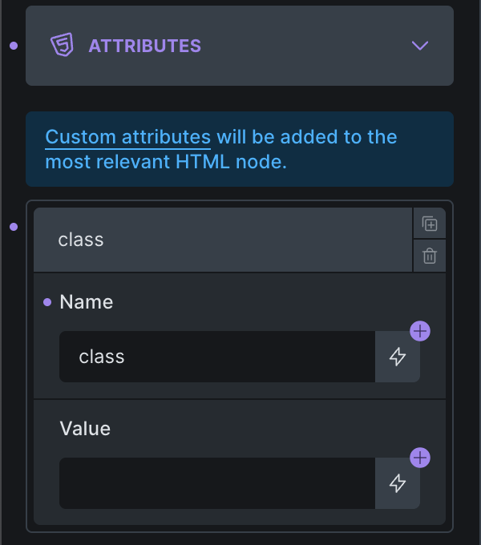

Next, lets create a "Select" property with the class name options:

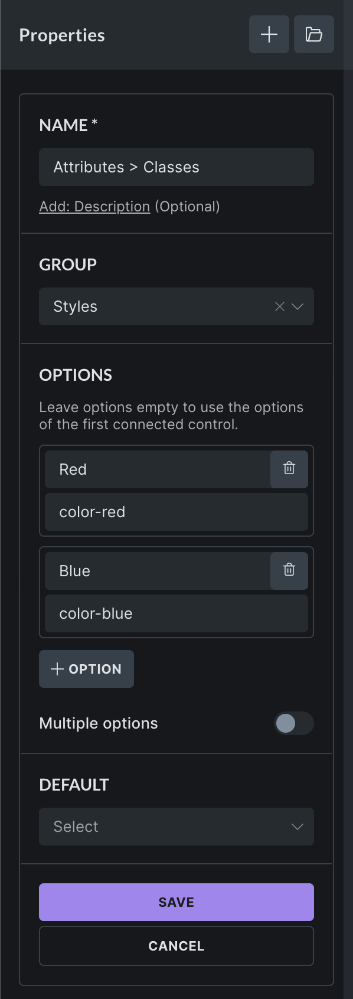

Once we created & connected this select property to the Attributes value, it'll be available on the instance, and we can apply our local class with one click like this, which add the `color-red` class to our Heading element inside the component.

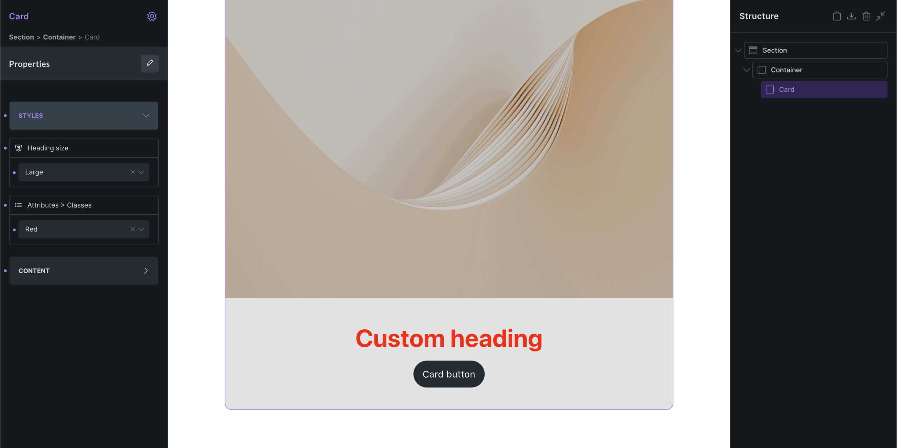

You can, of course, also connect a "Text" control to the "Attributes" value, if you want to allow users to enter the plain class names directly instead of choosing from predefined options.

## Unlinking a component

To unlink an instance from a component, right-click on the instance, and select the "Unlink component" icon under the "Edit component" menu item.

Once unlinked, this instance is no longer tied to your main component, and can be edited independently, like any other normal element.

## Global element to component converter

As global elements are officially deprecated @since 2.0, and you can't create new global elements, please use our "Global element to Component converter" available under `Bricks > Settings > General > Global elements`.

## Notes & Tips

- A component must have exactly one root element

- Components can't be created from Template or Query Filter elements

- Components are identifiable in the builder by their **purple** color

- You can change the label of each instance like any other element

- Take advantage of property descriptions & groups when working with complex property setups
