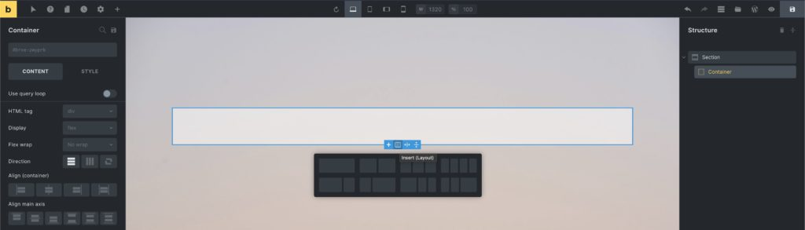
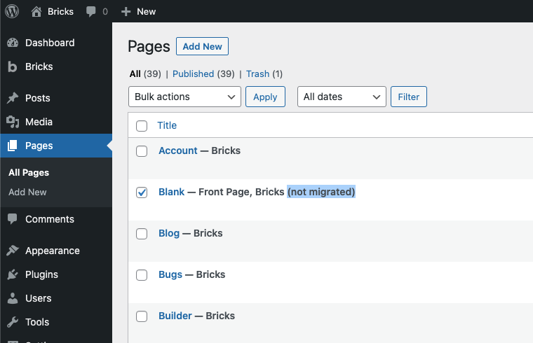
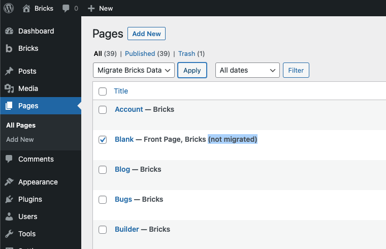
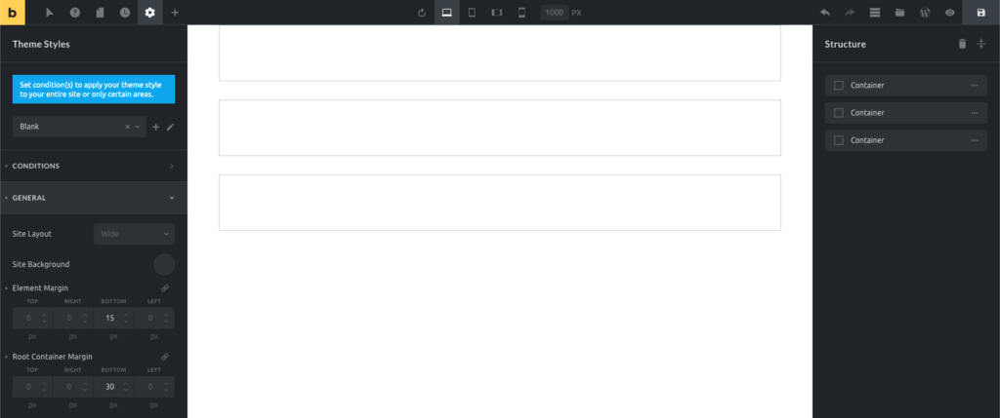

The Container element used to be the only layout element in Bricks until version 1.5. It has now been extended by the Section, Block, and Div element to provide a more maintainable & streamlined layout creation process.

The [Understanding the Layout](https://academy.bricksbuilder.io/article/layout/) article covers in more detail how to best use the layout elements in Bricks.

## How To Use The Container

The Container has a default width of 1100px, is centered, and uses the **flexbox** layout model. This provides various settings to easily direct, align, and space out the elements inside a Container.

We recommend using the Container at the root level or inside a Section.

When editing the Container, you can click the "column" layout icon on the canvas to quickly insert a pre-designed column-based layout:

**CSS grid support will be added in a future release of Bricks!**

Let's explore the container capabilities and go over a few container layout examples in the video below:

https://www.youtube.com/watch?v=\_dhKJdNNxLI

## Convert your pre-1.2 Bricks layout to Containers

If you've built your site prior to version 1.2 using the "old" section, row, and column layout, you first need to convert your data to the new container layout.

Bricks comes with a built-in **container migrator** that migrates your existing Bricks data to the new container layout with one-click. So you don't have to re-create your entire site from scratch.

As the new container layout is fully flexible and does NOT have a pre-defined concept of "sections", "rows" or "columns" you most likely have to make some manual adjustments after running the migrator.

After updating to Bricks 1.2 your old data will still be rendered on the frontend, but it's not a 100% accurate representation of your existing section layout.

Once you've updated to Bricks 1.2+, please convert your existing Bricks data as soon as possible as outlined in the step-by-step migration guide below.  
  
We highly recommend migrating your pages one by one, to ensure you don't miss reviewing any of your migrated pages.  
  
As an extra precaution, you can also clone your existing site or editing it on a staging server first, and perform the migration there (rather than on any live site).  
  
**The migrator does NOT delete any of your existing (section) Bricks data. If you feel Bricks 1.2 and the migrator are not ready for your site yet, you can always download a previous version of Bricks (like 1.1.3) from your Bricks account to roll back and continue using the section, row, column layout for now.**

https://youtu.be/3MrLHRQssrg

### STEP #1: View your un-migrated data on the post type screen

All un-migrated posts/pages/templates, etc. all marked as such by the "**(not migrated)**" label behind the title. As you can see in the screenshot below, we need to migrate a page named "Blank":

<figcaption>

Page "Blank" needs to be migrated

</figcaption>

### STEP #2: Select your page and run the migrator

Now select the page you want to migrate, click on the "Bulk actions" dropdown. Select "Migrate Bricks Data" and click "Apply" to run the migrator:

<figcaption>

Select and apply the "Migrate Bricks Data" bulk action

</figcaption>

### STEP #3: Review the migration result

To inspect the results of the one-click migrator, edit your migrated page with Bricks, and perform any necessary adjustments inside the builder. Then preview your changes on the frontend as well, to ensure your layout matches your expectations.

### Migration tips:

- Restore the default section margin-bottom of 30px under: Theme Styles > General > Root Container Margin
- Restore the default element margin-bottom of 15px under: Theme Styles > General > Element Margin

