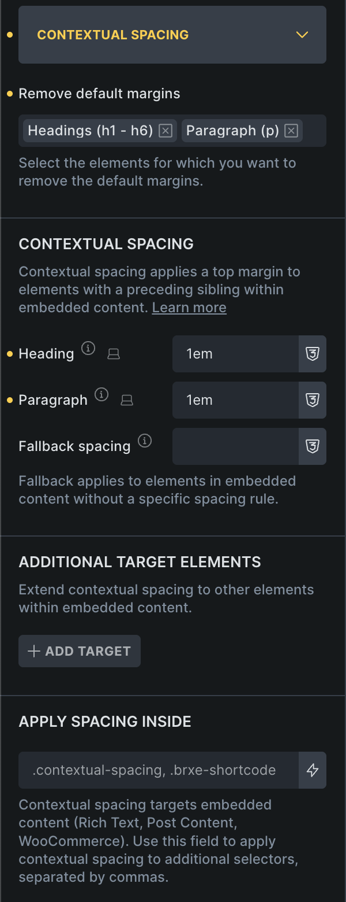
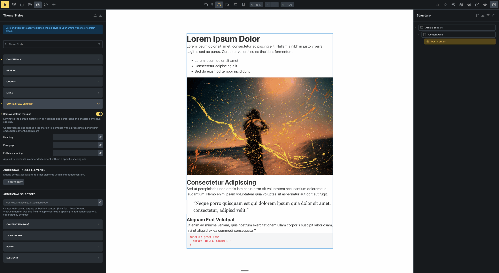
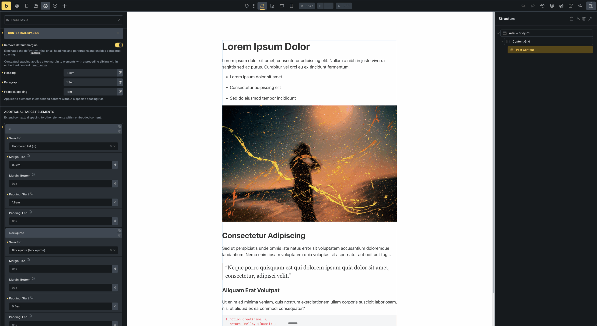
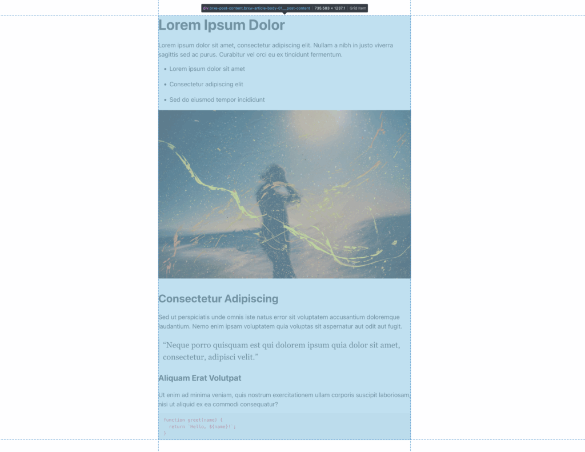
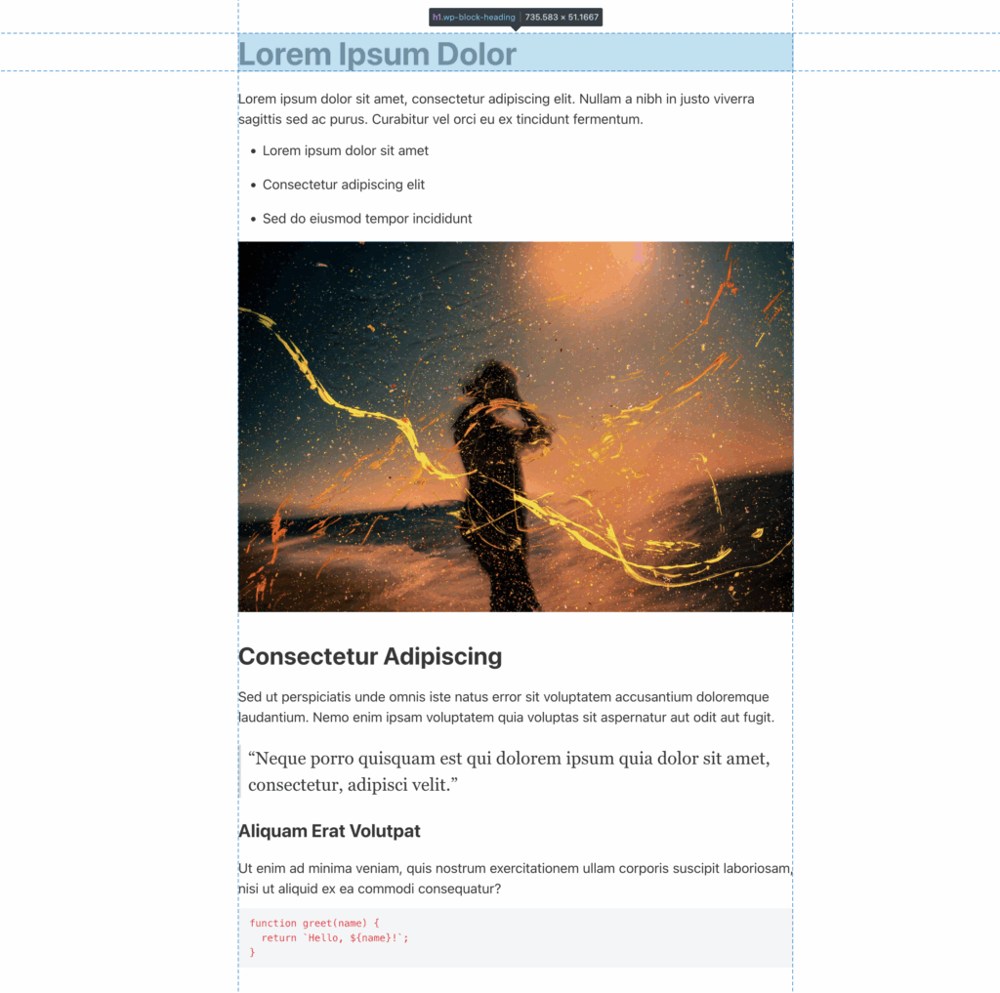
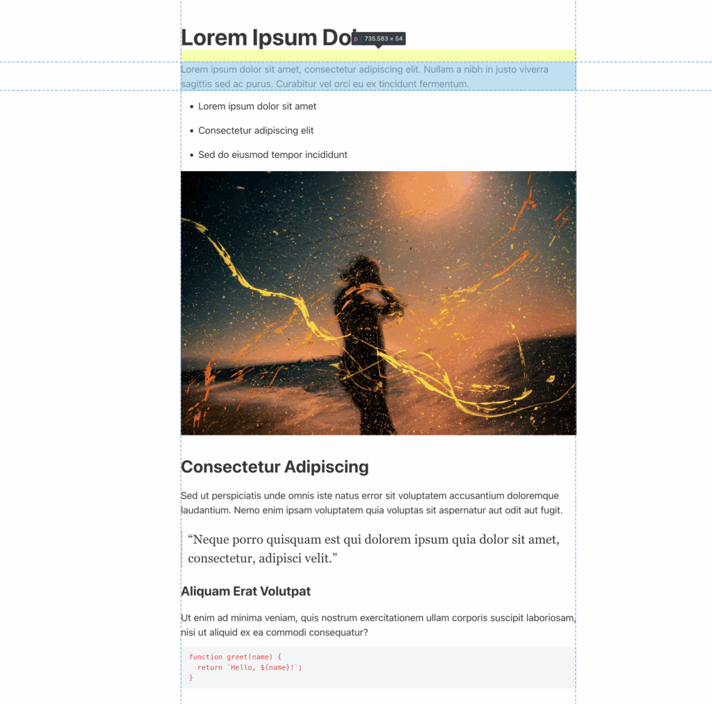
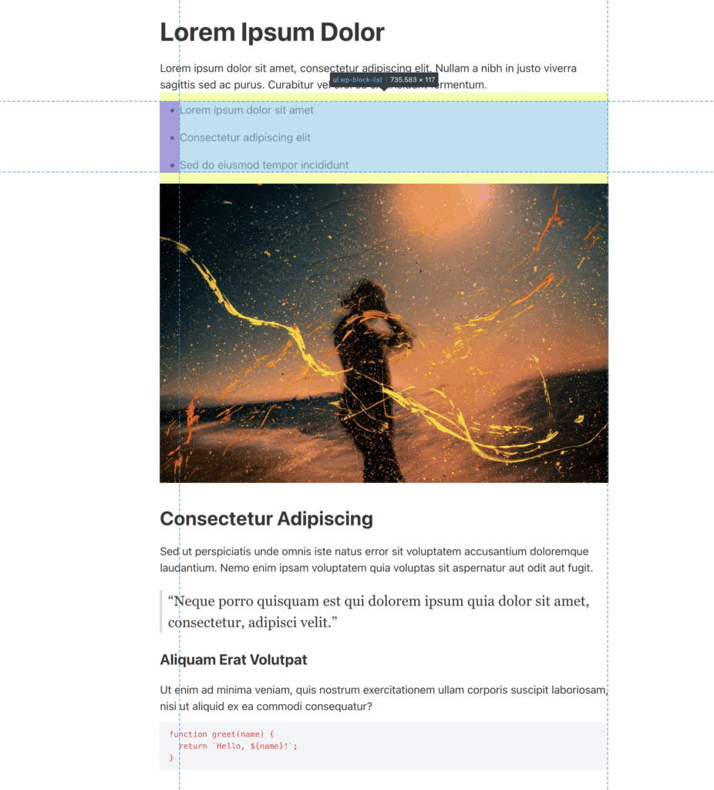
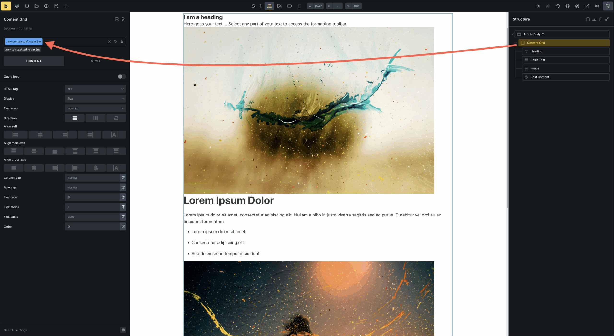
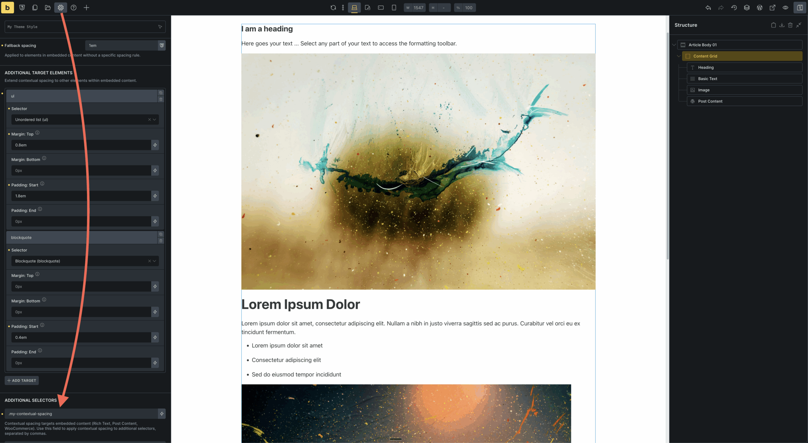

Bricks 2.0 introduces **Contextual spacing** to give you full control over vertical spacing (margin) between elements like headings, paragraphs, and lists within embedded content.

Contextual spacing automatically applies to elements within:

- Rich text element

- Post content element (source: WordPress)

- WooCommerce embedded content (excluding Checkout)

Out-of-the-box, Bricks tries to apply various top margins (`margin-block-start`) to elements like headings and paragraphs depending on their context.

If you want to override these defaults, you had to manually remove browser spacing, undo Bricks' built-in styles, and then define your own margins.

Contextual spacing simplifies this process. You can now reset easily reset those margins and visually define custom spacing rules under **[Theme Styles](https://academy.bricksbuilder.io/article/theme-styles/) **→** Contextual Spacing**.

Whether you are styling embedded content, working with dynamic layouts, or creating utility-based wrappers, this feature gives you consistent and flexible control over spacing.

## How to use contextual spacing

You can enable Contextual spacing inside the builder under **Settings → Theme Styles → Contextual Spacing**.

**Remove default margins**: Lets you select the HTML tags from which you want to remove the default margins (i.e. Heading, Paragraph, Lists, etc.). This creates a clean starting point for spacing that fits your layout needs, without interference from inherited or default styles

**Contextual spacing:** Only applies margins when an element is preceded by another. This prevents extra spacing at the very top while maintaining consistent spacing between elements.

## Settings overview

| Setting | Description |
| --- | --- |
| **Remove default margins** | Resets margins on the selected or manually entered HTML tags. |
| **Heading** | Applies top margin to `h1` through `h6` elements when they are preceded by another element. |
| **Paragraph** | Applies top margin to `p` elements when they are preceded by another element. |
| **Fallback spacing** | Applied to any element that does not match a heading, paragraph, or target elements, or when those targets have no spacing value defined. |
| **Additional target elements** | Define spacing rules for elements like `ul`, `blockquote`, or any custom selector. Lets you block margin (top, bottom) and inline padding (left, right). |
| **Additional selectors** | Extend contextual spacing to other parts of your layout by targeting wrapper selectors such as `.contextual-spacing`. |

## Additional target elements

Use the **Additional target elements** repeater to extend Contextual spacing to more than headings and paragraphs.

You can choose from predefined elements:

- Unordered list (ul)

- Ordered list (ol)

- List item (li)

- Figure (figure)

- Blockquote (blockquote)

Or enter your own custom selectors like `.my-class`, `code`, or `div`.

For each, you can set:

- Top and bottom margin (`margin-block`)

- Start and end padding (`padding-inline`)

This gives you spacing consistency across all types of content.

## Apply to more content areas

By default, Contextual spacing only targets Rich Text, Post Content, and WooCommerce content. But you can easily extend it by defining **Additional selectors** to apply Contextual spacing to any wrapper of your choice, such as `.contextual-spacing, .brxe-shortcode`.

Add these utility classes to wrappers (i.e. Container, Div, Block elements) that hold a mix of content elements, and Bricks will apply your Contextual spacing settings to them.

### **Why not apply spacing to all headings and paragraphs by default?**

In most Bricks layouts, especially when using **Heading** and **Basic text** elements in combination with other elements, spacing is typically handled using the **gap** property between containers.

Because of that, applying a single spacing rule to all headings and paragraphs wouldn't make sense in every context.

Contextual spacing gives you the flexibility to apply spacing only where it's needed, using selectors and utility classes.

## Example use case 1: Embedded post content

You’re building a single post template using a **Post Content** element (source: WordPress).  
Before enabling Contextual spacing, the post displays the default spacing added by Bricks.

When **Remove default margins** is enabled, Bricks removes both its own default spacing and the browser's default margins. You can then define your own spacing values using the Contextual spacing controls.

When you enable **Remove default margins**, then set spacing values. For example:

- **Heading**: `2rem`

- **Paragraph**: `1.25rem`

- **Fallback**: `1rem`

Bricks then applies spacing only between elements where needed. The first element inside the post has no margin above it, but elements that follow each other are spaced consistently.

**Result:** Clean layout, no spacing at the top, full control over vertical rhythm.

## Example use case 2: Mixed content layout

You've created a custom template that includes a container with the following elements:

- A **Heading** element

- A **Basic text** element (with a `p` tag)

- An **Image** element (with a `figure` tag)

- A **Post Content** element (source: WordPress)

Because these use different systems for spacing, the result may feel inconsistent.

To unify the layout:

1. Under Theme Styles > Contextual Spacing > Enable **Remove default margins**

3. Set spacing values. For example:
    - Heading: `2rem`
    
    - Paragraph: `1.25rem`
    
    - Fallback: `1rem`

5. Add a global class like `.contextual-spacing` to the container

7. Enter `.contextual-spacing` under **Additional selectors**

**Result**: All elements within that wrapper now follow your contextual spacing rules.
