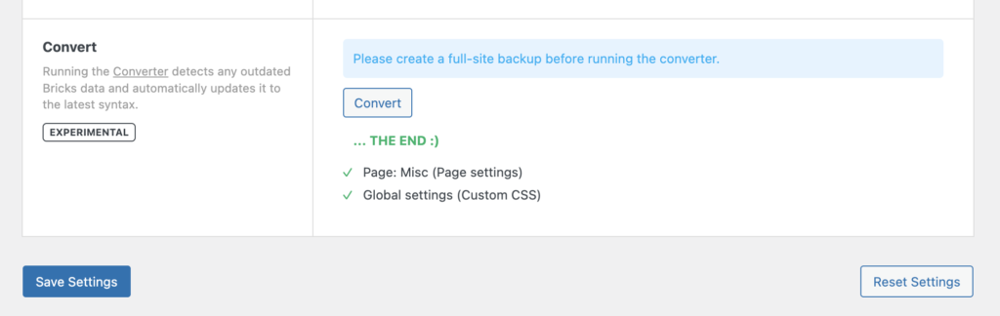

Bricks offers multiple so-called "Converter" options.

The Converter is a built-in tool that scans your database for outdated Bricks data and automatically updates it to the latest valid syntax of the installed version.

The converter performs changes to the Bricks data in your database. So please perform a full-site backup before running the converter.

To run the Converter, go to "Bricks > Settings > General" and click the "Converter" button.

Depending on your server and the size of your Bricks data, this process can take a minute or two. Please do not close or refresh the page until you see the green "THE END" success message:

<figcaption>

Converter results: Updated Page Settings & Global Custom CSS

</figcaption>

## What is being converted?

With the improved DOM structure and element ID & class names, Bricks replaced the old `bricks-element-` ID & class name prefix with a more succinct `brx-` prefix.

Running the Converter goes over the following pieces of Bricks data and does an automated "Search & Replace" of those strings for you:

- Bricks global settings

- Bricks page settings

- Bricks page data

- Global elements

- Bricks templates

**You shouldn't have to run the Converter if you aren't using any custom CSS/JS.**
