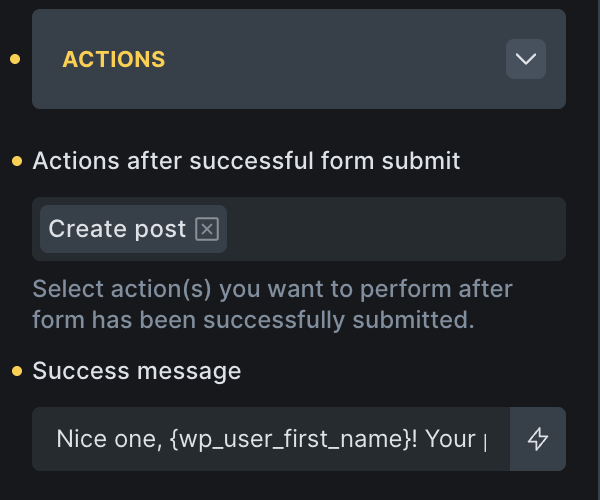
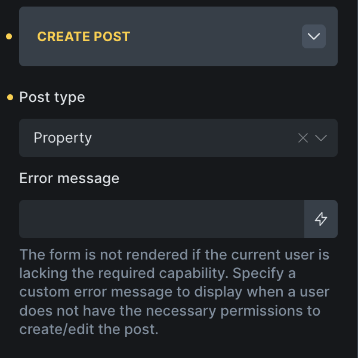
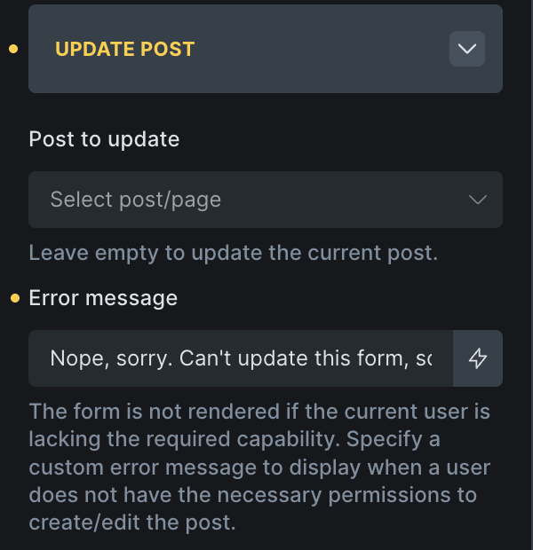
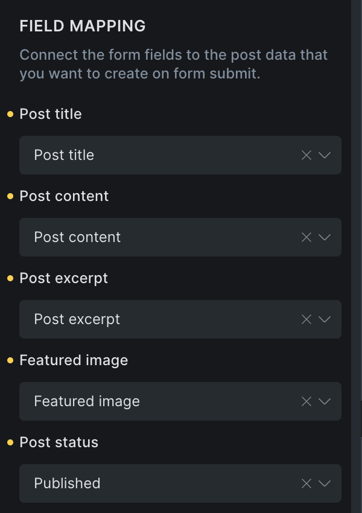
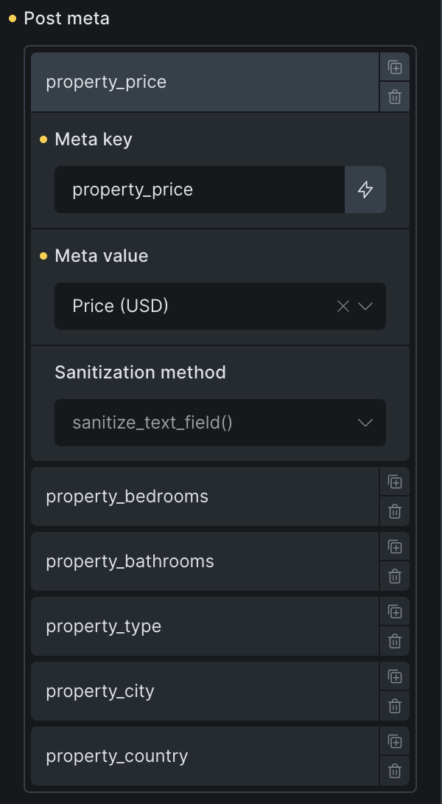

Bricks 2.1 introduces the "Create post" and "Update post" form action to allow users to create and update content of any post type on the frontend.

In this guide, we'll create & update property listings for our custom post type `property`.

**IMPORTANT:** Forms with the "Create post" or "Update post" action are only rendered if the current user has the necessary capabilities to create/update a new post for the selected post type or to edit the selected existing post.

https://www.youtube.com/watch?v=c9JcrLEVbnM

## How to create/update posts via form submission

As the process of creating a form to create or update a post is almost identical, we'll summarise both actions in one go in the following step-by-step instructions.

### Step 1 - Add form fields for post data

Create form fields for all the post data that you want to save when creating or updating a post through the Form element:

| **Post data** | **Field type** |
| --- | --- |
| Post title | Text |
| Post content | Rich text |
| Post excerpt | Textarea |
| Featured image | Image |
| Post meta | The most suitable field type |
| Taxonomy | Checkbox, radio, select |

#### Post meta

Make sure to select the most suitable field type for every piece of post meta data that you want to modify.

Bricks automatically detects the checkbox, radio, or select field options from ACF or Meta Box when you map the meta key correctly, so you don't have to specify those in the form field itself. For more details about this, please watch the Academy video on this page.

#### Taxonomy

The checkbox, radio or select form fields are most suitable to modify post taxonomies, such as the post category or tags. You can leave the options empty. Bricks will automatically populate the options with the terms of the selected taxonomy, when correctly mapped.

### Step 2 - Select "Create post" or "Update post" form action

Depending if you want to create or update a post, select the desired action when editing the Form element.

### Step 3 - "Create post" or "Update post" configuration

When creating a new post, select the post type that you want to create a new post for under the "Create post" control group:

<figcaption>

Create new post for post type "Property" on form submission

</figcaption>

When updating an existing post, select the specific post that you want to update under the "Update post" control group:

Leave the "Post to update" field empty to update the current post. Which is what we did in the Academy video as the update post form was located on the single post page.

## Step 4 - Field mapping

The last, and most important step is to map/connect your form fields with the post data that should be modified when the form is submitted. The mapping controls are also located within the "Create post" and "Update post" control groups.

### Mapping simple post data

For simple post data such as the Post title, Post content, Post excerpt, and Featured image you just have to select the corresponding form field from the select dropdown:

### Mapping post meta

When updating post meta via a form field you have to provide the correct "Meta key", select the corresponding form field under "Meta value", and select the correct "Sanitization method".

#### Auto-populated ACF & Meta Box checkbox, radio, select options

Bricks automatically detects if a post meta key belongs to ACF or Meta Box, and it'll auto-populate the options for the field for you, so you don't have to specify any "Options" when you create the form field in the Form element.

### Taxonomies

Mapping a form field to a taxonomy is straight-forward. Under "Taxonomies", select the taxonomy that you want to update, plus the corresponding form field, for which we recommend using the checkbox, radio, or select type.

Again, there's no need to manually enter the taxonomy terms, except that's what you want to do to limit the choice the user has, Bricks will automatically populate the form field with the taxonomy terms for you.

## Filters

Bricks offer support of some field types with ACF & Meta Box out-of-the-box, but it's impossible to support all field types. But you can programmatically handle all form submissions and how the post meta should be stored, by using the following two filters:

- `[bricks/form/create_post/meta_value](https://academy.bricksbuilder.io/article/filter-bricks-form-create_post-meta_value/)`

- `[bricks/form/update_post/meta_value](https://academy.bricksbuilder.io/article/filter-bricks-form-update_post-meta_value/)`
