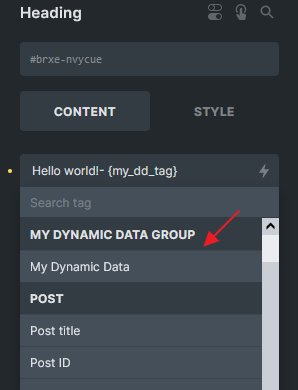

This article is intended for developers who wish to create a custom dynamic data tag within the builder.

The desired outcome should resemble the following example:




<figcaption>

A custom dynamic tag labeled "My Dynamic Data"

</figcaption>


## Step 1: Register a tag through filter: bricks/dynamic\_tags\_list

Use the `bricks/dynamic_tags_list` filter to render your custom dynamic data tag in the builder.

```php
add_filter( 'bricks/dynamic_tags_list', 'add_my_tag_to_builder' );
function add_my_tag_to_builder( $tags ) {
  // Ensure your tag is unique (best to prefix it)
  $tags[] = [
    'name'  => '{my_dd_tag}',
    'label' => 'My Dynamic Data',
    'group' => 'My Dynamic Data Group',
  ];

  return $tags;
}
```

## Step 2: Hook on several filters

#### 1) bricks/dynamic\_data/render\_tag

This will be used when `\Bricks\Integrations\Dynamic_Data\Providers::render_tag()` is called to parse a specific tag.

```php
add_filter( 'bricks/dynamic_data/render_tag', 'get_my_tag_value', 20, 3 );
function get_my_tag_value( $tag, $post, $context = 'text' ) {
  if( ! is_string( $tag ) ) {
    return $tag;
  }
  // $tag is the tag name with the curly braces after priority 10
  // Replace all curly braces 
  $clean_tag = str_replace( [ '{', '}' ], '', $tag );

  // Only look for dynamic tag my_dd_tag
  if ( $clean_tag !== 'my_dd_tag' ) {
    return $tag;
  }

  // Do your custom logic here, you should define run_my_dd_tag_logic() function
  $value = run_my_dd_tag_logic();

  return $value;
}

function run_my_dd_tag_logic() {
  // Do your custom logic here
  $my_value = 'My dynamic data value:';

  return $my_value;
}
```

If you intend to accept an argument such as "`my_dd_tag:arg1`", you may need to adjust the logic accordingly. Here is a basic example using PHP logic. For more complex scenarios, you can adapt the logic as needed:

```php
add_filter( 'bricks/dynamic_data/render_tag', 'get_my_tag_value', 20, 3 );
function get_my_tag_value( $tag, $post, $context = 'text' ) {
  if( ! is_string( $tag ) ) {
    return $tag;
  }

  // $tag is the tag name with the curly braces after priority 10
  // Replace all curly braces 
  $clean_tag = str_replace( [ '{', '}' ], '', $tag );

  // Only look for dynamic tag starts with my_dd_tag:
  if ( strpos( $clean_tag, 'my_dd_tag:' ) === false ) {
    return $tag;
  }
	
  // Get argument
  $argument = str_replace( 'my_dd_tag:', '', $clean_tag );

  // Do your custom logic here, you should define run_my_dd_tag_logic() function
  $value = run_my_dd_tag_logic( $argument );

  return $value;
}

function run_my_dd_tag_logic($argument) {
  // Do your custom logic here
  $my_value = 'My dynamic data value: ' . $argument ;

  return $my_value;
}
```

#### 2) bricks/dynamic\_data/render\_content and bricks/frontend/render\_data

These will be used when `\Bricks\Integrations\Dynamic_Data\Providers::render_content()` is invoked to parse strings that may contain various dynamic tags within the content. One of the functions that perform this action is `bricks_render_dynamic_data()`.

It is crucial to exercise extra caution while working on this aspect, as any mishandling may disrupt the dynamic tag functionality across the entire website.

```php
add_filter( 'bricks/dynamic_data/render_content', 'render_my_tag', 20, 3 );
add_filter( 'bricks/frontend/render_data', 'render_my_tag', 20, 2 );
function render_my_tag( $content, $post, $context = 'text' ) {

  // $content might consists of HTML and other dynamic tags
  // Only look for dynamic tag {my_dd_tag}
  if ( strpos( $content, '{my_dd_tag}' ) === false ) {
    return $content;
  }

  // Do your custom logic here, you should define run_my_dd_tag_logic() function
  $my_value = run_my_dd_tag_logic();

  // Replace the tag with the value you want to display
  $content = str_replace( '{my_dd_tag}', $my_value, $content );

  return $content;
}

```

If your dynamic tag accepts an argument, consider the following example:

```php
add_filter( 'bricks/dynamic_data/render_content', 'render_my_tag', 20, 3 );
add_filter( 'bricks/frontend/render_data', 'render_my_tag', 20, 2 );
function render_my_tag( $content, $post, $context = 'text' ) {

  // $content is the content of the element, including other dynamic tags, HTML, etc.
  // Only look for content starts with {my_dd_tag:
  if ( strpos( $content, '{my_dd_tag:' ) === false ) {
    return $content;
  }
	
  // Regex to match my_dd_tag: tag
  preg_match_all( '/{(my_dd_tag:[^}]+)}/', $content, $matches );

  // Nothing grouped in the regex, return the original content
  if ( empty( $matches[0] ) ) {
    return $content;
  }

  foreach ( $matches[1] as $key => $match ) {
    $tag = $matches[0][ $key ];

    // Get the dynamic data value, $match is the tag name without the curly brackets
    // Can reuse the get_my_tag_value function created earlier
    $value   = get_my_tag_value( $match, $post, $context );

    // Replace the tag with the transformed value
    $content = str_replace( $tag, $value, $content );
  }

  return $content;
}
```

Note: Please ensure returning an array with image IDs if your dynamic tag is using on image element (image context). Please refer to the example in our forum threads: [Dynamic data not rendered correctly on image element](https://forum.bricksbuilder.io/t/dynamic-data-not-rendered-correctly-on-image-element/22641/2?u=itchycode)
