By following this tutorial, you will be able to create a custom WooCommerce archive template that can show product categories and products.

At the same time you can also use the **Shop page display** option and **Category page display** option to control when to show categories or products.


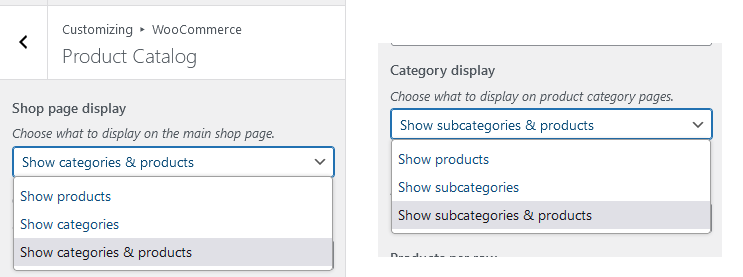

<figcaption>

Appearance > Customize > WooCommerce > Product Catalog

</figcaption>


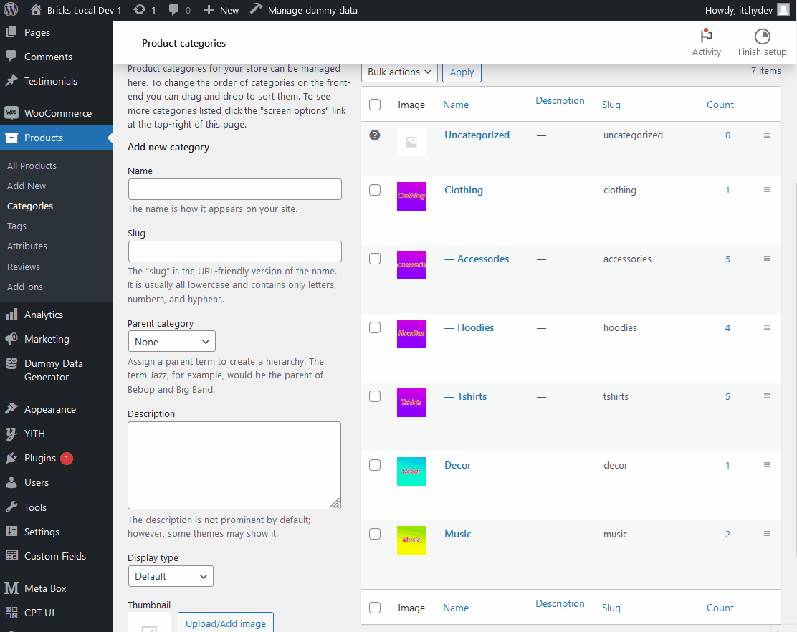

<figcaption>

Example result

</figcaption>


## Step 1: Products & Product Categories Preparation

Ensure your product categories created included subcategories as well. Add some products and assigned them to different product categories. Best if you can add some images for each category, we will output them in the template too.

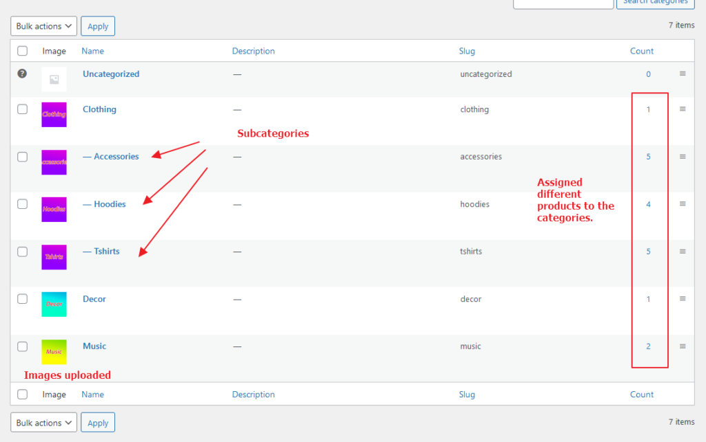

## Step 2: Create WooCommerce Archive

Remember to select the correct template type (**WooCommerce - Product archive**)  
If you are not familiar with the Bricks product archive, you can learn more about them [here](/article/product-archive-woocommerce/).

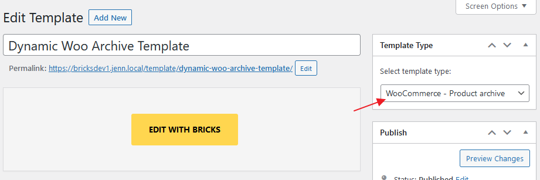

Set the conditions for the template in Settings > Template Settings > Conditions so it will be applied when browsing the WooCommerce shop page and product categories & tags archive pages.

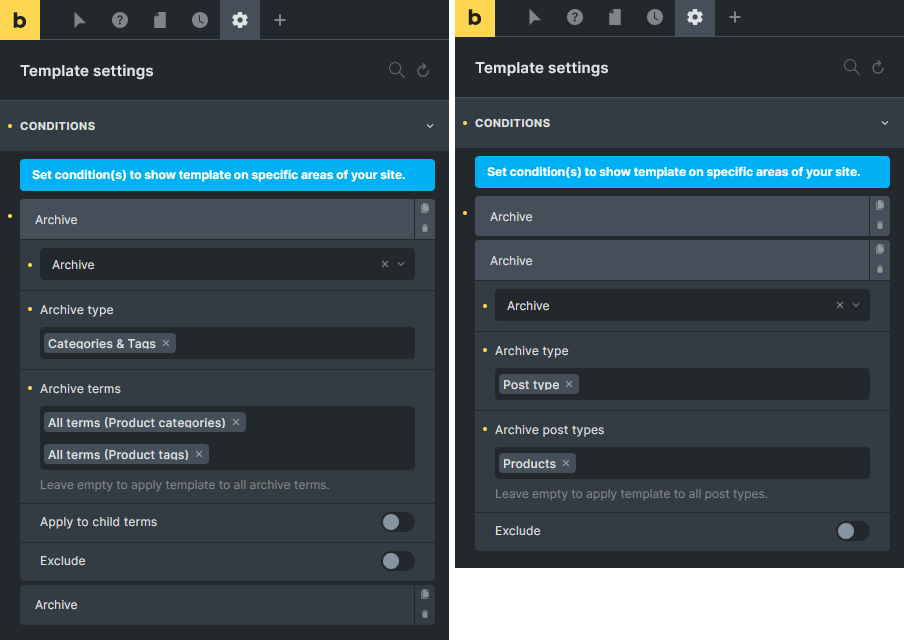

You have to create 2 different query loops and we will use condition to dynamically render them in actual frontend. In below example, 2 sections were created. 1 for the product categories loop, and another 1 for the products loop.

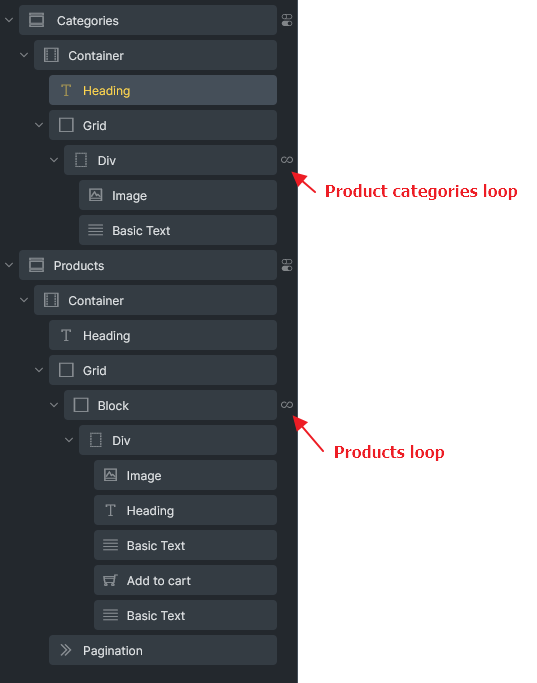

## Step 3: Product Categories Section

Important: You must enable code execution when using echo dynamic tag. Please also ensure the function names added in the `bricks/code/echo_function_names` hook. Reference: [Code Review](/article/code-review/)

To show product categories dynamically, you will need to use `get_queried_object_id()` PHP function on Parent field. Simply use Bricks echo dynamic tag and set `{echo:get_queried_object_id}` on Parent field like below.

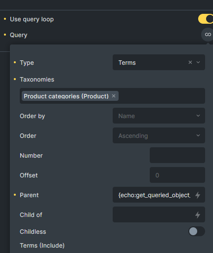

Additionally, we will also use `woocommerce_get_loop_display_mode()` PHP function from WooCommerce to conditionally display this section.

`woocommerce_get_loop_display_mode()` will return either **products**, **subcategories**, or **both** (in string) based on your settings.

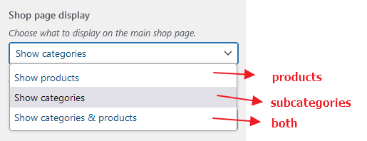

Let's set the condition on the categories section like this:

Use `{echo:woocommerce_get_loop_display_mode}` != products


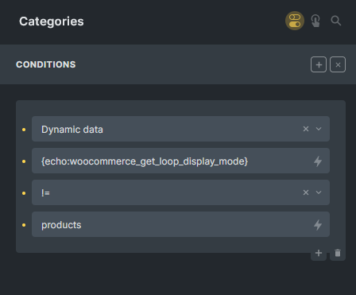

<figcaption>

This section will show if you are not selecting Show products

</figcaption>


Here are the settings for the looping images and text of my example.`{woo_product_cat_image}` to output the category image. `{term_name:link}` to output the category text with link

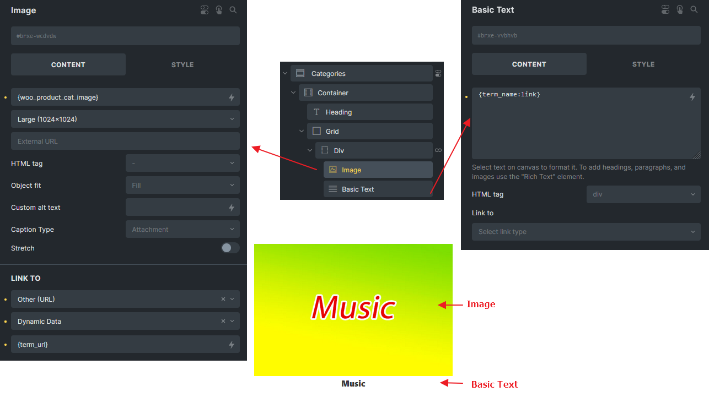

## Step 4: Products Section

Query settings for products are pretty straightforward, just control how many posts per page will do.

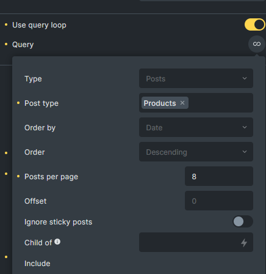

Let's set the condition on the products section like this:

Use `{echo:woocommerce_get_loop_display_mode}` != subcategories


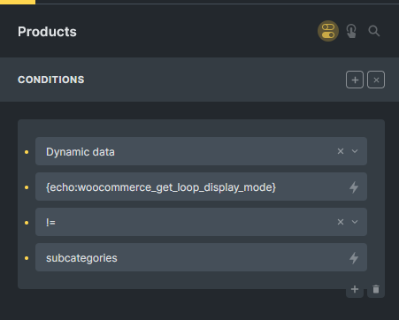

<figcaption>

Products section will shows if you are not selecting Show subcategories / Show categories

</figcaption>


Here are the settings for the looping product for your reference. (Only focus on the dynamic tag I used instead of the style)

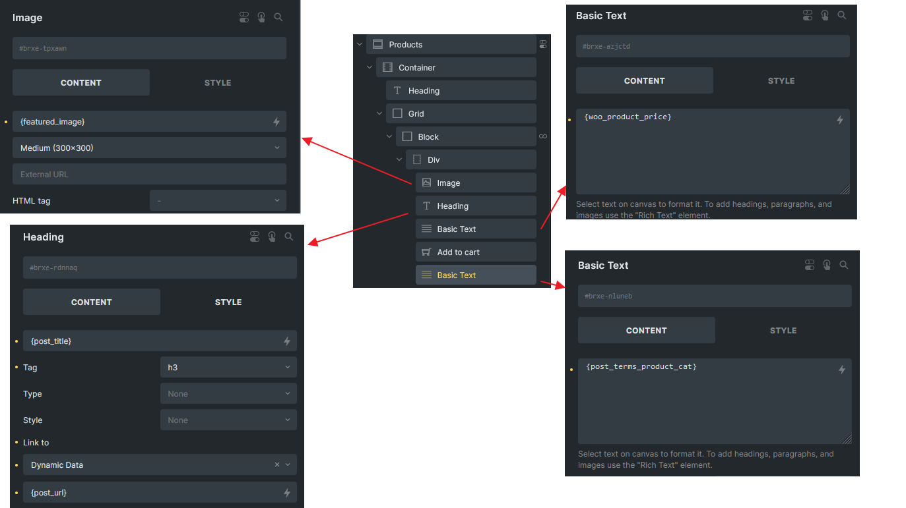

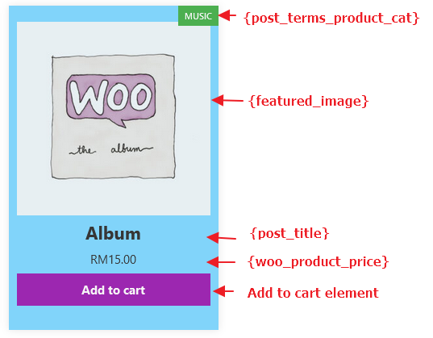

In case your product has multiple product categories checked, but you wish to output the first checked category only so the green box wouldn't be too long, you can use this simple custom function. Just replace the `{post_terms_product_cat}` with `{echo:product_first_category_name}`

```php
// Place in your child theme functions.php
// Returns the first category name of a product
function product_first_category_name() {
	global $product;
	if( $product && is_a( $product, 'WC_Product' ) ) {
		// Get the product categories
		$terms = get_the_terms( $product->get_id(), 'product_cat' );

		$cats = [];

		// Loop through the categories, and add them to the $cats array
		foreach( $terms as $term ) {
			$cats[] = $term->name;
		}

		// Return the first category
		if( ! empty($cats) ) {
			ob_start();
			echo $cats[0];
			return ob_get_clean();
		}
	}
}
```

## Check Result

Now, your shop page and product category pages should be able to work as expected. You can always control when to display the product categories section and products section via the settings in the WordPress dashboard under **Appearance > Customize > WooCommerce > Product Catalog**


<figcaption>

Custom WooCommerce Archive Template

</figcaption>


