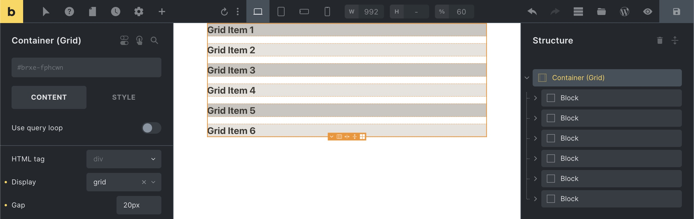
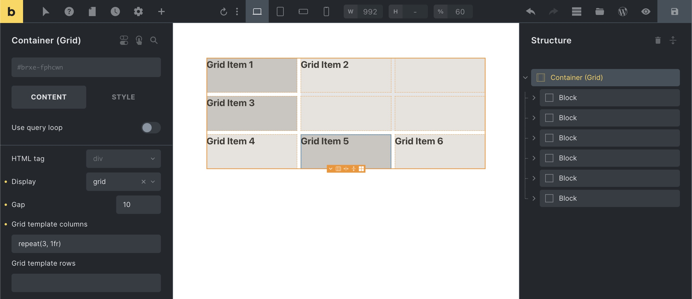
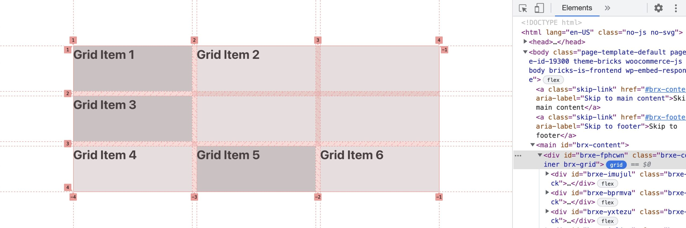
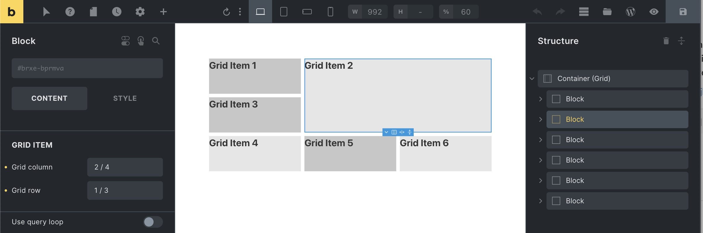

Available since Bricks 1.6.1 CSS grid allows you to create two-dimensional layouts (columns & rows). Whereas CSS flexbox, which Bricks uses as the default layout model, is designed for one-dimensional layouts (either column or row).

## Creating a grid layout

You can turn any layout element (section, container, block, div) into a CSS grid layout by setting the **Display** value to `grid`. This element is your **Grid Container**.

Every direct child element of your Grid container is a **Grid Item**, with additional settings for **Grid column** & **Grid row** to place an item it within the grid.

When editing a grid container in the builder a grid overlay becomes visible indicating the [grid cells](https://developer.mozilla.org/en-US/docs/Glossary/Grid_Cell). Clicking the little four-square element action icon lets to show/hide this overlay.

<figcaption>

Grid container (display: grid) with 6 grid items (direct children) and 20px gap

</figcaption>

As you can see in the screenshot above grid items are laid out in rows by default, covering the full width of the grid container. Which in itself doesn't unlock the true power of CSS grid, until you start ...

## Setting up column & row tracks (explicit grid)

Once we've created our grid container it is time to define our grid column & row [tracks](https://developer.mozilla.org/en-US/docs/Glossary/Grid_Tracks).

We can do this explicitly via the **Grid template columns** (`[grid-template-columns](https://developer.mozilla.org/en-US/docs/Web/CSS/grid-template-columns)`) & **Grid template rows** (`[grid-template-rows](https://developer.mozilla.org/en-US/docs/Web/CSS/grid-template-rows)`) settings of our grid container.

Let's explore a few examples together ...

`_**grid-template-columns: 200px 1fr 2fr**_`

Each value of the `grid-template-columns` property creates a column track.

The example above creates a three-column grid layout.

Column 1 has a fixed width of 200px. Column 2 is `1fr` a column 3 is `2fr` wide.

`**fr**` is a new flexible unit, called the fractional unit, which takes up x parts of the available space.

How is `fr` calculated?

Let's say our grid container has a width of 1100px (the container's default width).

We first need to subtract all non-fr values and gaps: So minus the fixed 200px width of column 1 the remaining available width is 900px.

We have 3 fractional units in total (1fr from column 2 plus 2fr from column 3) to allocate the remaining space towards.

Meaning 1fr equals 300px (= 900px / 3). So column 2 is 300px wide (= 1fr x 300px), and column 3 is 600px (= 2fr x 300px) wide.

`_**grid-template-rows: 100px 300px**_`

Each value of the `grid-template-row`s property creates a row track.

The example above explicitly defines the first two rows. Row 1 is 100px high, and row 2 is 300px high.

As we only explicitly defined the height for the first two rows, the height of any row after row 2 is determined by the height of its content by default. We can change this behaviour by creating an implicit grid ...

### Implicit grid

The grid container automatically generates additional (column & row) tracks for grid items that fall outside of your explicitly defined grid. This is called the implicit grid.

You can define the column & row sizes of this implicit grid via the **Grid auto columns** (`grid-auto-columns`) and **Grid auto rows** (`grid-auto-rows`) settings of your grid container.

### Min & max grid track sizes

The `[minmax](https://developer.mozilla.org/en-US/docs/Web/CSS/minmax)` CSS function lets you set a minimum and maximum track size.

It accepts two arguments. The first one is the minimum value, and the second one is the maximum value of your grid track.

`grid-template-columns: repeat(3, minmax(200px, 1fr))`

Creates an explicit 3-column grid where each grid item has a min. width of 200px, and a max. width of 1fr.

The problem is this sort of explicit grid is that is it not responsive. It overflows when the viewport is less than 600px wide (3 columns of min. 200px), and the number of columns doesn't adjust to different breakpoints out of the box.

### auto-fill & auto-fit keywords

We can use the `auto-fill` or `auto-fit` keywords to address those responsive issues. Allowing us to create responsive grid layouts without media queries.

So instead of setting an explicit 3 column grid, we use the `auto-fill` or `auto-fit` keyword like this:

`grid-template-columns: repeat(auto-fill, minmax(200px, 1fr))`

Which keyword to use depends on the desired behavior. `auto-fit` expands grid items to fill the available space. While `auto-fill` does not (it keeps the available space).

### Repeat track sizes

The [repeat](https://developer.mozilla.org/en-US/docs/Web/CSS/repeat) CSS function lets you define a repeating track size pattern in a compact format.

It accepts two arguments. The first one is the number of times the track should repeat and the second one is the definition of the tracks.

`grid-template-columns: repeat(3, 1fr)`  
Creates an explicit 3-column grid.

`grid-template-rows: 100px repeat(2, 1fr) 200px`  
Creates an explicit 4-row grid. Where row 1 is 100px high, row 2 & 3 are 1fr each, and row 4 is 200px high.

## Placing grid items (by line number)

[Grid lines](https://developer.mozilla.org/en-US/docs/Glossary/Grid_Lines) mark the start or end of a column or row track. The count starts at 1.

We can use those line numbers to place a grid item onto the grid.

The example below shows an explicit three column grid layout, whose grid items cover three rows.

That means this grid has 4 column lines and 4 row lines.

When inspecting the grid layout of any website by clicking the little blue `grid` button next to the element node in the browser, in this case Chrome, shows you the grid lines as well:

In our example above we positioned **Grid Item 2** via the Grid column (`[grid-column](https://developer.mozilla.org/en-US/docs/Web/CSS/grid-column)`) and Grid row (`[grid-row](https://developer.mozilla.org/en-US/docs/Web/CSS/grid-row)`) settings like this, so it takes up two columns and two rows:

The **Grid column** & **Grid row** settings are available for all grid items (direct children of the grid container).

Syntax: The first value specifies the starting line number. Followed by a forward slash (`/`). Followed by the second value, which specifies the end line number.

In our example above we've set the Grid column to "2 / 4". Telling the grid we want Grid Item 2 to start at column line 2 and end at column line 4. The Grid row is set to "1 / 3", meaning Grid Item 2 starts at row line 1 and ends at row line 3.

We could have achieved the same layout by setting the grid column & Grid row setting to "`span 2`". `span` is a keyword that tells the grid layout how many columns or rows the item should span.

## Notes

Named grid areas (`[grid-template-areas](https://developer.mozilla.org/en-US/docs/Web/CSS/grid-template-areas)`) have to be defined via custom CSS.

Placing grid items inside a query loop are best done via `nth-child` custom CSS.

This article is meant to provide an overview of CSS grid, and not a complete reference. We recommend following the resources linked below to learn more about CSS grid.

### Additional resources

- [A Complete Guide to CSS Grid](https://css-tricks.com/snippets/css/complete-guide-grid/) (by CSS tricks)

- [learncssgrid.com](https://learncssgrid.com/) (comprehensive CSS grid overview)

- [cssgrid.io](https://cssgrid.io/) (free CSS grid course by Wes Bos)
