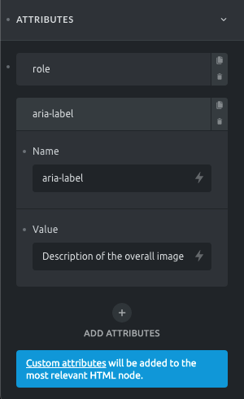

Bricks 1.3 introduces the possibility to add your own custom HTML attributes to any element.

You can add custom attributes under "Style > Attributes". Set a "Name" and a "Value" and your attribute(s) will be added to the elements' most relevant node. By default, your attributes are added to the element root node. Besides manually entered values you can populate your custom attributes with dynamic data, too.

In there you'll be able to insert multiple attributes (name and value). You'll also be able to use Dynamic Data in both name and value fields.



<figcaption>

Container: Custom Attributes

</figcaption>

Let's say you want to add an ARIA **role** and **label** to a container that contains multiple images that should be [considered as a single image](https://developer.mozilla.org/en-US/docs/Web/Accessibility/ARIA/Roles/Role_Img). You'd add the following two attributes when editing your container:

- Attribute #1 name: **role**

- Attribute #1 value: **img**

- Attribute #2 name: **aria-label**

- Attribute #2 value: **Description of the overall image**

This results in the following container HTML:

```php
<div id="bricks-element-sfglik" class="bricks-element-sfglik bricks-container" role="img" aria-label="Description of the overall image">
... Container elements ...
</div>
```

Custom attributes precede default attributes. So if you set a custom **alt** attribute when editing your image, this custom attribute will be used instead of the default image **alt** attribute.

Elements where custom attributes are added to the following specific HTML tags:

| **Bricks Element** | **HTML tag**                                   |
| ------------------ | ---------------------------------------------- |
| Nav Menu           | `<nav>`                                        |
| Heading            | `<h1>` or any other heading tag                |
| Text               | `<div class="text-wrapper">`                   |
| Button             | `<a>` or `<span>` depending if there is a link |
| Image              | ``                                        |
| Video              | `<div class="bricks-video-wrapper">`           |
| Form               | `<form>`                                       |

### How To Add Tooltips

Bricks comes with built-in (CSS-only) tooltips that you can set via custom attributes.

Make sure to set the attribute "Name" to `data-balloon` and the value to whatever you want your tooltip text to be. You also have to set a second HTML attribute named `data-balloon-pos` and then set the value to whatever you want your tooltip to be positioned like:

- top | top-right | top-left

- right

- bottom | top-bottom | top-bottom

- left

For a full list of all available tooltip HTML attributes please visit the official website of the Balloon.css library Bricks uses for its tooltips: [https://kazzkiq.github.io/balloon.css/](https://kazzkiq.github.io/balloon.css/)

If you are planning to add tooltips on the Icon element, please wrap the Icon element in a Div element and set the attribute on the Div element. Otherwise, balloon library CSS will overwrite the Icon element's CSS and cause it invisible in the frontend.

#### Resources:

- HTML attribute reference: [https://developer.mozilla.org/en-US/docs/Web/HTML/Attributes](https://developer.mozilla.org/en-US/docs/Web/HTML/Attributes)
