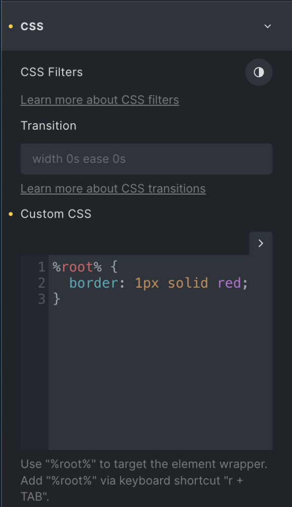
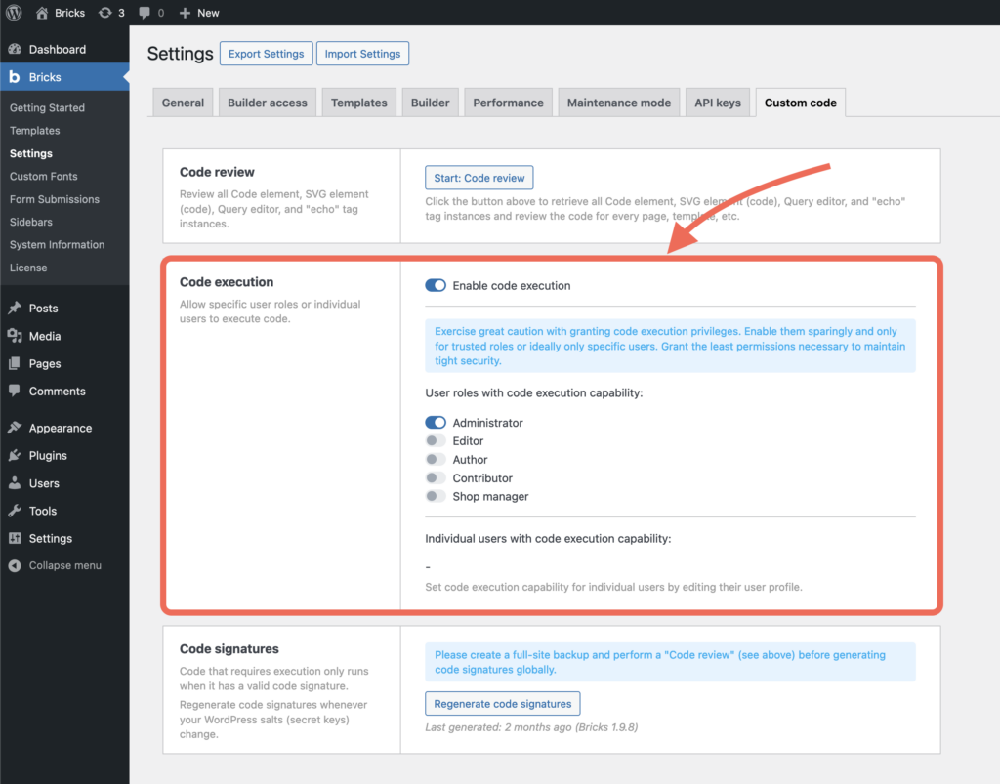

Bricks allows you to add your own custom code (CSS, JavaScript, HTML, PHP) to various parts of your website.

https://www.youtube.com/watch?v=LiYwBZ\_R-f8

## Global CSS & JavaScript

You can add your own **Custom CSS** & **Custom JavaScript** globally from your WordPress dashboard under **Bricks > Settings > Custom Code**.

Custom scripts (JavaScript) can be added in three different (document) locations:

- **Header scripts**: Adds your scripts right before the closing `</head>` tag. This is where you want to copy & paste tracking scripts, etc.

- **Body (header) scripts**: Adds your scripts right after the opening `<body>` tag.

- **Body (footer) scripts**: Adds your scripts right before the closing `</body>` tag.

## Page-Specific CSS & JavaScript

To apply custom CSS & JavaScript to a specific page, edit this page with Bricks. Go to **Settings > Page Settings > Custom Code**. There, you can add your custom CSS & JS that should only be applied to the page you are currently editing.

## Element-Specific Custom CSS



Extend the styles of any element and global class by adding your own custom CSS to it.

First, edit the element to which you want to add your own custom CSS.

Under the "Style" tab, open the "CSS" control group.

There, you can find the **Custom CSS** code editor. 

Use the `**%root%**` placeholder to target the element or global class you are currently editing. Bricks automatically converts this**`**%root%**`** placeholder to your element ID or global class.

Keyboard shortcode to insert **`**%root%**`** is "r + TAB".

The screenshot on the right illustrates how to add a 1px width red border to an element.

### CSS code completion via Emmet

You can use CSS abbreviations to write your CSS even faster. Instead of writing `margin: 10px`, simply type `m10` and press the TAB key.

[https://docs.emmet.io/css-abbreviations/](https://docs.emmet.io/css-abbreviations/)

## Code Element (PHP, HTML, CSS, JS)

The "Code" element allows you to execute your own code (PHP, HTML, CSS & JS) anywhere on any page.

By default, the code added to the Code element is displayed as a code snippet.

In order to execute your code, you need to first enable **"Code Execution"** for the appropriate user role or user in your WordPress dashboard under "Bricks - Settings - Custom code" (see the screenshot below).




<figcaption>

Code Execution: Enabled for user role "Administrator"

</figcaption>


Make sure to only enable code execution for users & user roles you trust 100%.

### How to add PHP & HTML code to your element


<figcaption>

Code Element: Executing HTML & PHP code

</figcaption>


Once you've enabled code execution you can start adding the "Code" element wherever you want to execute your code.

You'd usually execute PHP & HMTL code, as CSS & JS can be added much easier via the solutions outlined above.

Once you've added the Code element to your page, you can add your custom code to it (as shown in the screenshot ).

To run/execute the code, enable the "**Execute Code**" setting. Otherwise, the code just shows as a code snippet.

Click the "Sign code" icon at the top-right of the code editor (or CMD/CTRL + R) once you've finished editing your executable code.

### HTML Code Completion via Emmet

You can use abbreviations to generate your HTML structures much faster via a familiar CSS-based syntax.

**Abbreviation:** `#header` (+ TAB key)

**Generates:** `<div id="header"></div>`  
  
**Abbreviation:** `h$[title=item$]{Header $}*3`

**Generates:**

```php
<h1 title="item1">Header 1</h1>
<h2 title="item2">Header 2</h2>
<h3 title="item3">Header 3</h3>
```

[https://docs.emmet.io/cheat-sheet/](https://docs.emmet.io/cheat-sheet/)
