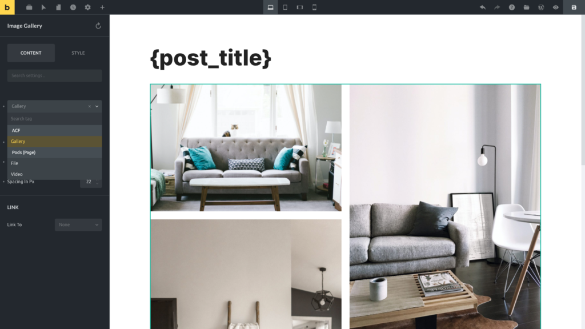
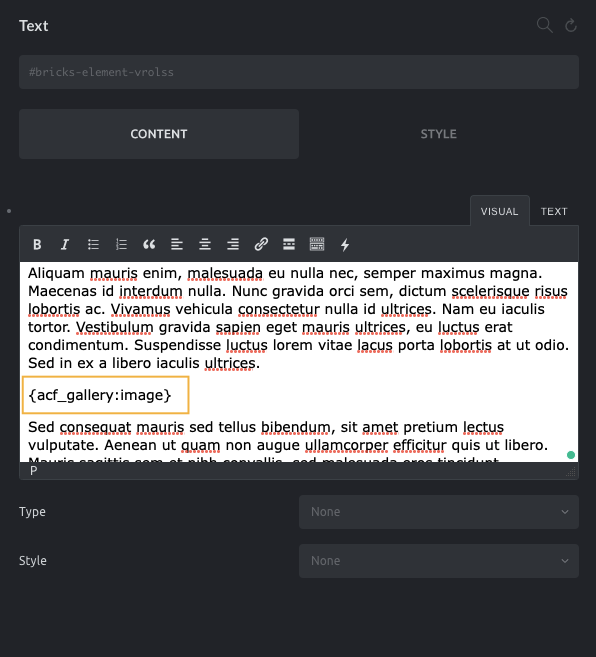
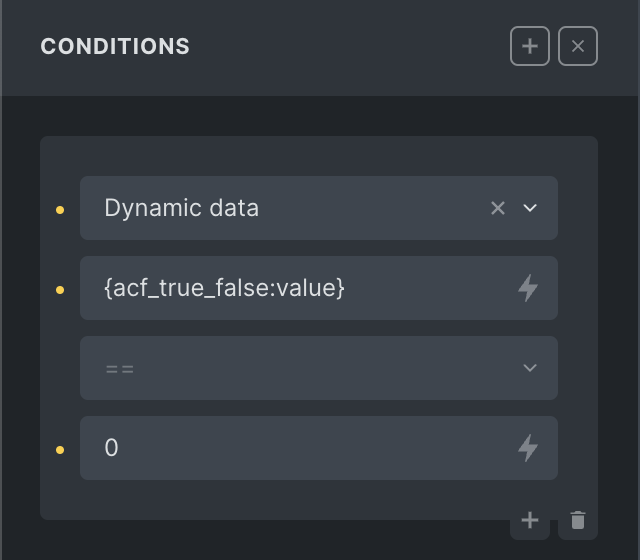

Use dynamic data to render all sorts of data from your WordPress database with Bricks.

For example: Featured image, post title, post date, author name, categories, tags, site title, all of your custom fields, etc.

You'll most likely use dynamic data when creating templates in Bricks. Such as your blog post template, and custom post type templates (e.g. single property listing).

## How to insert dynamic data

The dynamic data picker for text shows up when typing a `{` onto the canvas. You can also click the "bolt" icon in the settings panel to reveal it:

https://youtu.be/w4Bv-Pd6n2w

Dynamic data for non-text settings such as images, videos, etc. is available from the "Select dynamic data" dropdown menu in the panel settings.

Below you can see an Advanced Custom Fields gallery (named "Gallery") rendered inside the Bricks image gallery element:

All dynamic data tags are available in all elements that support dynamic data. This means that you may insert a gallery field (like an ACF gallery field type) inside a text element and it will be rendered as a set of `img` tags (using the filter `:image`), like so:

## Custom Fields Integrations

You can render much more than just standard dynamic WordPress data. Bricks supports the most popular custom fields plugins such as:

- [Advanced Custom Fields](#acf)

- [Meta box](#metabox)

- [Crocoblock (JetEngine)](#jetengine) (Not support WooCommerce Product Data / Variation Meta Box)

- Pods

- CMB2

- Toolset

This allows you to design templates for even the most complex custom post type layouts and data requirements.

### Advanced Custom Fields

Bricks integrates with all the ACF and ACF Pro fields, including Flexible Content and Nested Groups.

The fields will be listed in the Dynamic Data dropdown inside of the Bricks builder so you can use them while building your pages and templates with Bricks.

The Relationship (including the [bidirectional](https://www.advancedcustomfields.com/resources/bidirectional-relationships/) implementation) and the Repeater field types are also available inside the Query Loop builder, so you could loop through the output of these fields while rendering the sub-fields as dynamic data.

The ACF field type "[True / False](https://www.advancedcustomfields.com/resources/true-false/)" is great for conditional checks inside the element conditions. By default, the localized "True / False" label is returned. When using it in your element conditions, make sure to apply the `:value` filter. To check for false, you can compare against `== 0`. Or `== 1` to check for true.

<figcaption>

Check if ACF True / False field is false

</figcaption>

The following dynamic data can be used together with [Element conditions](/article/element-conditions/) effectively.

`{acf_get_row_layout:raw}` - Returns the ACF Flexible layout name

### Meta Box

Bricks is compatible with the Meta Box Post Types, Taxonomies, Custom Fields, and Relationships. Regarding the Custom Fields, Bricks will list the fields inside the builder in the Dynamic Data dropdown. According to the custom field contents, these tags will be rendered properly in the front end.

The Group field (when cloneable) and the Relationships will also be available inside the Query Loop builder. You can iterate through these values and render the sub-fields as dynamic data.

It is also possible to build nested non-clone-able Group fields in Bricks Query Loop.

### Crocoblock JetEngine

Bricks is compatible with Crocoblock JetEngine Post Types, Meta Boxes (Custom fields), Taxonomies, Relations, and Options pages.

[Custom Content Types](https://crocoblock.com/knowledge-base/jetengine/how-to-showcase-cct-meta-fields-using-dynamic-tags-in-bricks/) (CCT) has been supported since April 2024 by the JetEngine plugin, not Bricks itself. For any CCT questions, please get in touch with the JetEngine support directly.

Bricks integration with the JetEngine plugin makes the custom fields available as dynamic data inside the Bricks builder.

Bricks also integrates with the JetEngine Relations and Repeaters to feed the Bricks builder query loop.

## Standard WordPress data

By default, you may use the following dynamic data tags.

### Post fields

The following fields are related to the posts or custom post types.

`{post_title}` - Returns the post title  
`{post_id}` - Returns the post ID  
`{post_url}` - Returns the post link  
`{post_slug}` - Returns the post slug  
`{post_type}` - Returns the post type (@since 1.12)  
`{post_date}` - Returns post published date  
`{post_modified}` - Returns post modified date  
`{post_time}` - Returns post publish time  
`{post_comments_count}` - Returns number of comments  
`{post_content}` - Returns post content (Gutenberg editor)  
`{post_excerpt}` - Returns the post excerpt  
`{read_more}` - Renders an anchor tag (link) to the post with the label "Read more"  
`{featured_image}` - Renders an image tag with the featured image

These fields support the following **dynamic data filters**:

`{post_title:link}` - Renders the post title as a link to the post  
`{post_title:link:3}` - Same as before but the title is limited to 3 words  
`{post_title:link:newTab}` - Open post title in new tab  
`{post_date:human_time_diff}` - outputs the date difference in a human readable format such as "1 hour", "5 mins", "2 days"  
`{post_excerpt:55}` - Limit post excerpt to 55 words. Using the ":" followed by a number limits the output to that number of words  
`{post_excerpt:format:10}` - Keep the HTML format and limit post excerpt to 10 words.  
`{featured_image:medium_large}` - Renders an image tag with the featured image of size medium_large (defaults to thumbnail size)  
`{featured_image:large:link}` - Renders an image tag (within text context) of the featured image, size "large2, wrapped by an anchor tag to the post

### Taxonomies

The following dynamic data tags render a list of the taxonomy terms assigned to a post. A link to the term archive wraps each term:

`{post_terms_category}`  
`{post_terms_post_tag}`  
`{post_terms_my_taxonomy_slug}` - Replace the "my_taxonomy_slug" part with the slug of the actual taxonomy you want to use  
`{post_terms_category:plain}` - Remove the links via :plain filter

If you already use a link around your element, you can disable the terms' links output using the `[bricks/dynamic_data/post_terms_links](https://academy.bricksbuilder.io/article/filter-bricks-dynamic_data-post_terms_links/)` filter.

### Terms

The following dynamic data tags render data related to taxonomy terms.

`{term_id}` - Renders the term ID  
`{term_name}` - Renders the term name  
`{term_slug}` - Renders the term slug  
`{term_count}` - Renders the term count  
`{term_taxonomy_slug}` - Renders the term's taxonomy slug. (@since 1.11)  
`{term_url}` - Renders the term archive link  
`{term_description}` - Renders the term description  
`{term_meta:my_term_meta_key}` - Renders the "my_term_meta_key" meta value

### Author Fields

`{author_id}` - Returns the post author ID  
`{author_name}` - Returns the post author name  
`{author_bio}` - Returns the post author biographical info  
`{author_email}` - Returns the post author email  
`{author_website}` - Returns the post author website  
`{author_archive_url}` - Returns the post author url  
`{author_avatar}` - Returns the post author avatar as an image tag (text) or an image url (link)  
`{author_meta:meta_key}` - Returns the specified author meta value. Set the author meta key as the filter. Example. author_meta:first_name returns the author's first name. See [here](https://developer.wordpress.org/reference/functions/get_the_author_meta/#description) for available author meta keys.

These fields support dynamic data filters like the following:

`{author_bio:20}` - Post author biographical info limited to 20 words  
`{author_name:link}` - Post author name rendered as a link to the author profile page  
`{author_email:link}` - Post author email rendered as a link  
`{author_website:link}` - Post author website rendered as a link  
`{author_avatar:200}` - Post author avatar image tag limited to the width/height of 200px

### Current Date fields

You can render the current date through dynamic data.

`{current_date}` - Returns the current date (UTC) with the format defined at WordPress > Settings > General > Date Format  
`{current_wp_date}` - Returns the current date (WordPress timezone) with the format defined at WordPress > Settings > General > Date Format

You may specify a different date format using the PHP date format, for example:

`{current_date:Y}`  
`{current_date:Ymd}`  
`{current_date:Y-m-d}`  
`{current_date:Y.m.d}`  
`{current_date:Y/m/d}`  
`{current_date:Y m d}`  
`{current_date:g:i A}`  
`{current_date:timestamp}`

### Query fields

`{query_loop_index:raw}` - Returns the index of the current loop item, starting at 0. Use the `@start-at` argument to start the index from any other number. Example: `{query_loop_index` `` @start-at:1`:raw`} `` to start the index at 1 instead of 0. The `@pad` argument lets you define a 0-based padding. Using `{query_loop_index @pad:2:raw}` results in an index output of `001` and `010` instead of `1` and `10`.

`` {query_results_count`:raw`} `` – Use inside or outside a query loop to return the query results count. When used outside a loop you have to pass the query loop ID as a filter to this tag like this: `` {query_results_count:quer34`:raw`} ``. "quer34" in this example is the Bricks ID, which you can copy to your clipboard from the right-click context menu.

### Site & Archive fields

`{site_title}` - Returns site title as defined in the WordPress settings > General > Site Title  
`{site_tagline}` - Returns site tagline as defined in the WordPress settings > General > Tagline  
`{site_url}` - Returns site URL as defined in the WordPress settings > General > Site address (URL)  
`{site_login}` - Returns site login URL. Redirect after login URL can be set by specifying the post ID as the filter like this: `{site_login:3}`

`{site_logout}` - Returns site logout URL. Redirect after logout URL can be set by specifying the post ID as the filter like this: `{site_logout:3}`  
`{archive_title}` - Returns archive title  
`{archive_title:context}` - Add context to the archive title  
`{archive_description}` - Returns archive description (author, post type or term)

You can get dynamic data from the URL parameters like so:

`{url_parameter:my_key}` - Returns the value of the `my_key` parameter in the url (https://mydomain.pt/?my\_key=value)

### User profile fields

`{wp_user_id}` - Returns current user context ID  
`{wp_user_login}` - Returns current user context username  
`{wp_user_email}` - Returns current user context email address  
`{wp_user_url}` - Returns current user context website  
`{wp_user_author_url}` - Returns current user context author URL  
`{wp_user_role}` - Returns current user context primary role. Use `:value` to return the role slug. (@since 1.12)  
`{wp_user_registered_date}` - Returns current user context registered date (@since 1.12)  
`{wp_user_nicename}` - Returns current user context nicename  
`{wp_user_description}` - Returns current user context biographical info  
`{wp_user_first_name}` - Returns current user context first name  
`{wp_user_last_name}` - Returns current user context last name  
`{wp_user_display_name}` - Returns current user context display name  
`{wp_user_picture}` - Returns current user context avatar image tag or url  
`{wp_user_meta:my_user_meta_key}` - Returns current user context "my_user_meta_key" meta value

### Native WordPress custom fields

To render your own custom field entries, you have to prefix them with `cf_`.

If your custom field name is `phone_number`, you'd use `{cf_phone_number}` to render this custom field on the front end.

Your `phone_number` custom field entry should also be available in the dynamic data picker dropdown under "Custom fields".

### Advanced: echo

Starting at Bricks 1.9.7, you have to explicitly allow any function names that you want to call via Bricks’ dynamic data `echo` tag using the new `bricks/code/echo_function_names` filter. Which you can add to your Bricks child theme or the code snippet plugin of your choice. You can find more information in this article: [https://academy.bricksbuilder.io/article/filter-bricks-code-echo_function_names/](https://academy.bricksbuilder.io/article/filter-bricks-code-echo_function_names/)

Bricks 1.4 introduces the `echo` tag to render the output of any PHP function:

`{echo:my_custom_function}` - Echoes the value of the PHP function `my_custom_function()`

It accepts arguments, with or without single quotes, like so:  
`{echo:get_the_date('Y-m-d', 55)}` - Echoes the date of the post 55 formatted to `Y-m-d`

Please note that the `echo` tag does not support double quotes, and the custom PHP function should `return` the value (do not `echo` the value inside of the custom function).

https://www.youtube.com/watch?v=ajAXEZoyk0E

### Advanced: do_action

The `do_action` tag enables developers and other plugins to integrate with your template designs seamlessly. With this tag, you can place action hooks such as `{do_action:my_custom_hook}` anywhere.

For example, you can insert the `{do_action:woocommerce_after_single_product}` in your WooCommerce single product template, allowing other plugins to hook into it. This enhances the flexibility of your template design.

It is important to note that the `do_action` tag does not support passing arguments to the action. If the `add_action()` function expects additional arguments, an error in PHP will occur. The `do_action` only runs on the front end of the website, not inside the builder.

### WooCommerce

When the WooCommerce plugin is installed and active, you'll get access to an extra set of Dynamic Data tags related to the products and orders. Please refer to the [WooCommerce builder](https://academy.bricksbuilder.io/article/woocommerce-builder/#dynamic-data) article for more details.

## Filters

You can change the output of certain dynamic data tags by using the following filters:

- `:_numeric value_` - When used on a text field, it trims the content to the number of words specified (e.g. `{post_excerpt:10}`). When used with an avatar field like `author_avatar` it specifies the width/height of the avatar image

- `:context` _or_ `:prefix` - Add context to the archive title

- `:image` \- Outputs the field as an image tag, _e.g._ ``

- `:link` - Output the field as an anchor tag, _e.g._ `<a href="https://...">_value_</a>`

- `:newTab` - Sets the link to open in a new tab

- `:tel` - The URL of the anchor will be formatted as a telephone number,  
   _e.g._ `<a href="tel:+123456789">+123456789</a>`

- `:_text value_` \- Depending on the context, it could mean the following:

  - User or term custom field meta key

  - The URL parameter key

  - Post terms separator

  - Date format

  - Image size slug (e.g., thumbnail or full)

  - The echo tag function name

- `:value` - Outputs the value instead of the label. Useful for comparing choices field types like MetaBox checkbox list, etc. inside element conditions, or with ACF choice fields (set the return type to "Both (Array)") such as Select, Checkbox, Radio Button, and Button Group. ACF field types that supporting this filter: True/False, User, Taxonomy, Image, Gallery, Post Object, Relationship (`@since 1.12`) MetaBox field types that supporting this filter: File Input, File, File Upload, File Advanced, Video, Image, Image Advanced, Image Upload, Single Image, Image Select Taxonomy, Taxonomy Advanced, Post, User (`@since 1.12`)

- `:raw` - Skip parsing dynamic data tag

- `:url` - Return URL from post ID. Useful to return URL for `file` field, etc.

- `:format` - Keep HTML format or show empty Star rating for [WooCommerce dynamic data](/article/woocommerce-builder/#dynamic-data)

- `:plain` - Removes HTML tags using `wp_strip_all_tags`, which can be helpful when you need to extract plain text from a dynamic tag result. For example, you may want to remove links from a post term dynamic tag.

- `:array_value|{KEY}` - Returns the value of a specific array key within a dynamic tag result. It can be particularly useful for custom fields such as ACF Google Map and ACF Link types. The filter can also be applied to an echo dynamic tag. In cases where the value is a nested array, Bricks will flatten it as a JSON string to allow for seamless output without any errors. It's important to note that this filter should only be used when you are certain that the dynamic tag result is an array. Another important point to keep in mind is that if the specified array key does not exist, this filter will return an empty string. [Examples](#array_value-filter-examples)

- `:timestamp` - Convert the date or time related dynamic data to timestamp value.

- `:slug` and `:term_id` - Used in {post_terms_xxxx} dynamic tags, to output slug or term ID, instead of the term name. It can also be helpful in combination with `:plain` filter, like `{post_terms_xxxx:slug:plain}`, when using it inside conditions, taxonomy query, ... to compare the correct values (`@since 2.0`).

##### Examples of :array_value filter

`{acf_place_map:array_value|lat}` - Echoes the `$value['lat']` of the ACF google map type field  
`{acf_place_map:array_value|post_code}` - Echoes the `$value['post_code']` of the ACF google map type field  
`{acf_ext_link:array_value|title}` - Echoes the `$value['title']` of the ACF link type field  
`{je_football-team_logo:array_value|id}` - Echoes the `$value['id']` of the JetEngine media field (Value format set as Array with media ID and URL)  
`{mb_testimonials_user_image:array_value|name}` - Echoes the `$value['name']` of the Metabox single image field  
`{echo:custom_function:array_value|hello}` - Echoes the `$value['hello']` of PHP `custom_function()` function

## Key-value pair arguments

This feature allows for greater flexibility and customization in displaying dynamic content. The general syntax for using key-value pair arguments is: `{dynamic_data_tag @key:value}`.

- Wrap text with spaces in single quotes.

- The value can include other dynamic data tags (e.g., `{acf_text_field @fallback:'No content was found for {post_title}'}`).

### Available arguments:

`@fallback` – Provides fallback text if the dynamic data tag doesn't return any data. This argument can be used with any dynamic data tag (`@since 1.10`).

- **Example:** `{acf_text_field @fallback:'This is the fallback text!'}`. If `acf_text_field` is empty, "This is the fallback text!" will be displayed.

- **Example**: `{acf_page_builder_cta_modul_options_css_id:raw @fallback:'{acf_get_row_layout:raw}-{query_loop_index:raw}'}`. If `acf_page_builder_cta_modul_options_css_id` is empty, use current ACF flexible layout concatenate with current loop index as return string. Good use case when using this on dynamic CSS ID.

`**@fallback-image**` – Used for image dynamic data tags. It accepts either an attachment ID or a URL.

- **Examples:** `{acf_image @fallback-image:554}` or `{acf_image @fallback-image:'https://example.com/placeholder.png'}`. If `acf_image` is not available, the specified image (by attachment ID or URL) will be displayed.

`@sanitize` - Available `@since 1.11.1` it allows you to control the sanitization method applied to all dynamic tags within a "text" context. By default, all dynamic tags are sanitized using `wp_kses_post`, which helps secure output by stripping unwanted HTML and scripts.

This argument is particularly useful if you have a shortcode outputting JavaScript—such as a form shortcode from plugins—stored within a custom field. In earlier versions, this JavaScript would be sanitized, preventing the form from functioning when the field is output via `{acf_custom_field}`.

**Examples:**

- `{acf_my_wysiwyg @sanitize:false}` – Disables sanitization, allowing scripts to be output if stored in the custom field. **Use carefully, ensuring that the content is safe for output without sanitization.**

- `{acf_my_wysiwyg @sanitize:sanitize_email}` – Applies `sanitize_email` to the `my_wysiwyg` field. If the value doesn’t pass as a valid email, it returns empty.

- `{acf_my_wysiwyg @sanitize:sanitize_email @fallback:'abc@gmail.com'}` – Applies `sanitize_email` to the `my_wysiwyg` field. If the result is empty, it falls back to `'abc@gmail.com'`.

**Note:** The `@sanitize` argument only accepts methods listed in the [WordPress Sanitizing API](https://developer.wordpress.org/apis/security/sanitizing/) , `**false**` or `wp_kses`. If using `@sanitize:false`, be cautious, as this will output the field content without sanitization.

## Bricks hooks related to Dynamic Data

`[bricks/dynamic_data/exclude_tags](https://academy.bricksbuilder.io/article/filter-bricks-dynamic_data-exclude_tags/)` - exclude a list of tags from the Bricks dynamic data logic

`[bricks/dynamic_data/replace_nonexistent_tags](https://academy.bricksbuilder.io/article/filter-bricks-dynamic_data-replace_nonexistent_tags/)` - Disable the default Bricks behavior of replacing the non-existent dynamic data tags with an empty string
