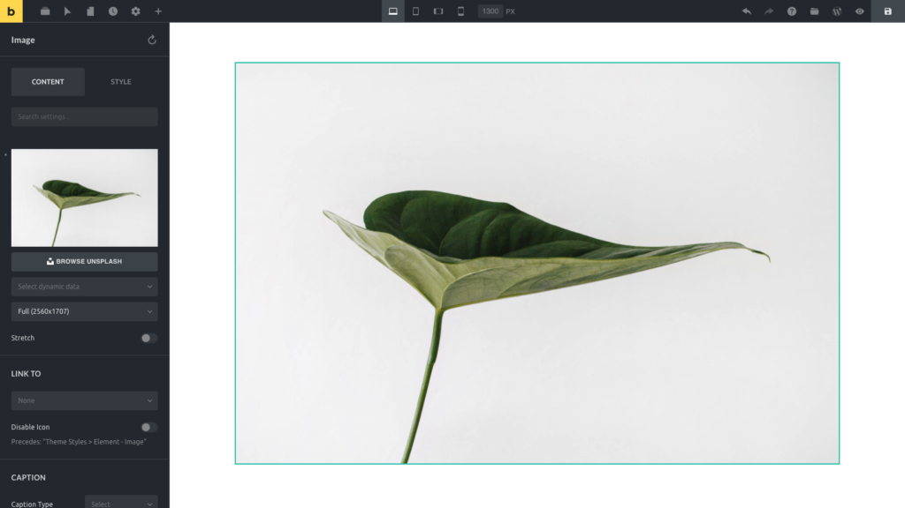
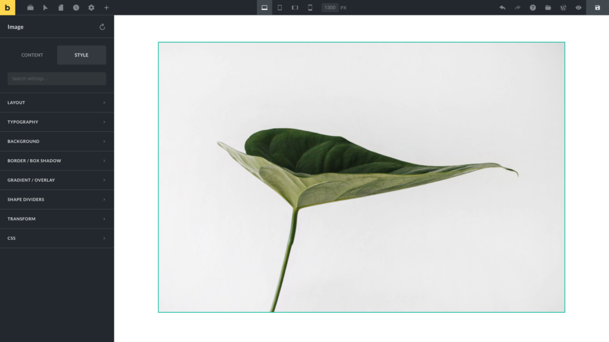

To add an element to the canvas simply drag it from the panel and drop it anywhere onto the canvas.

Click on any element to start editing it. The panel will now show you all available controls of the selected element.

**Tip:** You can edit text directly on the canvas by clicking on it and start typing. Select text portions with your mouse to reveal the text formatting toolbar with various styling options such as bold, italic, links, etc.

Element controls are organized under two tabs: **CONTENT** and **STYLE**. Sections, rows, and columns don't have a control tab, as all controls are styling-related.

## Tab: Content

Content controls affect the actual element markup (HTML) of your page. The screenshot below shows you all available Content controls for the image element:

<figcaption>

Element Image: Content Tab

</figcaption>

## Tab: Style

Controls under the **STYLE** tab affect the style/design (CSS) of a block and are grouped into:

- Layout
- Typography
- Background
- Border / Box Shadow
- Gradient / Overlay
- Shape Dividers
- Transform
- CSS

<figcaption>

Element Image: Style Tab

</figcaption>

## How To Reset Controls

To undo all styling changes you have applied to a block, click the **Reset Styles** icon next to the block name in the panel header.

This will only remove any settings that concern the design of your element. All content controls are preserved.

You can also reset individual controls and entire control groups with a single click. Every control and control group with a setting value has a little grey indicator next to its label.

To reset an entire control group (such as **Typography**) click the indicator next to its label. This removes all settings of this control group.

## Copy & Paste Styles

To copy & paste block styles hover over the blocks' action icons, and right-click to reveal the custom context menu. Click on **Copy Styles**.

Then hover over the action icons of the block you want to apply those copied styles to, right-click, and select **Paste Styles**.
