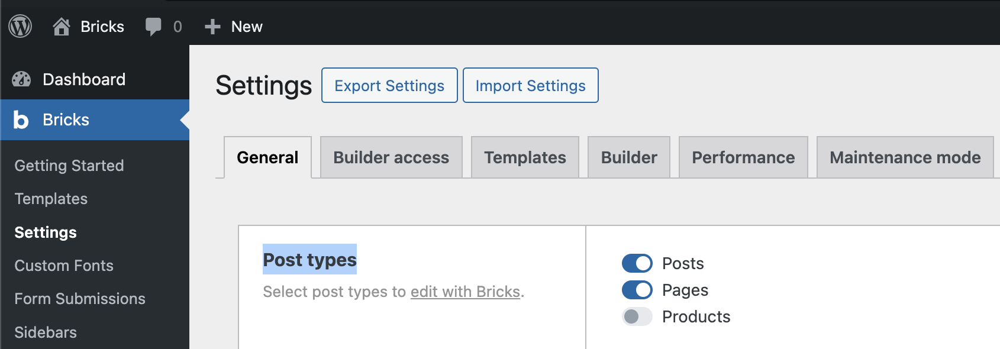
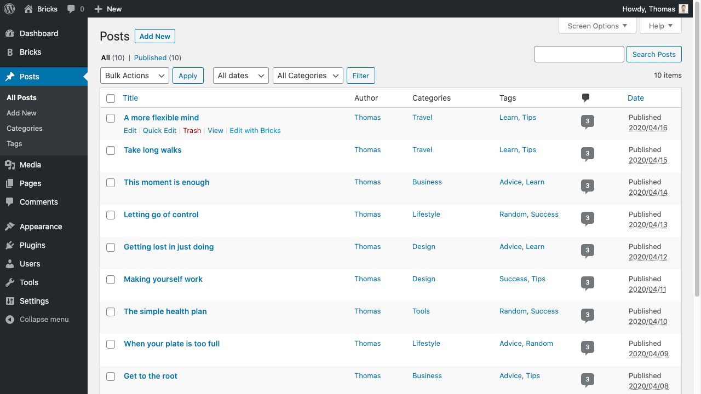
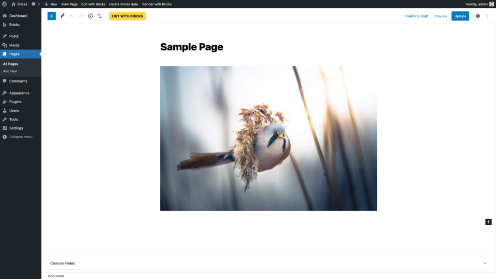
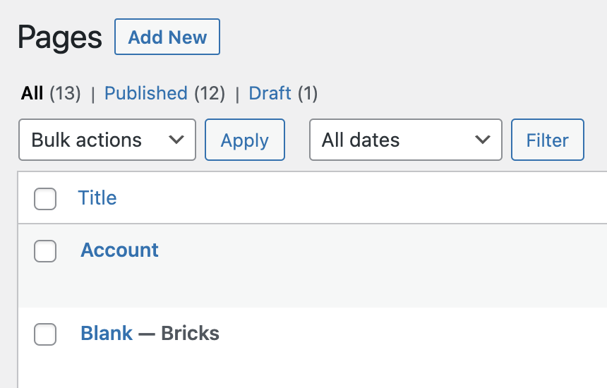

Once you have [activated your license](https://academy.bricksbuilder.io/article/installation-activation/) head over to **Bricks → Settings** and select the post types you want to edit with Bricks:

**Tip:** While you could write your blog posts with Bricks, it's best to create a Bricks template for your blog post layout, and write your blog posts in the WordPress editor as usual.

To enter the builder, click the **Edit with Bricks** link when hovering over the post title in your WordPress dashboard:

You can also enter the builder right after creating a new Page or while editing an existing Page by clicking the **Edit with Bricks** button at the top of the page:

### WP Admin Bar

You'll also find an **Edit with Bricks** link in the admin bar. When editing with Gutenberg and you don't see the admin bar, make sure you've disabled Gutenberg's "Fullscreen mode".

Use the **Delete Bricks Data** button in the WP admin bar to delete the Bricks data of the page you are currently editing. This action is disabled by default. To enable it, go to Bricks → Settings and check the 'Enable "Delete Bricks Data" Button' setting.

The last Bricks item in the admin bar is the **Render with Bricks** / **Render with WordPress** links. Select whatever data source you want to render this page with.

If a Page (or any other Bricks-enabled post type) is rendered with Bricks, you'll see a "**\- Bricks**" post status after the title. In the screenshot below, you can see that the Account Page is not rendered with Bricks, but WordPress, and that the Blank Page is rendered with Bricks:

<figcaption>

Post status "Bricks" shows you that a page is rendered with Bricks

</figcaption>

