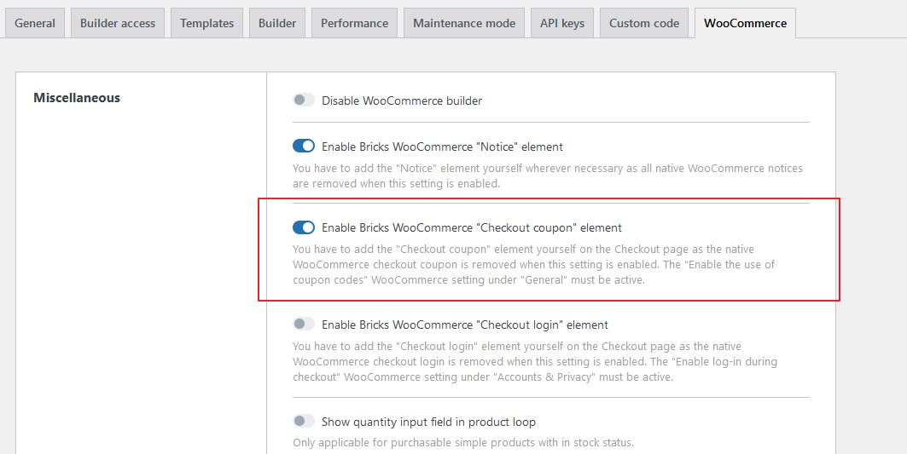
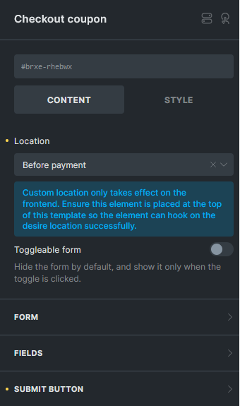

This Checkout coupon element, available @since 1.11.1, allows you to display the coupon field in various locations on the checkout page, making it easy for customers to apply discount codes during their purchase.

In previous versions, you couldn’t control the location of the checkout coupon. Additionally, styling options were limited, and adjustments required custom CSS. With this new, dedicated checkout coupon element you now have greater control over placement and design.

To use this element, first enable it under **`Bricks > Settings > WooCommerce`** by turning on **`Enable Bricks WooCommerce "Checkout coupon" element`**.

**Note:** This element is specifically designed for the Checkout page and will only work when placed on the **Checkout template** or the Checkout page itself, depending on your design requirements.

**Key Controls**

**Location:**

- By default, the **Checkout Coupon** element will appear where it’s placed in the layout. However, you can choose alternative positions, such as: Before Order Review Heading, After Order Review Heading, Before Payment

- Custom location settings only apply on the actual frontend (Checkout page). To ensure correct placement, add this element at the top of your Checkout template.

You can set the form to be toggle-able, hiding it by default and revealing it only when the toggle is clicked, for a cleaner layout.
