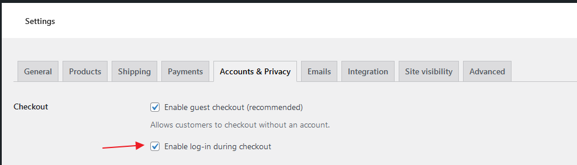
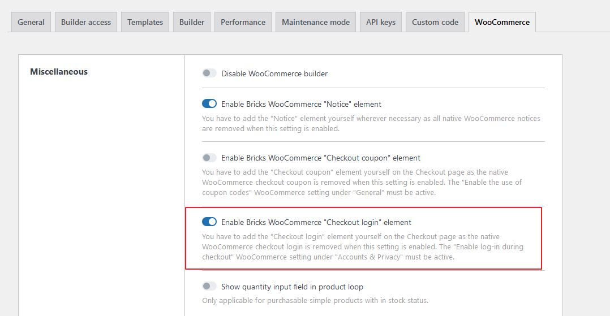
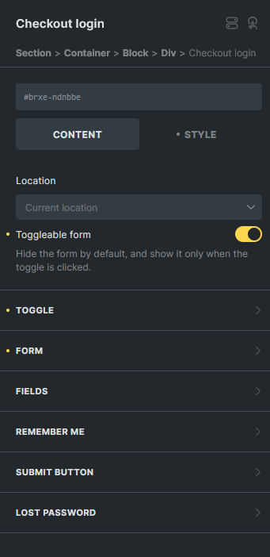
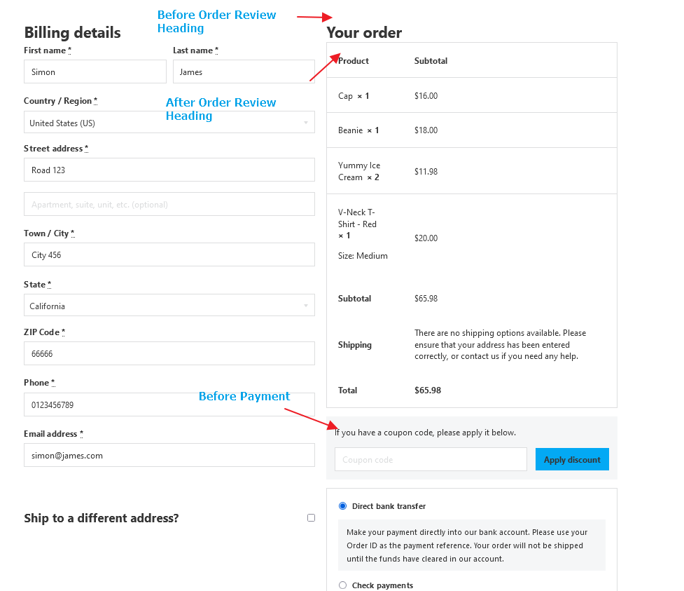

The Checkout Login element allows for a convenient login option directly on the checkout page, enabling returning customers to sign in before completing their purchase.

This features becomes available once you've enabled the **`Enable login during checkout`** under **`WooCommerce > Settings > Accounts & Privacy`** .

In previous versions, the placement of the checkout login form was fixed, and styling options were limited, requiring custom CSS for adjustments. Now, you can control both placement and appearance.

To use this element, activate it under **`Bricks > Settings > WooCommerce`** by toggling on **`Enable Bricks WooCommerce "Checkout login" element`**.

**Note:** This element is specifically intended for the Checkout page. Place it within the **Checkout template** or directly on the Checkout page, depending on your design needs.

**Key Controls**

**Location:**

- By default, the **Checkout Login** element will appear where it’s placed in the layout. However, you can choose alternative positions, such as: Before Order Review Heading, After Order Review Heading, Before Payment.

- Custom location settings only apply on the frontend. To ensure the login form appears in the desired location, add this element at the beginning of your Checkout template.

You can set the form to be toggle-able, hiding it by default and revealing it only when the toggle is clicked, for a cleaner layout.
