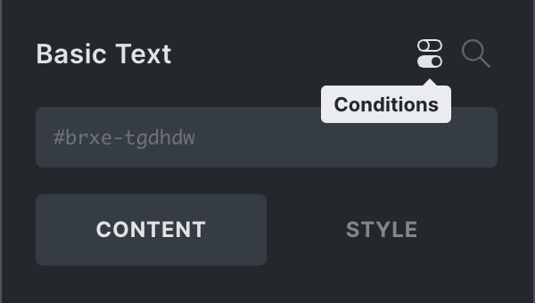
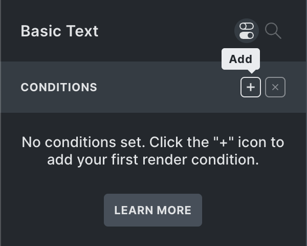
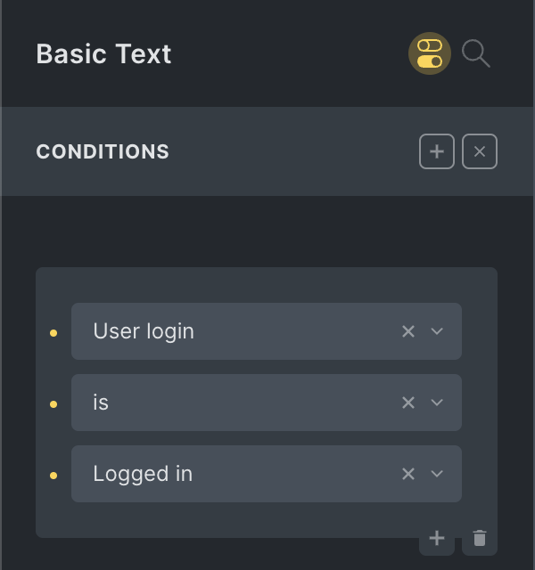
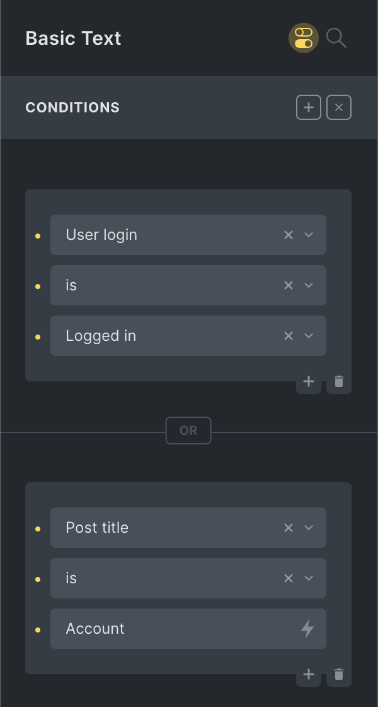
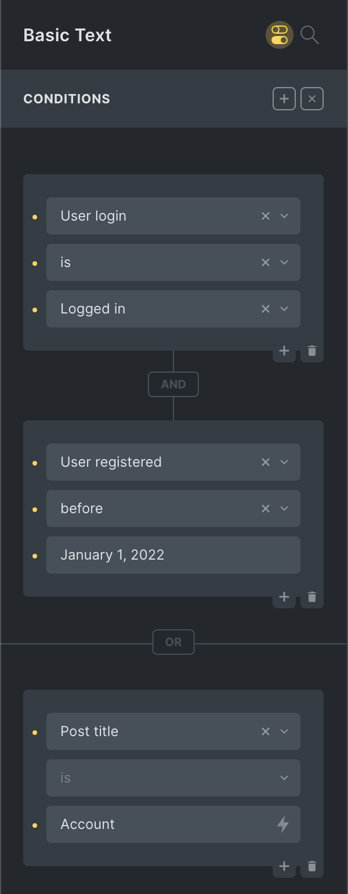
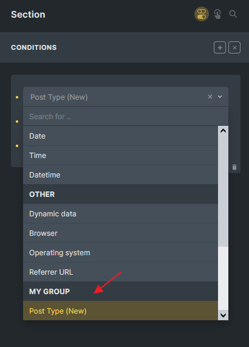
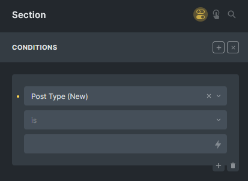

Element Conditions let you define one or multiple conditions for any element. Only if those conditions are met is the element rendered on the front end.

Conditions are validated server-side and are meant to filter out/not load an element based on data (post, user, dynamic data, date & time, etc.).

Not rendering an element means **the element HTML doesn't exist in the source code**.

This is perfect for restricting content to logged-in users or users with a specific role (e.g., membership sites) to hide time-sensitive information according to a certain weekday/date/time, according to dynamic data, etc.

If you need full programmatic power to define your element conditions, use the [bricks/element/render](https://academy.bricksbuilder.io/article/filter-bricks-element-render/) Bricks filter.

**IMPORTANT:** Element conditions are not applied in the builder!

## Accessing conditions

When editing an element, click the "Conditions" (toggle) icon in the panel header to open/close the element conditions interface. You'll see the "Conditions" toggle icon in the structure panel if an element has conditions. Click the icon to jump right into the conditions interface for this element.



## How element conditions work

At least one set of conditions must be fulfilled to render the element. This means all conditions inside a condition "set" must be evaluated to be true.

So there is an OR relationship between condition sets and an AND relationship between conditions inside a set.

To add your first set of conditions, click the "+" icon next to the "Conditions" title:



We now have one set with one condition. Every condition consists of the following three properties:

- **Key** (post ID, user role, date, dynamic data, etc.)

- **Comparison operand** (`==`, `!=`, `>`, `<`, `contains`, `before`, `after`, etc.)

- **Value** (numeric, text, checkbox, select option(s), etc.)

Let's say we want to show an element only to logged-in users. We'd create the following condition:



This element is only rendered when the person viewing this page is logged in.

Non-logged-in guests, bots, crawlers, etc., will not be able to see this element (as it's not in the source code).

## Conditions indicator

Notice the highlighted "Conditions" icon in the screenshot above. It's a great indicator to see at a glance if the element you are editing has any conditions (without having to open the conditions interface).

The "Conditions" (toggle) icon is also visible next to an element in the structure panel to quickly scan for element conditions on your page. A click on it brings you right into the conditions interface.

## Checking multiple conditions

Between a set of conditions exists an **OR** relation. And conditions within a set have an **AND** relation.

Let's create a second set of conditions (by clicking the "+" icon at the top-right again) to illustrate this.

The condition in this new set is fulfilled (true) if the post title is "Account".

As there is an OR relation between condition sets, the element is rendered if (1) the user is logged in **OR** (2) the title of the post/page being viewed is "Account".



## Combining AND & OR conditions

Let's extend the conditions for this element by checking if the logged-in user has been registered before the 1st of Jan 2022.

As there is an AND relation between conditions inside a set, we'll click the "+" bottom on the bottom-right of our first condition to add another condition to this first set like this:



You'll also notice the vertical "**AND**" label between conditions inside a set.

And the horizontal "**OR**" label between condition sets.

We hope this helps to visualize the element conditions logic even better.

### How to compare dynamic data against the value

The element conditions, by default, compare against the label.

Certain dynamic data provider fields allow you to specify the value & label (e.g., [ACF true false](https://academy.bricksbuilder.io/article/dynamic-data/#acf), Metabox checkbox list, radio, select, etc.).

To compare against the value instead, you can use the `:value` filter like this:


In the example above, the condition is fulfilled when the Metabox checkbox list has the `blue` value selected. Without the `:value` filter, the condition would compare against the checkbox option label.

## Element Conditions API

The following information is intended for developers who wish to extend the default element conditions interface programmatically (`@since 1.8.4`).

The custom element condition that we will create should resemble the following example:



<figcaption>

Builder: New condition group with "Post type" option

</figcaption>

### Step 1: Add condition group via filter: bricks/conditions/groups

```php
add_filter( 'bricks/conditions/groups', 'add_my_condition_group' );
function add_my_condition_group( $groups ) {
  // Ensure your group name is unique (best to prefix it)
  $groups[] = [
    'name'  => 'my_group',
    'label' => esc_html__( 'My Group', 'my-plugin' ),
  ];

  return $groups;
}
```

### Step 2: Add condition options via filter: bricks/conditions/options

In this example, we'll create a new condition to compare the current page post type with the user's value. The compare is a dropdown with "is" and "is not" options. The value field type is a `text` input.

```php
add_filter( 'bricks/conditions/options', 'add_my_custom_condition' );
function add_my_custom_condition( $options ) {
  // Ensure key is unique, and that group exists
  $options[] = [
    'key'   => 'my_post_type',
    'label' => esc_html__( 'Post Type (New)', 'my-plugin' ),
    'group' => 'my_group',
    'compare' => [
      'type'        => 'select',
      'options'     =>  [
        '==' => esc_html__( 'is', 'my-plugin' ),
        '!=' => esc_html__( 'is not', 'my-plugin' ),
      ],
      'placeholder' => esc_html__( 'is', 'my-plugin' ),
    ],
    'value'   => [
      'type'        => 'text',
    ],
  ];

  return $options;
}
```



<figcaption>

Expected result: New condition in the builder

</figcaption>

### Step 3: Execute your logic to return a Boolean result via filter: bricks/conditions/result

Based on your custom logic, return `true` or `false` for your condition. Bricks take care of the `OR` and `AND` conditions.

In this example, we check if the current post type matches the user value.

If the condition is met, return `true`.

You can access the `$condition` variable, which has been set inside the builder.

```php
add_filter( 'bricks/conditions/result', 'run_my_custom_condition', 10, 3 );
function run_my_custom_condition( $result, $condition_key, $condition ) {
  // If $condition_key is not 'my_post_type', we return the $render as it is
  if ( $condition_key !== 'my_post_type' ) {
    return $result;
  }

  // Now you can perform your logic by using the $condition variable
  // $condition['compare'] is the compare operator, might be empty
  // $condition['value'] is the user value, might be empty

  // In my example, if compare is empty, we set it to '==' as default
  $compare    = isset( $condition['compare'] ) ? $condition['compare'] : '==';
  $user_value = isset( $condition['value'] ) ? $condition['value'] : '';

  $condition_met = false;

  // Get the current post type of the page
  $current_post_type = get_post_type();

  switch( $compare ) {
    case '==': // "is"
      $condition_met = $current_post_type === $user_value;
      break;
    case '!=': // "is not"
      $condition_met = $current_post_type !== $user_value;
      break;
  }

  return $condition_met;
}
```

If you have added multiple options under the same group, you can target them like this:

```php
add_filter( 'bricks/conditions/result', 'run_my_custom_condition', 10, 3 );
function run_my_custom_condition( $result, $condition_key, $condition ) {

  $condition_options = \Bricks\Conditions::$options;
  $registered_condition = $condition_options[ $condition_key ];
  if ( $registered_condition['group'] !== 'my_group' ) {
    return $result;
  }
  // Now you can perform your logic by using the $condition variable
  // $condition['compare'] is the compare operator, might be empty
  // $condition['value'] is the user value, might be empty

  $condition_met= false;

  switch( $condition_key ) {
    case 'my_condition_option_1':
      // Example
      $condition_met = execute_my_logic_1( $condition );
      break;
    case 'my_condition_option_2':
      // Example
      $condition_met = execute_my_logic_2( $condition );
      break;
  }

  return $condition_met;
}
```
