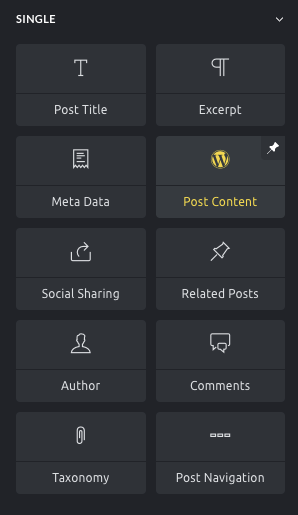
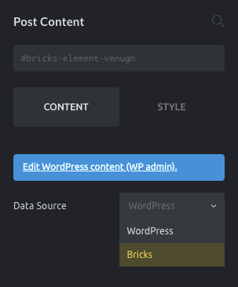
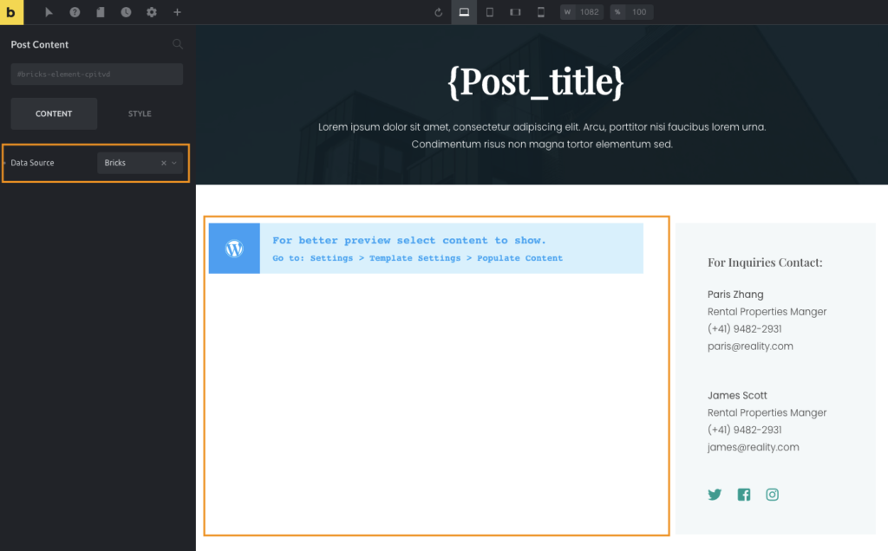

The **Post Content** element is a placeholder in the builder that tells Bricks to fetch the post content into the layout you're building.

Since Bricks 1.3.5 you can select the source from which to pull the content:

- WordPress Editor (Gutenberg/Classic editor)
- Bricks Data

The **Data Source** control is only visible when the Post Content element is used in Bricks templates.

If the **Post Content** element is placed in a Page/Post, etc. the WordPress content is fetched by default.

## How to use the Post Content element

Inside the builder, go to the Elements panel and look for the **Post Content** element in the Single elements group or use the element search bar in the panel header. Click or drag the Post Content element onto the canvas.

If the element is inserted when editing a post or page, it will automatically show the WordPress editor content on the canvas unless there is no Page/Post content. That content is also shown on the front end.

This is useful when creating a **Single Post template** in which you want to show the WordPress content (e.g. a single blog post).

## Fetching Bricks Data with the Post Content element

In certain scenarios, you'd like to edit each post with Bricks instead of using the WordPress editor such as when using more complex layouts that aren't possible with WordPress.

In this case, you need to set the **Data Source** to "Bricks" in the Post Content settings:

## Creating different page layouts using the Post Content

When using a Bricks template as your page layout this template is rendered on the frontend instead of the individual page created with Bricks.

If you use the **Post Content** element and set the **Data Source** to Bricks, you can design different page templates and still fetch each page content built with Bricks.

A common use case would be to build a page template with two areas: the main area (which is populated with the page content), and a fixed sidebar for all the pages.

To get the Bricks-built content of each page, the Data Source of the Post Content element needs to be set to "Bricks":

<figcaption>

Bricks Page Template using a Post Content element to fetch page bricks data

</figcaption>

