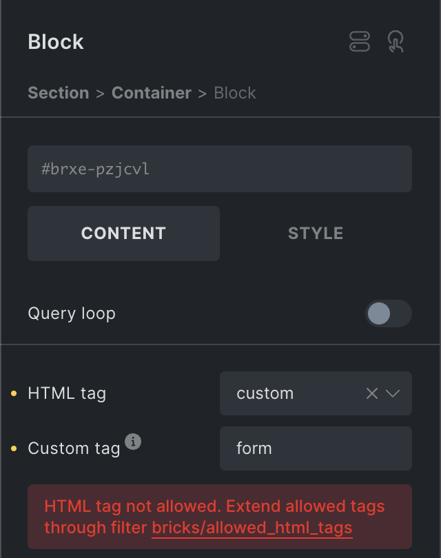

Starting at version `1.10.2` Bricks restricts the allowed HTML tags to the WordPress core logic for `wp_kses_allowed_html( 'post' )`.

This results in the following HTML tags being allowed out-of-the-box:

address, a, abbr, acronym, area, article, aside, audio, b, bdo, big, blockquote, br, button, caption, cite, code, col, colgroup, del, dd, dfn, details, div, dl, dt, em, fieldset, figure, figcaption, font, footer, h1, h2, h3, h4, h5, h6, header, hgroup, hr, i, img, ins, kbd, label, legend, li, main, map, mark, menu, nav, object, p, pre, q, rb, rp, rt, rtc, ruby, s, samp, span, section, small, strike, strong, sub, summary, sup, table, tbody, td, textarea, tfoot, th, thead, title, tr, track, tt, u, ul, ol, var, video

For example, setting the "Custom tag" on a "Block" element to `form` is not allowed by default, and will throw the following error in the builder:



Using the new filter as shown in the code snippet below, the `form` tag is added to the list of allowed HTML tags and can be used without throwing any errors.

```php

add_filter( 'bricks/allowed_html_tags', function( $allowed_html_tags ) {
    // Define the additional tags to be added (e.g. 'form' & 'select')
    $additional_tags = ['form', 'select'];

    // Merge additional tags with the existing allowed tags
    return array_merge( $allowed_html_tags, $additional_tags );
} );
```

**Only allow HTML tags that are considered safe, as anyone with builder access can use them!**
