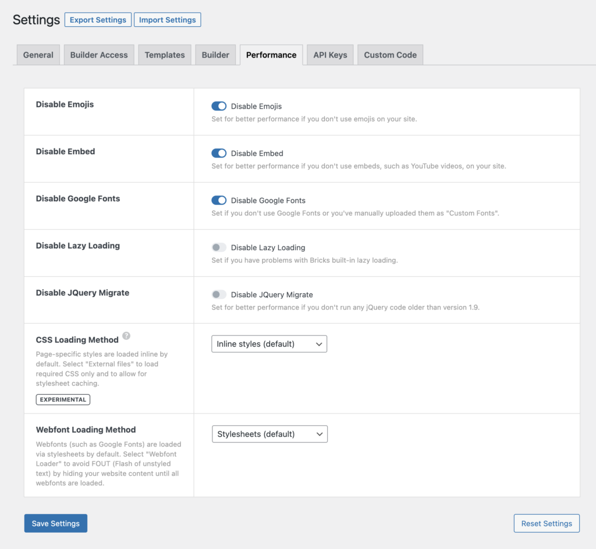

Bricks 1.4 introduces the possibility to "Disable Google Fonts". Either via the Bricks settings under "Performance" or programmatically using the filter as explained below:




<figcaption>

Bricks > Settings > Performance: Disable Google Fonts

</figcaption>


With the filter `bricks/assets/load_webfonts` you'll be able to prevent Google Fonts to load in the frontend by returning `false`:

```php
// Prevent Google Fonts loading
add_filter( 'bricks/assets/load_webfonts', '__return_false' );
```

If you use this filter to remove the embed of Google Fonts but you still like to use Google Fonts, just head to the [Google Fonts website](https://fonts.google.com/) and download the fonts you need. Then, add them manually to your website, using the [Custom Fonts](https://academy.bricksbuilder.io/article/custom-fonts/) screen.
