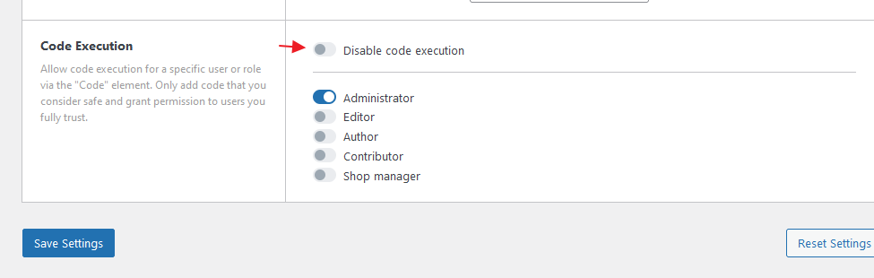

An alternative to the **Disable code execution** setting under `Bricks > Settings > Builder Access`. You can use this PHP filter to disable/enable code execution programmatically.



```php
add_filter( 'bricks/code/allow_execution', function( $allow ) {
  // Only allows to return false to disable code execution programmatically
  return false;
} );
```
