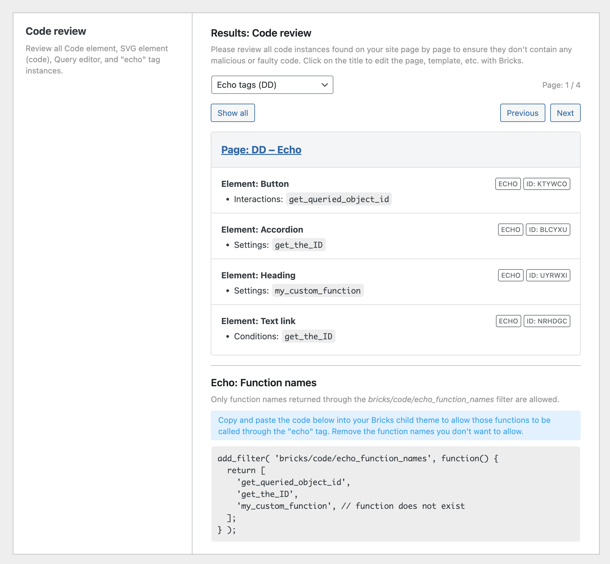

Starting at Bricks 1.9.7, you must explicitly allow any function names you want to call via Bricks' dynamic data echo tag using the new bricks/code/echo\_function\_names filter. You can add this to your Bricks child theme or the code snippet plugin of your choice.

```php
add_filter( 'bricks/code/echo_function_names', function() {
  return [
    'my_custom_function',
    'another_custom_function',
  ];
} );
```

To use echo functions, you must first enable “Code execution” for the appropriate user role or user in your WordPress dashboard under “Bricks – Settings – Custom code” (see the screenshot below).


<figcaption>

Code Execution: Enabled for user role "Administrator"

</figcaption>


Make sure to only enable code execution for users & user roles you trust 100%.

You can get a list of all functions on your site called through the `echo` tag as part of the "Code review" results. Here's how:

1. Go to `Bricks > Settings > Custom code`

3. Click the "Start: Code review" button

5. Once finished, select "Echo tags" from the dropdown.

7. Copy the code snippet under "Echo: Function names" and paste it into the `functions.php` file of your Bricks child name. Make sure to remove any unknown or unwanted function names from the array.



## Using patterns (regex) to simplify echo function calls

Bricks 1.9.8 offers greater flexibility when it comes to echo function calls.

While you can still return an array with the exact function names, you can also return an array that contains specific regex checks. We identify those regex calls by the `@` prefix.

If your function name matches any of those regex checks, it can be called through the `echo` tag.

**Example: Allow calling any functions that start with `brx_`:**

```php
add_filter( 'bricks/code/echo_function_names', function($function_name) {
  return [
    '@^brx_', // Allow all functions that start with "brx_"
  ];
} );
```

## Check function names against your own custom logic

Instead of returning an array, you can also perform any custom check against the function name itself or any other logic you want to run. The filter receives the function name (`$function_name`) as an argument to assist in making more dynamic decisions. Returning a boolean (`true` or `false`)

**Example: Allow function execution based on function name prefix**

```php
add_filter('bricks/code/echo_function_names', function($function_name) {
  // Only allow functions that start with "custom_"
  return strpos($function_name, 'custom_') === 0;
});
```

This example uses a straightforward check to determine if the function starts with `custom_`. If so, it returns `true`, allowing the function to be executed; otherwise, it returns `false`.

**Example: Run any function when development mode is enabled**

```php
add_filter( 'bricks/code/echo_function_names', function($function_name) {
  return defined( 'WP_DEVELOPMENT_MODE' ) ? WP_DEVELOPMENT_MODE : false;
} );
```

The `[WP_DEVELOPMENT_MODE](https://make.wordpress.org/core/2023/07/14/configuring-development-mode-in-6-3/)` PHP constant has been available in WordPress core since version 6.3. We use it just as an example. You can use any custom PHP constant of your choice by defining it in your child theme's functions.php file.

**Example: Run function if the current user can edit posts**

```php
add_filter( 'bricks/code/echo_function_names', function($function_name) {
  return current_user_can( 'edit_posts' );
} );
```
