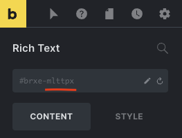

Bricks 1.5 introduces the new `bricks/element/render` filter. This filter enables you to implement your own conditional display logic programmatically.

This is ideal for restricting premium content to certain users, etc.

If the condition inside this filter is not met (i.e. it returns `false`), then the element won't be rendered on the frontend.

```php
add_filter( 'bricks/element/render', function( $render, $element ) {
  // Conditional display logic goes here:
  // $render = true to render the element 
  // $render = false to skip the element render

  return $render;
}, 10, 2 );
```

Bricks introduced [Element Conditions](/article/element-conditions/) in 1.5.4. Use this PHP filter for a more complicated scenario.

## Example 1: Output a specific element if the visitor is logged-in




<figcaption>

The 6-character element ID is the last part of the default HTML ID (after the dash).

</figcaption>


In the following example, we check if the element has a specific element ID, and if so, we allow the element to be rendered based on the logged-in/out condition.

```php
add_filter( 'bricks/element/render', function( $render, $element ) {
  // Render element ID "mlttpx" if user is logged in
  if ( $element->id === 'mlttpx' ) {
    return is_user_logged_in();
  }

  return $render;
}, 10, 2 );
```

## Example 2: Don't output elements with a specific custom CSS class for users with a subscriber role

The following example will render an element if it contains the custom CSS class `hide-for-subscribers`, if the user is logged in and is not a subscriber.

You may select different [users' capabilities](https://wordpress.org/support/article/roles-and-capabilities/) according to your needs.

```php
add_filter( 'bricks/element/render', function( $render, $element ) {
  // Get the element CSS classes
  $classes = ! empty( $element->attributes['_root']['class'] ) ? $element->attributes['_root']['class'] : false;

  // Check if the element has the special class "hide-for-subscribers"
  if ( $classes && in_array( 'hide-for-subscribers', $classes ) ) {
    return current_user_can( 'edit_posts' );
  }

  return $render;
}, 10, 2 );
```

## Example 3: Output elements for a specific post category

The following example will render a specific element based on the HTML ID on a single post page with a specific category:

```php
add_filter( 'bricks/element/render', function( $render, $element ) {
  // Check if this is a single post page
  if ( ! is_single() ) {
    return $render;
  }

  // Get the element custom HTML ID
  $html_id = isset( $element->settings['_cssId'] ) ? $element->settings['_cssId'] : false;

  // Check if the element has the HTML ID "project-award"
  if ( $html_id && $html_id === 'project-award' ) {
    return has_category( 'projects' );
  }

  return $render;
}, 10, 2 );
```

## Example 4: Output elements having a class of "logged-in" to logged-in users and elements having a class of "logged-out" to non logged-in visitors

The following example renders elements that have a class of `logged-in` only to users that are logged in and elements that have a class of `logged-out` only to users that are logged out:

```php
add_filter( 'bricks/element/render', function( $render, $element ) {
  // Get the element CSS classes
  $classes = ! empty( $element->attributes['_root']['class'] ) ? $element->attributes['_root']['class'] : false;
  
  // Check if the element has the special class "logged-in"
  if ( $classes && in_array( 'logged-in', $classes ) ) {
  return is_user_logged_in();
  }
  
  // Check if the element has the special class "logged-out"
  if ( $classes && in_array( 'logged-out', $classes ) ) {
  return ! is_user_logged_in();
  }

  return $render;
}, 10, 2 );
```

## Example 5: Output an element having a specific HTML ID based on value of a custom field

The following example renders an element that has the specified HTML ID based on the value of a specific custom field of the current post when viewing a singular page:

```php
// Render an element with "project-award" HTML ID if the specified condition is true.
// Condition: The value of a custom field "dont_output_project_award" is false.
add_filter( 'bricks/element/render', function( $render, $element ) {
  // Check if this is a singular page
  if ( ! is_singular() ) {
    return $render;
  }

  // Get the element custom HTML ID
  $html_id = isset( $element->settings['_cssId'] ) ? $element->settings['_cssId'] : false;

  // Check if the element has the HTML ID "project-award"
  if ( $html_id && $html_id === 'project-award' ) {
    return ! get_post_meta( $element->post_id, 'dont_output_project_award', true );
  }

  return $render;
}, 10, 2 );
```

The examples above are really just to illustrate a few simple use cases. Anything that you can check with PHP is possible to include in your own conditional display logic using this new `bricks/element/render` filter.

## Example 6: Output an element in ACF Repeater if the sub field is not empty

Scenario:

ACF Repeater: FAQs

Sub fields: Question, Answer, Button Text and Button URL

Requirement: When Query Loop's query type is set to this ACF Repeater, output a Button (a child element of the repeating element) only in the rows that have a value set for the Button Text sub field.

```php
// Output one or more instances of the specified element (inside a query loop of ACF Repeater type) when the condition is true.
// Condition: The specified sub field inside the specified ACF Repeater field is not empty.
add_filter( 'bricks/element/render', function( $render, $element ) {
  if ( $element->id === 'huciku' && class_exists( 'ACF' ) ) {
    if ( have_rows( 'faqs' ) ) {
      // Loop through rows.
      while( have_rows( 'faqs' ) ) : the_row();
        return get_sub_field( 'button_text' );
      // End loop.
      endwhile;
    }
  }
  
  return $render;
}, 10, 2 );
```

where `huciku` is the element ID of the Button.

Note: This will be applied as `brxe-huciku` class in the output in this case, not a ID.

Also, replace `faqs` and `button_text` strings as applicable.
