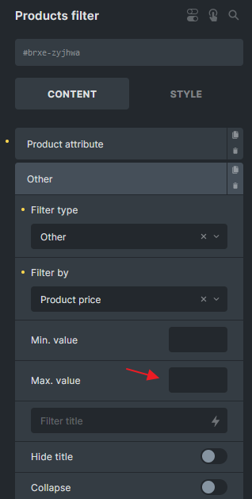

Bricks 1.5 adds the possibility to change the element settings before it is rendered.

This allows you to change a text element content programmatically, or add styles based on a custom conditional logic, like so:

```php
add_filter( 'bricks/element/settings', function( $settings, $element ) {
    // Add "[online]" text to all the headings elements if the visitor is logged in 
    if ( $element->name === 'heading' && is_user_logged_in() ) {
        $settings['text'] .= ' [online]'; 
    }

    return $settings;
}, 10, 2 );
```

In case you need to programmatically add an element conditional display logic, check the filter `[bricks/element/render](https://academy.bricksbuilder.io/article/filter-bricks-element-render/)`.

##### Example: Dynamically set WooCommerce Product Filter (Price) max price from all products



```php
add_filter('bricks/element/settings', function( $settings, $element ) {
  // Change the zyjhwa to your element ID
  if( $element->id !== 'zyjhwa' || ! isset( $settings['filters'] ) ) {
    return $settings;
  }

  // Get all products
  $products = wc_get_products(array(
    'status' => 'publish',
    'limit' => -1, // Retrieve all products
  ));

  $highest_price = max(array_map(function ($product) {
    return $product->get_price();
  }, $products));

  foreach( $settings['filters'] as $key => $filter ) {
    if( ! isset( $filter['otherFilter'] ) || $filter['otherFilter'] !== 'price' ) {
      continue;
    }

    $settings['filters'][$key]['sliderMax'] = $highest_price;
  }

  return $settings;
}, 10, 2);
```
