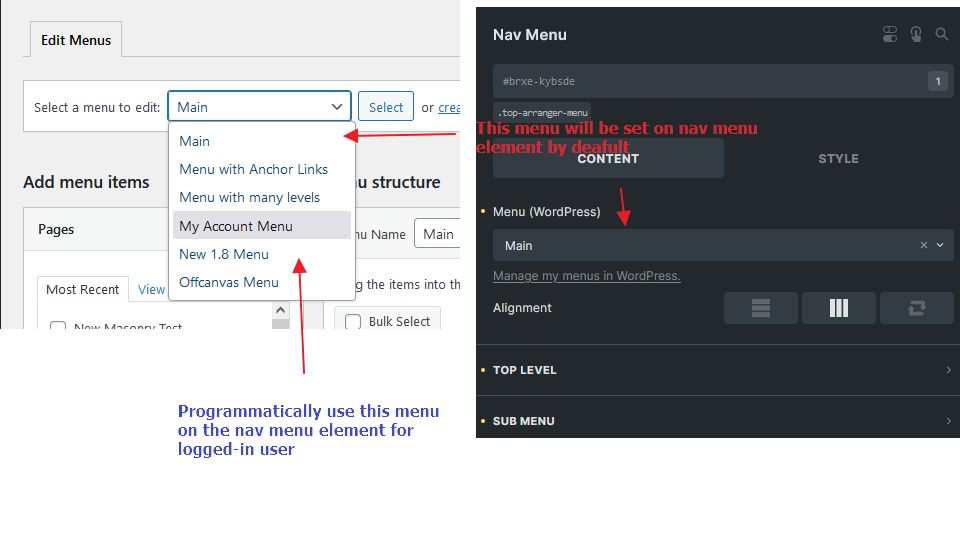
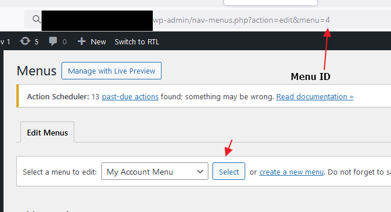

The `bricks/nav_menu/menu` filter allows you to modify the navigation menu dynamically in Bricks Builder based on your conditions.

In the following example, we'll demonstrate how to change the navigation menu if the user is logged in.

This can be useful for displaying different menus to guests and logged-in users without using multiple Nab Menu elements and Bricks conditions.

**Example:** Use "My Account Menu" on the "Nav Menu" element (id: `kybsde`) if the user is logged in.



You can retrieve the menu ID via the URL parameter after selecting it.



```php
add_filter( 'bricks/nav_menu/menu', function( $menu, $post_id, $element ) {
  // Only target this nav menu element
  if( $element['id'] !== 'kdkdge' ) {
    return $menu;
  }

  // If logged-in, use the menu ID 4
  if( is_user_logged_in() ) {
    $menu = 4;
  }

  return $menu;
}, 10, 3 );
```
