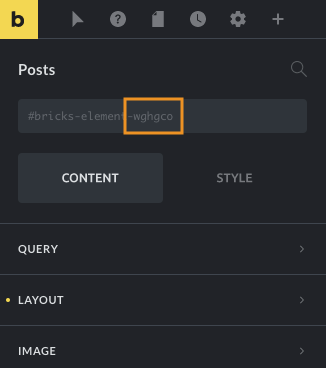

Since Bricks 1.3.7 you'll be able to decide if a certain element query should be merged with the WordPress main query, in the archive or search templates, using the following filter:

```php
add_filter( 'bricks/posts/merge_query', function( $merge, $element_id ) {
  if ( $element_id === 'wghgco' ) {
    return false;
  }

  return $merge;
}, 10, 2 );
```

The filter callback receives two arguments:

- `$merge` is a boolean variable indicating whether the query should be merged or not (default: true)

- `$element_id` is a string containing the element ID

This is triggered for all the Bricks elements containing one internal WP\_Query query like the Posts and the Carousel element, or any other element where the Query Loop is enabled (Container, Slider, Accordion).

Starting from Bricks 1.7, you can achieve the same result by utilizing the "Disable Query Merge" option in the [Query Loop](/article/query-loop/#posts-query), without the need for a PHP filter. Use this filter for more advanced situations.

## How to find the element ID?

Each element in Bricks has a unique ID. You may find the element ID when editing the element and looking into the Global CSS classes input. By default, it shows the element HTML ID (e.g. `#bricks-element-wghgco`). For the purpose of this filter, we only need the last portion of the string, the six-character long element ID (e.g. `wghgco`).


