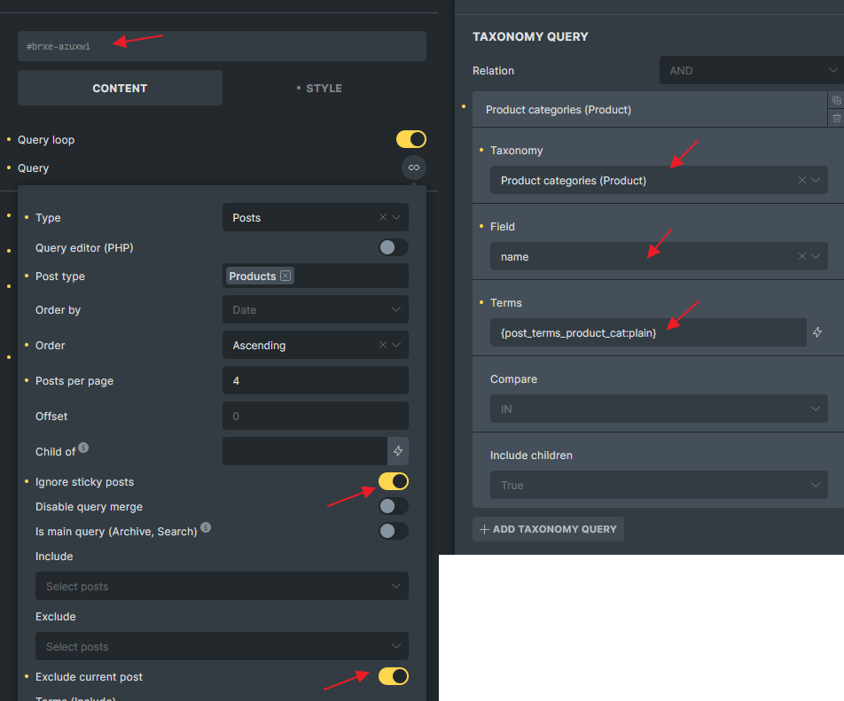
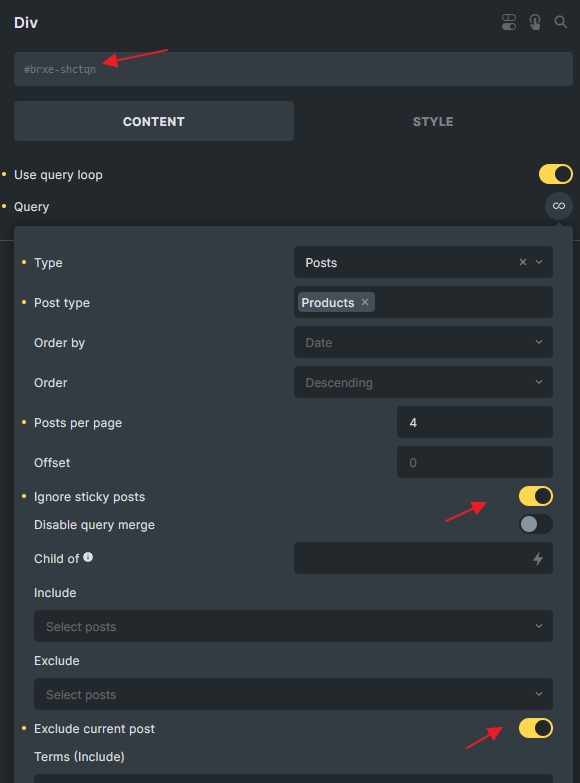

Since Bricks 1.3.2 you may manipulate the **posts**, **products,** or **Query Loop** elements query vars before the query is performed like so:

```php
add_filter( 'bricks/posts/query_vars', function( $query_vars, $settings, $element_id, $element_name ) {
    // Use an ACF custom field to restrict the query to a set of posts
    if ( $element_id == 'fhmnfx' && function_exists('get_field') ) {
        $query_vars['post__in'] = get_field('my_posts_acf_field');
    }

    return $query_vars;
}, 10, 4 );
```

The filter callback receives three arguments:

- `$query_vars` an associative array used to feed the [WP\_Query](https://developer.wordpress.org/reference/classes/wp_query/) class

- `$settings` an associative array containing the element settings set in the builder

- `$element_id` is a string containing the unique element ID (`@since 1.3.6`)

- `$element_name` is a string containing the element name (`@since 1.11.1`)

If you intend to modify the $query\_vars for the WooCommerce product query in Bricks, consider increasing the priority argument to a higher value, such as 20 or 30. Failure to do so could result in your filter being potentially overridden by other code that hooks into this filter.

#### Example: Loop images from Metabox.io Advanced Image Field of current post

```php
add_filter( 'bricks/posts/query_vars', function( $query_vars, $settings, $element_id, $element_name ) {

    // Only target yeamho element_id
    if ( $element_id !== 'yeamho') return $query_vars;
        
    // Get Metabox advanced images field values. 'mg_projet_galerie_images' is the field id
    $gallery_images = (array) rwmb_meta( 'mg_projet_galerie_images', ['size' => 'full'] );
	
    // Get the Images Ids only
    $gallery_images_ids = array_keys($gallery_images);
    
    // If no gallery images, set empty string array
    $gallery_images_ids = count( $gallery_images_ids ) > 0 ? $gallery_images_ids : [''];
    
    // Set the images ids as post__in parameters
    $query_vars['post__in'] = $gallery_images_ids;

    return $query_vars;
}, 10, 4 );
```

#### Example: Use current taxonomy's ACF gallery images IDs for a Media query loop (Nestable Slider)

If you want to build a dynamic Slider in term archive template, you can set the query loop on the Slide like below image, and use the code snippet below to retrieve the images IDs from the gallery field for each term, then assign them to the `post__in` parameter.


```php
add_filter( 'bricks/posts/query_vars', function( $query_vars, $settings, $element_id, $element_name ) {
  // Only target udcvuw element_id
  if ( $element_id == 'udcvuw' && function_exists('get_field') ) {
    // Set to 0, ensure no results by default
    $query_vars['post__in'] = [0];
    $current_term = get_queried_object();
		
    // Check if the current page is a term archive
    if( is_a( $current_term, 'WP_Term' ) ) {
      // Get the images associated with the current term, region_-_banniere is the field name
      $images = get_field('region_-_banniere', 'region_'. $current_term->term_id );
            
      // Check if images exist and if there's more than 0 images
      if( is_array( $images ) && count( $images ) > 0 ) {
        // Get the IDs of the images (if this field return format is array)
        $images_ids = wp_list_pluck( $images, 'ID' );
        // Set the query to include only posts with these image IDs
        $query_vars['post__in'] = $images_ids;
      }
    }
  }
  return $query_vars;
}, 10, 4 );
```

#### Example: Apply orderby argument with 2 different fields

Imagine you got a Performance post type with a start date field and a start time field. As you will not create the Performance post by actual sequence, you wish to order the Performance posts by start date (ascending) and start time (descending).

Since 1.11.1, you can achieve this in Query Loop user interface. Check [this](/article/query-loop/#enhanced-ordering-options) out.

```php
add_filter( 'bricks/posts/query_vars', function( $query_vars, $settings, $element_id, $element_name ) {
    
    // Only target 3b03dd element_id
    if( $element_id !== '3b03dd') return $query_vars;

    // Set meta_query
    $query_vars['meta_query'] = [
        'relation' => 'AND',
        'performance_start_date' => array(
            'key' => 'performance_start_date',
            'compare' => 'EXISTS',
        ),
        'performance_start_time' => array(
            'key' => 'performance_start_time',
            'compare' => 'EXISTS',
        ), 
    ];

    // Set orderby
    $query_vars['orderby'] = [
        'performance_start_date' => 'ASC',
        'performance_start_time' => 'DESC'
    ];

    return $query_vars;
}, 10, 4 );
```

#### Example: Get WooCommerce Related Products

Create a query loop with the following settings



```php
add_filter( 'bricks/posts/query_vars', function( $query_vars, $settings, $element_id, $element_name ) {
	if( $element_id !== 'azuxwi' ) return $query_vars;

	$product_id = get_the_ID();
	$product = wc_get_product( $product_id );

	if( ! is_a( $product, 'WC_Product' ) ) return $query_vars;
	// Exclude the upsell products
	$upsell_ids = $product->get_upsell_ids();

	if( count( $upsell_ids ) > 0 ) {
		if( isset( $query_vars['post__not_in'] ) ) {
			$query_vars['post__not_in'] = array_merge( $query_vars['post__not_in'], $upsell_ids );
		} else {
			$query_vars['post__not_in'] = $upsell_ids;
		}
	}

	return $query_vars;
}, 10, 4);
```

#### Example: Get WooCommerce Upsell Products

Create a query loop with the following settings:



```php
add_filter( 'bricks/posts/query_vars', function( $query_vars, $settings, $element_id, $element_name ) {
	// Change the Id 
	if( $element_id !== 'shctqn') return $query_vars;

	$product_id = get_the_ID();
	$product = wc_get_product( $product_id );

	if( ! is_a( $product, 'WC_Product' ) ) return $query_vars;

	$upsell_ids = $product->get_upsell_ids();
	$query_vars['post__in'] =  ( count( $upsell_ids ) > 0 )? $upsell_ids : [0] ;
        // in case your have product variation set as upsell
        $query_vars['post_type'] = ['product', 'product_variation'];

	return $query_vars;
}, 10, 4 );
```

#### Different ways to target the query other than $element\_id

Sometimes you might want to target a group of queries instead of a specific element by using the `$element_id`

##### Use WordPress conditional tag function

```php
// Target any query in an archive page
add_filter( 'bricks/posts/query_vars', function( $query_vars, $settings, $element_id, $element_name ) {

  if( ! is_archive() ) return $query_vars;

  // Perform your logic here

  return $query_vars;
}, 10, 4 ); 
```

##### Check if CSS class exists on the query element

```php

// Target any query if 'my-custom-class' set on the query element in STYLE > CSS > CSS Classes
add_filter( 'bricks/posts/query_vars', function( $query_vars, $settings, $element_id, $element_name ) {

  $css_class = isset( $settings['_cssClasses'] ) ? $settings['_cssClasses'] : '';

  if( $css_class === '' || strpos( $css_class, 'my-custom-class' ) === false ) {
    return $query_vars;
  }

  // Perform your logic here

  return $query_vars;
}, 10, 4 );

// Target any query if 'my-custom-class' global class set on the query element
add_filter( 'bricks/posts/query_vars', function( $query_vars, $settings, $element_id, $element_name ) {

  $global_css_classes = isset( $settings['_cssGlobalClasses'] ) ? \Bricks\Element::get_element_global_classes( $settings['_cssGlobalClasses'] ) : [];
  
  if( empty( $global_css_classes ) || ! in_array( 'my-custom-class', $global_css_classes ) ) {
    return $query_vars;
  }

  // Perform your logic here

  return $query_vars;
}, 10, 4 );
```
