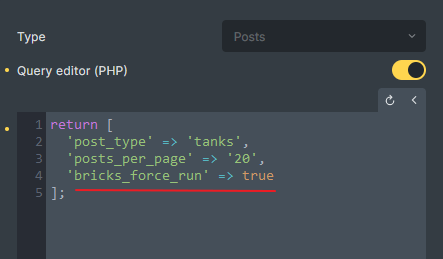

Bricks has enhanced query performance in 1.9.1. Now, each unique query is executed only once per page load, and subsequently, the query results are reused on the same page. Consequently, certain queries-related PHP filters will no longer be triggered multiple times.  
  
The following filters may be impacted:

- `bricks/posts/merge_query`

- `bricks/posts/query_vars`

- `bricks/terms/query_vars`

- `bricks/users/query_vars`

- `bricks/query/run`

- `bricks/query/result`

- `bricks/query/result_count`

- `bricks/query/result_max_num_pages`

Nevertheless, developers can utilize this filter to disable this setting for certain queries under specific circumstances.

```php
// Return boolean (default: false)
add_filter( 'bricks/query/force_run', function( $force_run, $query ) {
  // Get element ID
  $element_id  = $query::get_query_element_id();
  // Get element settings
  $settings = $query->settings;

  if ( isset( $settings['usingFacetWP'] ) ) {
    $force_run = true;
  }

  return $force_run;
}, 10, 2 );
```

Since 1.9.2, you can define `$query_vars['bricks_force_run'] = true` to achieve the same result as well. This will be handy if you are using the Bricks Query Editor or PHP filters like `bricks/posts/query_vars` etc.


