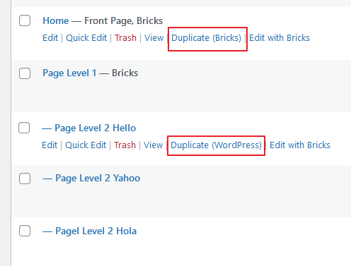
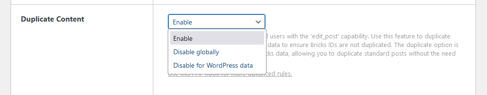

Duplicate content is available for all users with the `edit_post` capability. Use this feature to duplicate any post or page containing Bricks data to ensure Bricks IDs are not duplicated. The duplicate option is also available for posts without Bricks data, allowing you to duplicate standard posts without the need for a third-party plugin.



In **Bricks > Settings**, you can configure the duplicate content behavior:



**Enable**: Duplicate content is available for all posts.  
**Disable globally**: Duplicate content is disabled for all posts.  
**Disable for WordPress Data**: Duplicate content is disabled for posts that do not use Bricks data.

This `bricks/use_duplicate_content` hook provides an additional layer of customization, enabling you to implement more complex logic based on your specific requirements. `(@since 1.12)`

## Parameters

**`$use`** _(bool)_

- The current decision on whether duplicate content is allowed. Default is based on settings and user capabilities.

**`$post_id`** _(int)_

- The ID of the post being checked.

**`$setting`** _(string)_

- The value in Bricks > Settings. Which can be `enable`, `disabled_all`, or `disable_wp`

## Return Value

This filter expects a boolean value:

- `true` to allow duplicate content for the particular post.

- `false` to disallow duplicate content for the particular post.

## Example Usage

Follow setting logic + ensure the user is admin

```php
add_filter( 'bricks/use_duplicate_content', function( $use, $post_id, $settings ) {
  // Only allow if current has user administrative privileges
  $has_admin_cap = current_user_can( 'manage_options' );

  // Fulfilled the condition
  return $use && $has_admin_cap;
}, 10, 3 );
```

Follow setting logic + exclude post type for ACF or MB

```php
add_filter( 'bricks/use_duplicate_content', function( $use, $post_id, $settings ) {
  // Check if the post type is 'acf-field-group' or 'mb-post-type
  $post_type = get_post_type( $post_id );
  $exclude_post_types = [ 'acf-field-group', 'mb-post-type' ];

  // Fulfilled the condition
  return $use && ! in_array( $post_type, $exclude_post_types, true );
}, 10, 3 );
```
