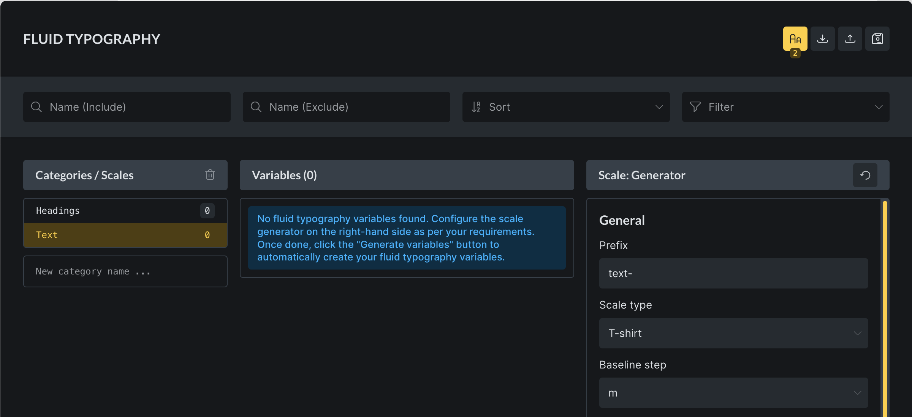
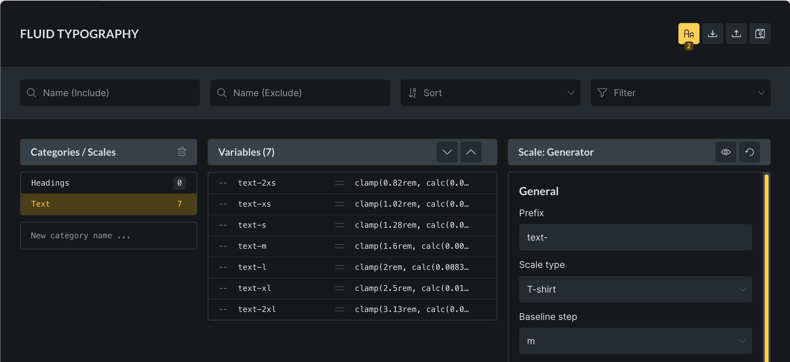
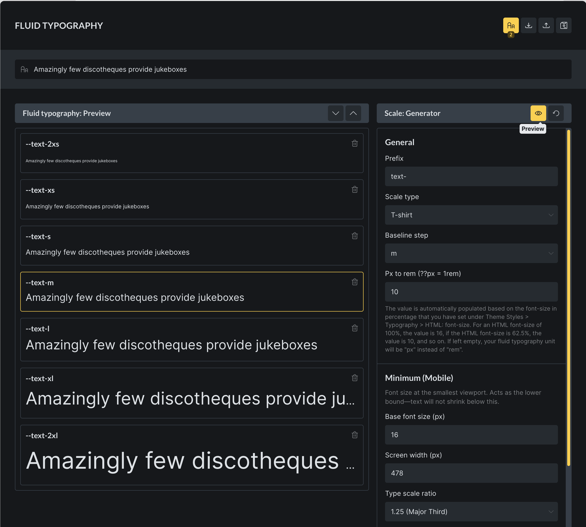

Starting with Bricks 2.1, the **Fluid Typography Generator** lets you create pixel-perfect & responsive font sizes (through CSS variables using `clamp`) that scale smoothly between defined minimum and maximum values, ensuring consistent readability across all screen sizes and devices. Simplifying the process of managing font sizes while maintaining flexibility and precision in your design.

## Accessing fluid typography

To access the Fluid Typography Generator click the `Aa` icon in the header of the **Variable Manager**:

There's also a "Fluid Typography" control under `Theme Styles > Typography` for easy access ;)

## Fluid typography categories

Bricks lets you create unlimited Fluid Typography Scales for your Headings, Text, etc. through categories.

So, **every Category is a Fluid Typography Scale**, that stores all its scale settings alongside it.

You can keep it simple and just create a `Headings` and `Text` category for those two scales as we did in the following screenshot:

## Fluid typography variables

Fluid typography variables can be generated with the Scale Generator on the right-hand side.

Whenever variables are generated, all existing variables within the selected category are deleted and replaced with the newly created variables. The number of variables is the same as in the previous set, but the names and values will be regenerated. So, any manual edits made to variable names or values are lost once the variables are regenerated.

## Scale controls

### Prefix

The prefix determines how variable names are structured. For instance, setting the prefix to `text-` results in variables being named `--text-m` or `--text-xl`, depending on the scale. It is recommended to use a prefix that is both unique and descriptive to maintain clarity and avoid conflicts.

### Scale type

The scale type specifies the naming convention used for fluid typography variables. There are three available options:

1. **T-shirt:** Generates variable names based on standard t-shirt sizes, such as `2xs, xs, s, m, l, xl, 2xl`. An example output would be `--text-m`.

3. **Numeric:** Generates variable names using numbers, typically ranging from 1 through 6. An example output would be `--text-4`.

5. **Custom:** Allows complete manual control over the naming convention. For example, scale names such as `small, medium, large, title` could be entered, resulting in variable names such as `--text-medium`.

### Custom scale type

This control only shows when the scale type is set to **Custom**. It provides the ability to define custom scale names, offering flexibility in aligning the naming convention with project-specific requirements.

### Baseline step

The baseline step acts as the foundation of the scale. The baseline variable will directly reflect the minimum and maximum font sizes defined, and all other scale steps will be calculated relative to this baseline. Proper definition of the baseline ensures accurate scaling across all steps.

### Px to rem

This value is automatically populated based on the root font-size setting defined in **Theme Styles > Typography > HTML: font-size**. For example, an HTML font-size of 100% corresponds to a value of 16, while an HTML font-size of 62.5% corresponds to a value of 10. Leaving this field empty results in units being expressed in `px` rather than `rem`. To ensure scalability and accessibility, it is strongly recommended to maintain this setting.

### Base font size (px)

The base font size establishes the minimum and maximum values for the baseline step. Font sizes for all other steps will be calculated automatically based on the defined **Type Scale Ratio**.

### Screen width (px)

Screen width determines the breakpoints at which the baseline font size reaches its minimum or maximum values. Outside these breakpoints, font sizes will remain constant.

### Type scale ratio

This control defines the ratio by which font sizes increase or decrease in relation to the next adjacent variable. For example, with a baseline of 16px and a scale ratio of 1.5, the next step above the baseline will be calculated as 24px. Ratios are applied upward and downward, generating consistent scaling in both directions.

For advanced use cases, it is possible to enter a custom ratio. A new control for defining custom values becomes available only when the **Custom** option is selected. This allows precise manual control over how each step in the scale is calculated.

## Editing variables

Once generated, variables are displayed in the central panel. These variables may be managed in several ways.

### Adding variables

Two buttons (arrow up & arrow down) are located at the top of the variables panel: one to create a smaller variable and one to create a larger variable.

Selecting either option inserts a new variable at the appropriate position, either above or below the baseline. Both the variable name and value are automatically generated.

In cases where the **Custom** scale type is used, variable names may need to be updated manually, or additional values can be added directly in the custom scale definition.

**Note:** If you used the **Custom** scale type, then you will need to update the variable name, or even better, add new value to the **Custom** scale directly.

### Deleting variables

Any variable, including the baseline, can be deleted. Removing variables does not interfere with calculations, even when additional variables are generated afterwards.

### Editing variables

Variable names and values can be directly edited by selecting them in the center column. Manual edits apply only to the selected variable and do not affect any calculations. This allows fine-tuned adjustments while maintaining overall scale consistency.

## Typography preview

A preview of the fluid typography can be activated by selecting the `eye` icon in the Scale Generator. Which opens the preview window on the left side of the popup, while hiding the categories to maximise space.

Within the preview window, several actions are available for managing and testing the generated variables:

- **Add variables:** New variables can be inserted above or below the existing ones, using the same process as described earlier.

- **Remove variables:** Each variable includes a trash icon, which can be used to delete it.

- **Customisable preview text:** The input field at the top of the panel allows the preview text to be customized.

- **Identify baseline step:** The highlighted variable (yellow border) represents the baseline step in the scale.
