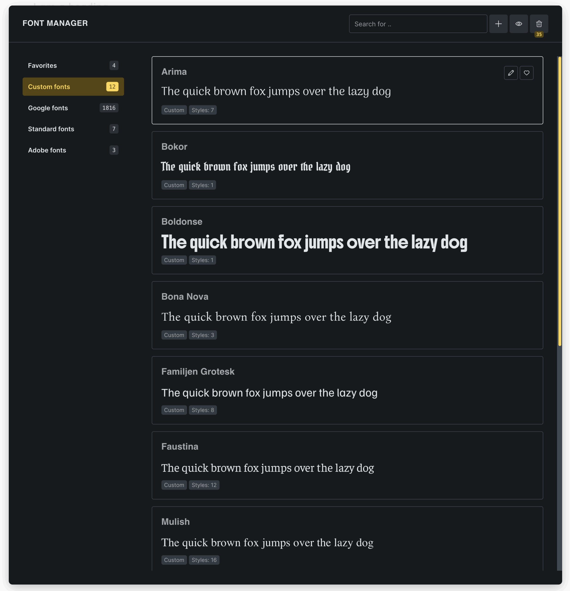
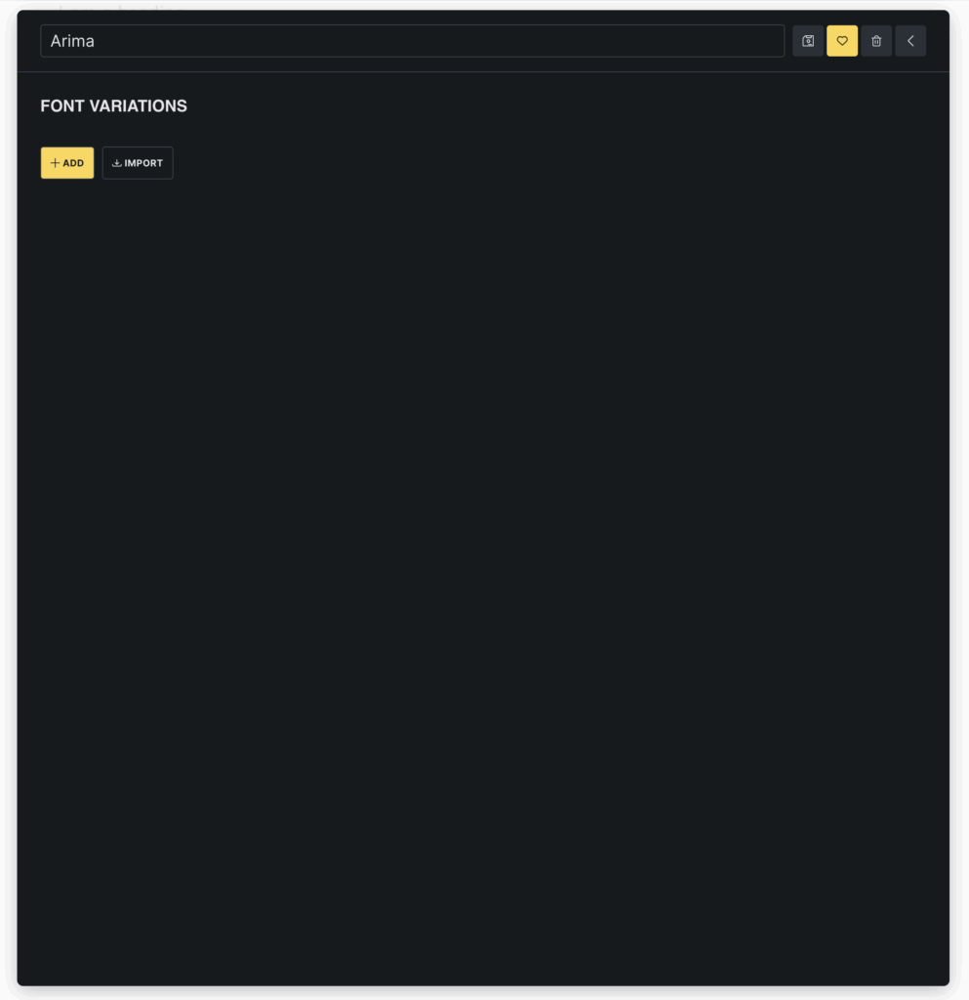
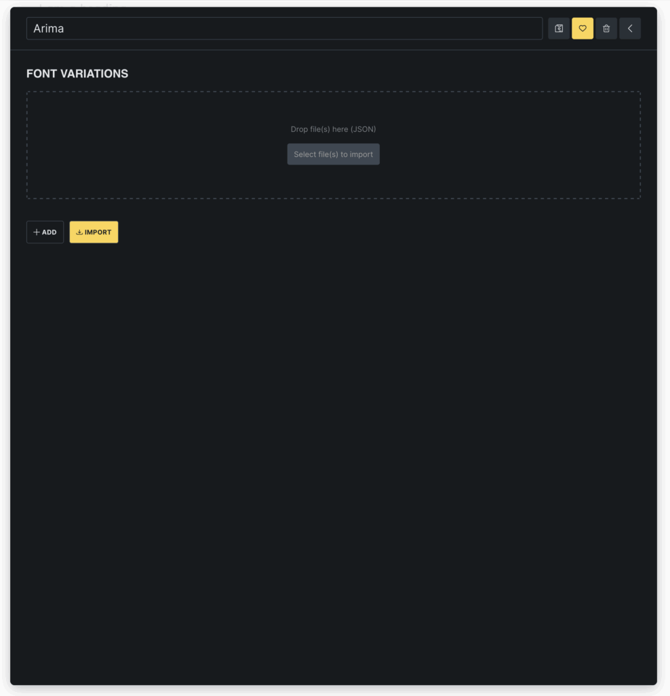

Bricks 2.0 introduces the new **Font Manager**, a centralized interface for adding, organizing, and managing all your site's fonts directly inside the builder.

## Accessing the Font Manager

You can open the Font Manager by going to **Settings > Font Manager** in the builder toolbar, or by clicking the **gear icon** next to any font-family control.

This opens a popup where you can manage all available fonts (Google fonts, Adobe fonts, Standard fonts, and Custom fonts).

## Core functionalities

### Add and manage custom fonts

Create and edit custom font families in just a few steps.

- **Add variant manually**: Click the **Add** button to upload a single font file. Set the font's **weight** and **style** individually.

- **Import multiple variants**: Click **Import** to drag and drop or select multiple font files. Bricks will automatically upload and organize them by weight and style.

You can rename, edit, or delete any custom font family. Fonts moved to the **Trash** are not deleted immediately and can be restored.

### Use Google Fonts locally

Browse the full Google Fonts library and download any font with a single click. Fonts are stored locally and loaded from your server, helping you stay GDPR-compliant by avoiding external requests.

### Favorite fonts

Mark individual fonts as **favorites** for faster access as they are added to the very top of the font-family options by default.

Under **Bricks > Settings > Builder > Font family: Options** you can choose to "Show all fonts", which lists any favorite fonts first (= default), or "Show favorites only", which limits the font family selection to the favoured fonts.
