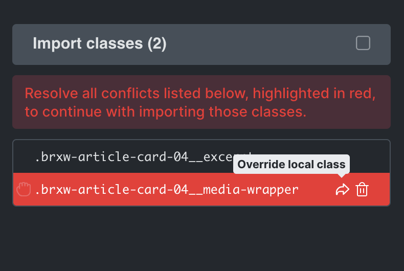
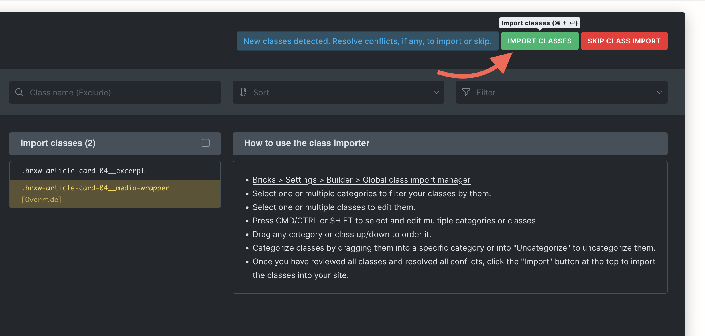

Since Bricks 1.12, the global class import manager addresses a key challenge in managing imported classes. Previously, conflicting classes were always automatically discarded, and users had no way to prepare or organize classes before importing them.

This new feature provides a clear and structured way to handle imported classes, giving users the ability to resolve conflicts, categorize classes, and maintain a clean workflow. To further streamline the process, we’ve included a setting that lets users decide when they’d like to be prompted, ensuring the feature suits their workflow.

## When does this show up?

The global class import manager opens whenever global classes are imported into the builder. This includes importing a global classes JSON file, pasting elements, or importing a template. Depending on your settings, it can open for specific situations, such as new classes, conflicting classes, or both.

## Types of classes in the import manager

The import manager displays two types of classes:

- **New classes**: These are classes that do not exist in the current site. Users can choose to import and categorize these classes before they are added to the site.

- **Conflicting classes**: These are classes that either share the same name or the same internal ID as an existing local class, but have different settings. Conflicting classes are highlighted in red, and users must resolve each conflict before completing the import. Conflicts can be resolved by:
    - **Overriding the local class**: Replace the existing class with the imported one.
    
    - **Discarding the conflicting class**: Skip importing the conflicting class.

## Configuring when the import manager opens

You can control when the global class import manager opens by navigating to **WordPress admin > Bricks Settings > Builder > Global class import manager**. The available options are:

- **Show for class conflicts (default)**: The manager opens only when conflicts are detected. New classes are imported automatically.

- **Show for new classes**: The manager opens for all new classes, allowing users to review and manage them, while conflicting classes are automatically discarded.

- **Show for new & conflicting classes**: The manager opens for both new and conflicting classes, providing full control over the import process.

- **Never**: The manager is disabled. New classes are imported automatically, and conflicting classes are automatically discarded.
