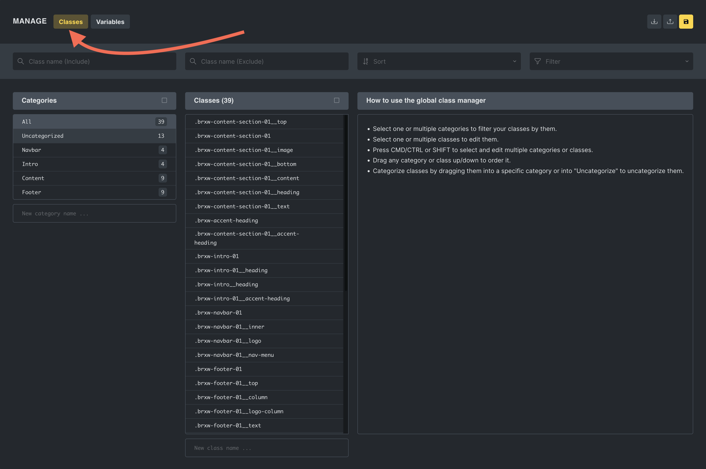
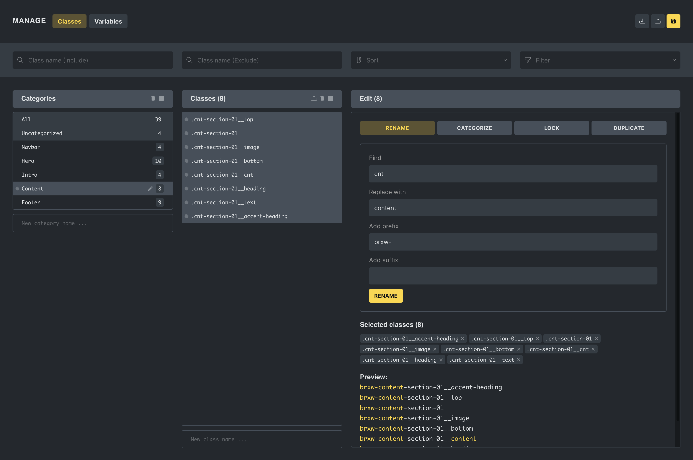
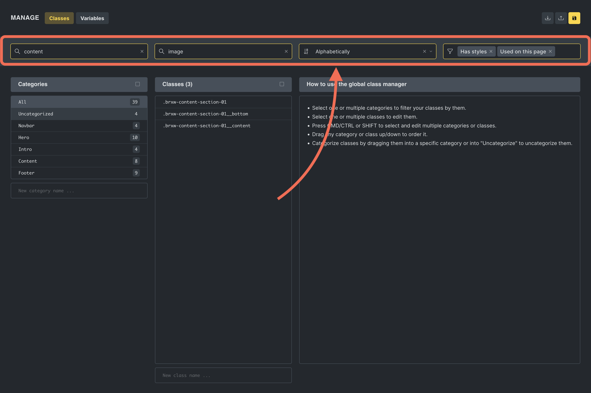
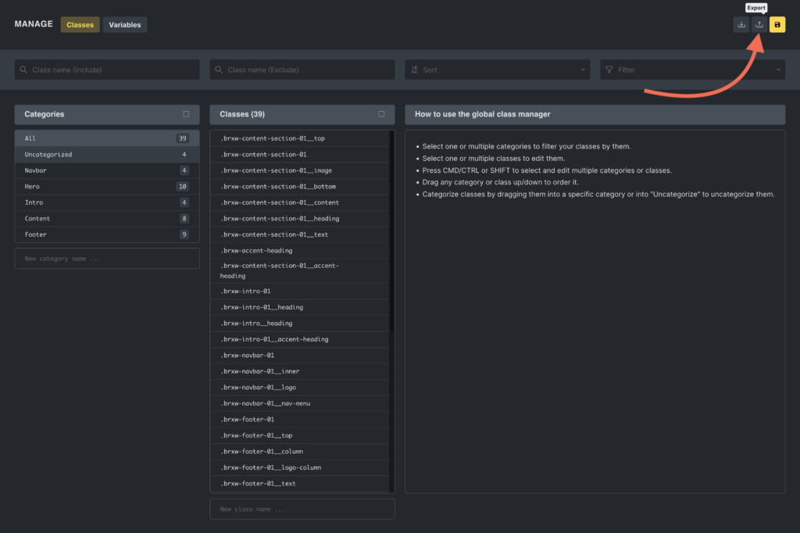
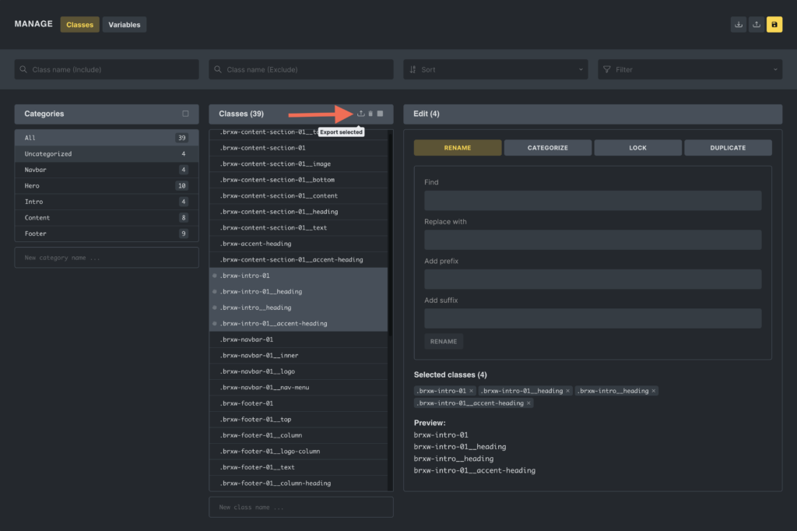
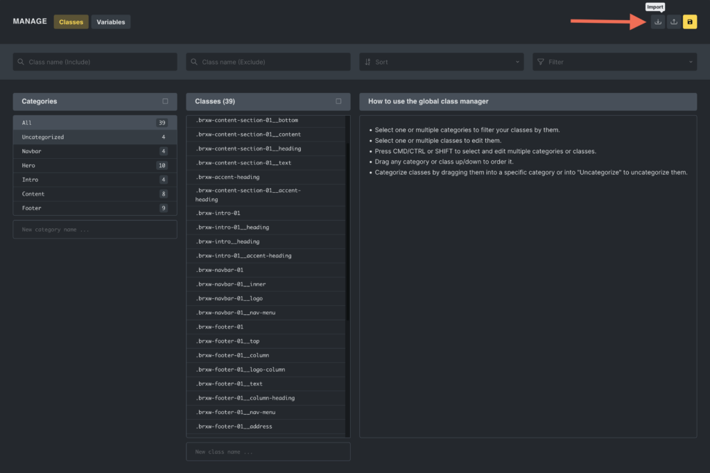
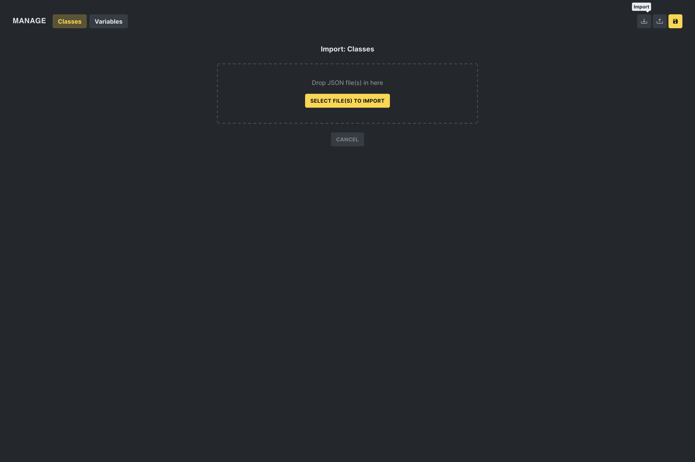

Bricks 1.9.5 introduced the Global Class Manager, a powerful new feature for creating, editing, deleting, and categorizing CSS classes directly within the builder. This tool simplifies managing global styles, allowing you to apply consistent designs across your projects easily.

## Accessing the class manager

The Global Class Manager is easily accessible either by clicking the "CSS3" icon in the builder toolbar or via the `CMD/CTRL + .` keyboard shortcut.

This action launches a popup where you can switch between managing your global classes and global CSS variables. Select "Classes" to open the class manager interface (if not already selected).

For users who prefer a streamlined interface, the class manager can be disabled under `Bricks > Settings > General > Disable global class manager`.

## Core functionalities

### Class creation and management

In the Global Class Manager, you can seamlessly handle your CSS classes through a unified interface where they can:

- **Manage classes:** Create new CSS classes or update existing ones. Delete classes that are no longer needed.

- **Order & categorize:** You can categorize classes for better management and order classes or categories via drag-and-drop for preferred structuring.

- **Bulk actions:** When two or more classes are selected, the editor enables users to perform mass actions such as renaming, duplicating, locking, and unlocking classes. These actions include the ability to find and replace strings or add prefixes or suffixes to class names.

### Search and sorting capabilities

In the header of the Global Class Manager, you can filter classes by:

- **Including or excluding specific strings.**

- **Sorting options:** Alphabetically sort classes for better organization.

- **Filtering based on usage and properties:** Filter options include "Used on this site", "Unused on this site", "Used on this page," "Unused on this page," "Has styles," "Has no styles," "Locked," and "Unlocked."

For more information on creating and applying global CSS classes, please refer to our dedicated [Global CSS Classes](https://academy.bricksbuilder.io/article/global-css-classes/) guide.

### Exporting and importing classes

The Global Class Manager facilitates the exporting and importing of CSS classes, making it easier to maintain a consistent styling framework across various Bricks projects.

#### Exporting classes

Users have two options for exporting classes:

1\. **Export all:** By clicking the "Export" button at the top of the manager, users can export all classes currently managed within the system as a JSON file.

2\. **Export selected:** Users can also choose specific classes to export by selecting them and then clicking the "Export selected" icon within the classes column header. This allows for more granular control over which classes are included in the exported JSON file.

#### Importing classes

In the "Import" popup, users can drag and drop a JSON file containing exported classes, streamlining transferring classes between projects.

#### Managing imported classes

If you're importing global classes and need to handle **conflicts** or organize new classes before they are added to your project, check out the [Global Class Import Manager](https://academy.bricksbuilder.io/article/global-class-import-manager/). This feature, introduced in Bricks 1.12, provides a structured way to resolve conflicts and categorize imported classes, ensuring a smooth and controlled workflow.
