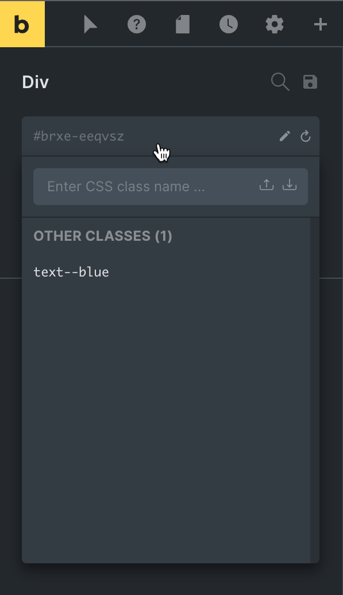

A CSS class is a collection of styles (CSS rules) that you can apply to any element anywhere on your site by assigning that CSS class to it.

Class-based styling is vital in web design and development in order to build scalable and maintainable websites.

Bricks allows you to visually create & manage your own CSS classes right in the builder and assign your classes to any element anywhere on your site with a few clicks.

https://youtu.be/JMCkE6dneTM

Styles applied to the element ID (which is what you do by default when editing an element) precede styles defined in a CSS class.

## How to create a global class

1. Select any element by clicking on it in the canvas or via the structure panel at the right.

3. Click on the input that shows the element's ID under its name in the left panel.

5. Type a valid class name in the "Enter CSS class name ..." input and hit return press the Save (floppy) icon.

7. Now any styling applied visually via the builder controls are added to that class.
