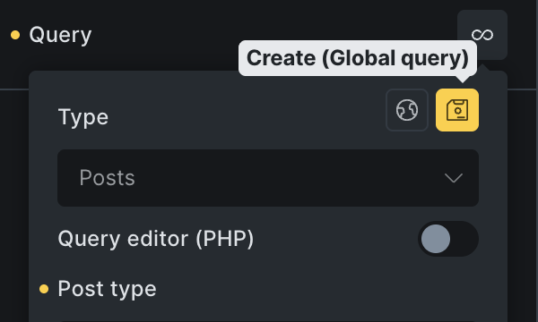
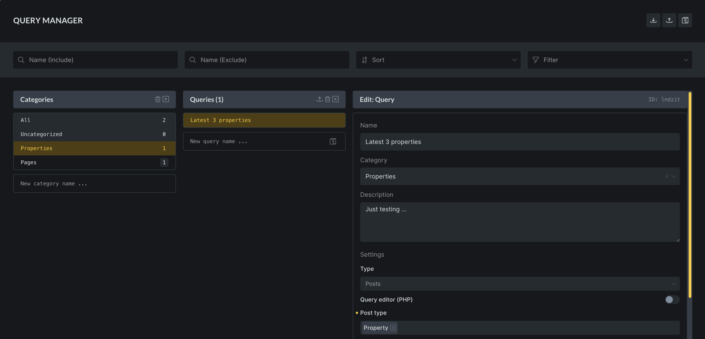

https://youtu.be/b4nGPJIE5rE

Starting with **Bricks 2.1**, you can create and manage **reusable global queries**. This lets you define query logic once and reuse it across your entire website. Any changes you make to a global query are automatically applied everywhere it’s used.

This feature improves efficiency, consistency, and maintainability for sites that rely on complex queries.

## Creating a Global Query

1. **Define a Local Query**
    - Insert a nestable element (e.g., Container, Block, Div).
    - Enable the **Query Loop**.
    - Configure query settings (e.g., post type, posts per page).

3. **Save as Global Query**
    - Click the new **Save icon** in the query control.
    
    - Provide:
        - **Name** (e.g., “Latest Three Properties”)
        
        - **Description** (optional, for team clarity)
        
        - **Category** (optional, useful for grouping queries)

5. Click **Create**.

The query now becomes global and can be reused site-wide.

You can also create a global query inside the [Query Manager](#query-manager).

## Using a Global Query

- When adding a new Query Loop, click the **globe icon**.

- Choose from your list of available global queries.

- Bricks will apply the stored query logic automatically.

If no global queries exist, the globe icon will not be available.

## Editing Global Queries

You can edit a global query in several ways:

- **Query Manager (recommended):**
    - Toolbar: **Manage → Query Manager**, or
    
    - Use the **Command Palette → Manage Queries**.

- **Inline Editing:**
    - Inside the Query Control, click the **Edit** (pencil) icon.
    
    - Bricks will indicate you are editing a global query (changes apply everywhere).

Edits update **all instances** that use the global query. For example, changing "Posts per page" from "3" to "5" updates every loop referencing that query.

## Disconnecting a Global Query

- Use **Disconnect** to convert a global query into a **local query**.

- The local query inherits the global settings as a starting point, but further edits won’t affect the original global query or other instances.

- Useful when you want a slightly different query in a specific context.

## Query Manager

The new Query Manager lets you create, organise, edit, import & export all your global queries.

It can be accessed in those following ways:

- Toolbar under **Manage → Query Manager**

- From the **Command Palette → Manage Queries**

- Query control **Globe → Gear icon**

## Import & Export

Global queries can be exported and imported as **JSON files** from the Query Manager.

- **Export:** Creates a JSON file containing queries and categories.

- **Import:** Upload the JSON file to another WordPress site to reuse queries.

This works the same way as exporting/importing classes and variables.

## Summary

The **Global Queries & Query Manager** feature in Bricks 2.1 allows you to:

- Create reusable queries.

- Apply them site-wide with a single click.

- Edit once, update everywhere.

- Disconnect for local variations.

- Import/export for portability.

This makes query management more consistent, efficient, and scalable across projects.
