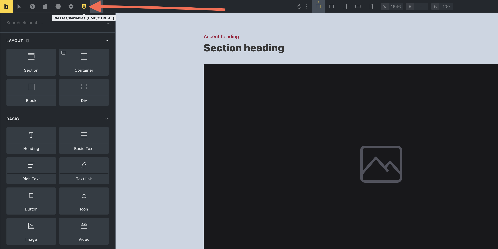
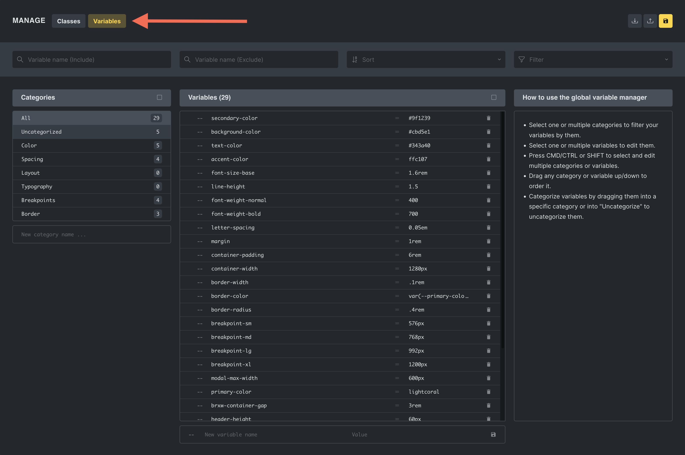
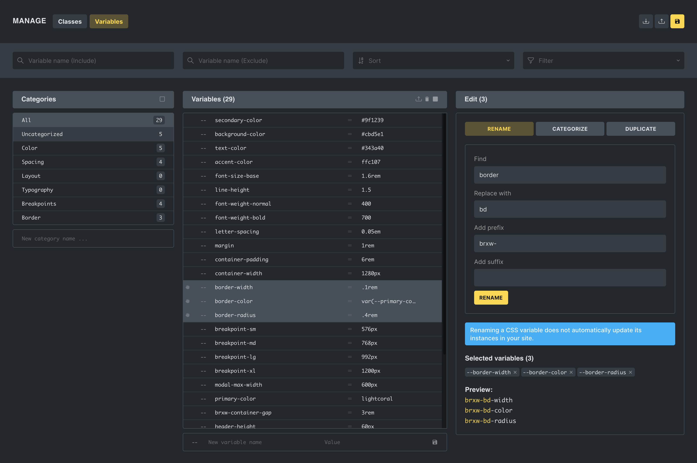
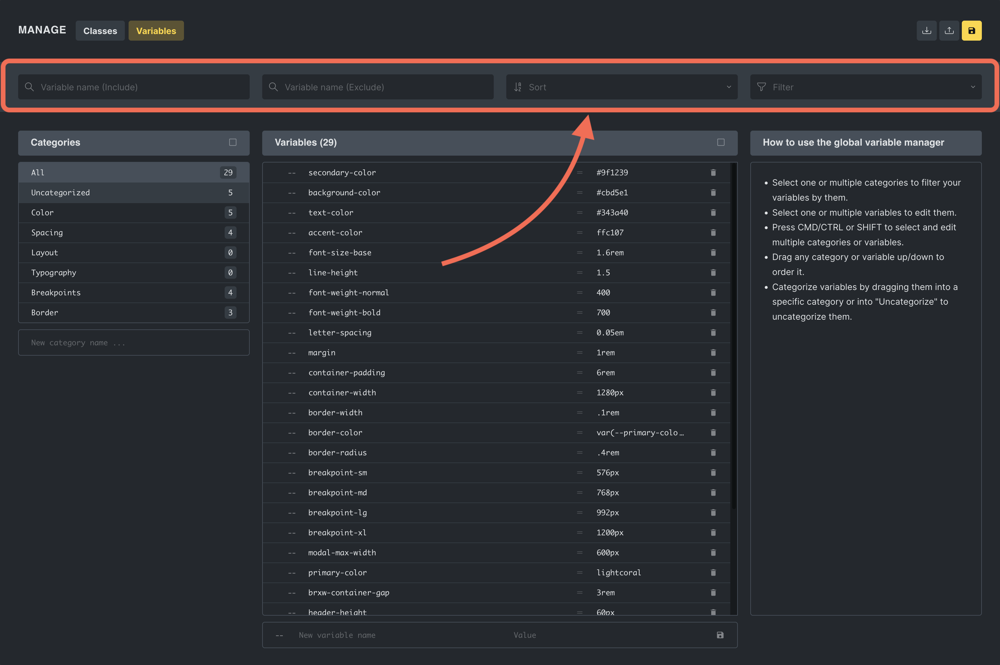
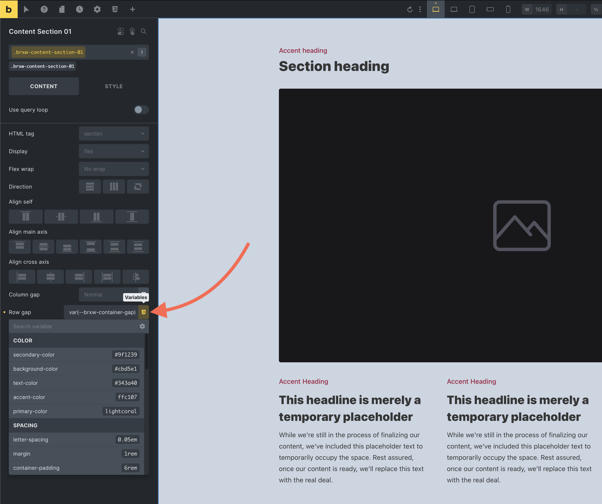
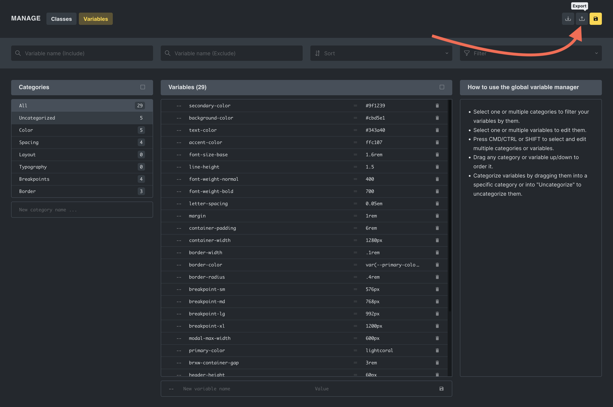
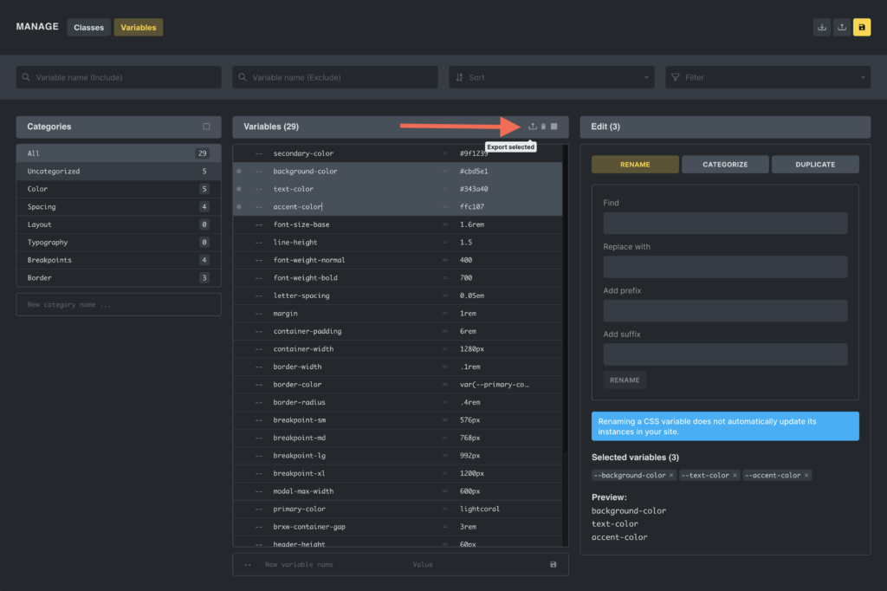
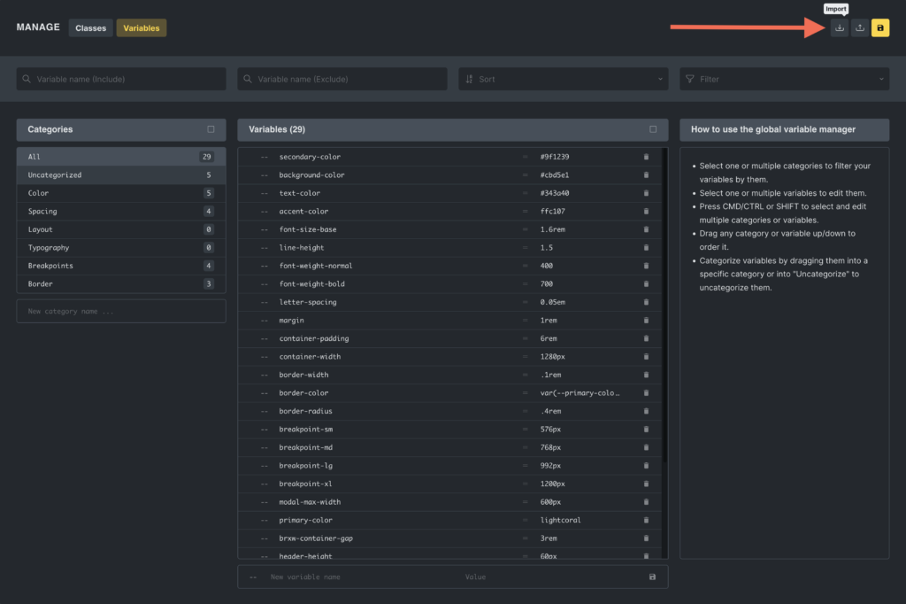
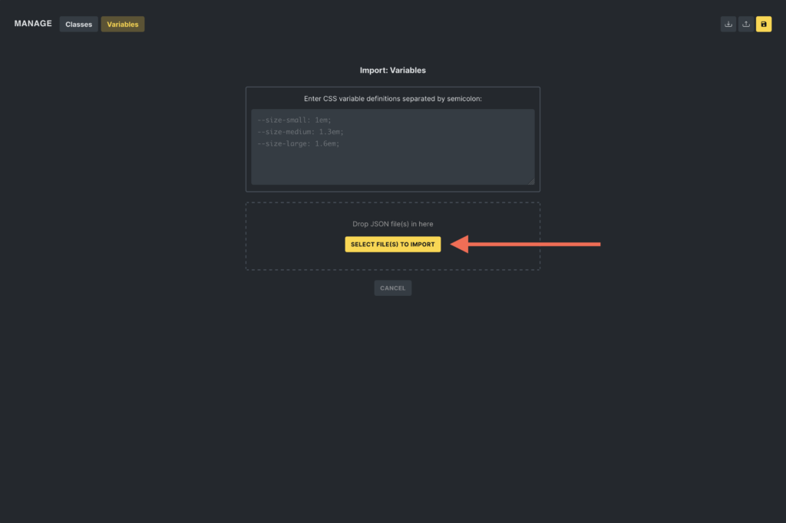
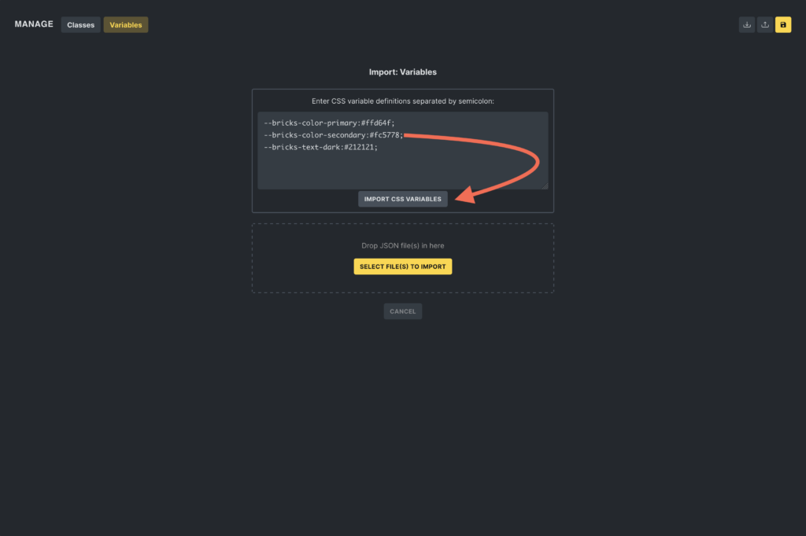

Bricks 1.9.8 introduces the Global Variables Manager, a powerful new feature that allows you to create, manage, and categorize all your CSS variables directly within the builder. This will simplify managing your CSS variables and allow you to apply consistent designs across your projects with ease.

## Accessing the variables manager

The Global Class Manager is easily accessible: click the “CSS3” icon in the builder toolbar or use the `CMD/CTRL + .` keyboard shortcut to open the manager.



This action launches a popup where you can switch between managing your global classes and global CSS variables. Select "Variable" to open the variable manager interface (if not already selected).



For users who prefer a streamlined interface, the class manager can be disabled under `Bricks > Settings > General > Disable global variable manager`.

## Core functionalities

### Variable creation and management

In the Global Variables Manager, users can seamlessly handle CSS variables through a unified interface where they can:

- **Manage variables:** Create new CSS variables or update existing ones with customizable names and values. Delete variables that are no longer needed.

- **Bulk actions:** When two or more variables are selected, the editor enables you to perform bulk actions such as renaming and duplicating. These actions include the ability to find and replace strings or add prefixes or suffixes to variable names. However, it’s important to note that renaming a CSS variable does not automatically update its instances throughout your site.

- **Variable categorization:** You can categorize variables for better management and order variables or categories via drag-and-drop for preferred structuring.



### Search and sorting capabilities

In the header of the Global Variables Manager, users can filter variables by:

- **Including or excluding specific strings**.

- **Sorting options:** Alphabetically sort variables for better organization.

- **Filtering based on usage:** Easily view variables that are "Used on this page" or "Unused on this page".



### Variable picker integration in the builder

A new "Variable Picker" is now available when editing element settings within the builder.

This picker lists all the variables created via the Global Variables Manager, organized by category.

Clicking on a variable from the picker inserts it directly into the selected setting. Simplifying using consistent styles across different elements and classes of your website.



### Exporting and importing variables

The Global Variables Manager facilitates the exporting and importing of CSS variables, making it easier to maintain a consistent styling framework across various Bricks projects.

#### Exporting variables

Users have two options for exporting variables:

1\. **Export all:** By clicking the "Export" button at the top of the manager, users can export all variables currently managed within the system as a JSON file.



2\. **Export selected:** Users can also choose specific variables to export by selecting them and then clicking the "Export selected" icon within the variables column header. This allows for more granular control over which variables are included in the exported JSON file.



#### Importing variables

Importing variables into Bricks is flexible and user-friendly, accommodating different scenarios:

**Importing via JSON file:** In the "Import" popup, users can drag and drop a JSON file containing exported variables, streamlining the process of transferring settings between projects.





**Manual text entry:** Additionally, you can manually enter variables into a textarea. This is particularly useful for quickly importing variables from child themes, custom plugins, or code snippets. The expected format for manual entry is a semicolon-separated list of CSS variable definitions, such as:

```php
--bricks-color-primary: #ffd64f;
--bricks-color-secondary: #fc5778;
--bricks-text-dark: #212121;
```



**Importing from remote templates:** When inserting a remote template, users can choose whether to include the CSS variables from the remote site. This option ensures that the imported template retains its intended design consistency or it can be adapted to fit the local styling guidelines.
